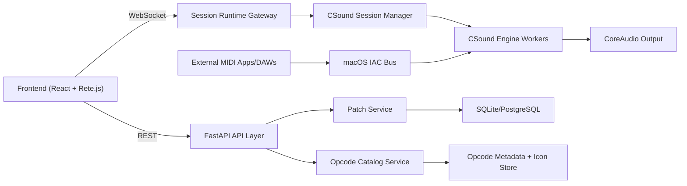

# VisualCSound Architecture

## 1) Purpose
VisualCSound is a 2-tier application for creating CSound instruments visually by connecting opcode nodes, then playing them in real time via MIDI.

Primary outcomes:
- Visual patching experience similar to modular analog synth workflows.
- Typed signal graph (audio, control, init, string, etc.) mapped to valid CSound instruments.
- Fast load/save of instrument patches.
- Real-time performance with external MIDI sources on macOS.

## 2) Scope and Non-Goals

In scope:
- Frontend graph editor (drag, drop, connect, parameter edit).
- Backend compilation from visual graph to CSound `.orc`/`.csd`.
- Realtime play/stop lifecycle and MIDI routing.
- Opcode catalog with icons and typed ports.

Out of scope (initial versions):
- Full DAW/sequencer features (timeline editing, multitrack arrangement).
- Collaborative multi-user patch editing.
- Cloud rendering farms or distributed audio engines.

## 3) Technology Stack

### Frontend
- TypeScript
- React (recommended UI runtime with Rete.js ecosystem)
- Tailwind CSS
- Rete.js (+ plugins for area, connection, context menu, minimap)
- Zustand or Redux Toolkit for global state (patch/session/UI)
- WebSocket client for runtime telemetry and parameter updates

### Backend
- Python 3.11+
- FastAPI
- Pydantic v2 for schema validation
- CSound Python bindings (`ctcsound`)
- Uvicorn / Gunicorn-Uvicorn workers
- SQLModel or SQLAlchemy for persistence (SQLite for local, PostgreSQL optional)

### Audio/MIDI Integration
- CSound realtime engine in-process with backend worker isolation
- CSound realtime MIDI input (`-M` and `-+rtmidi` runtime options)
- macOS CoreMIDI/IAC Driver loopback (recommended default)

### Asset Pipeline (Opcode Icons)
- Image generation pipeline for opcode icons (offline generation + curation)
- Raster-to-SVG/vector cleanup where needed
- Static CDN-like serving via FastAPI static files

## 4) High-Level Architecture



## 5) Logical Components

### Frontend Components
1. Patch Editor
- Rete.js canvas for node placement and wiring.
- Node inspector panel for opcode args/defaults/ranges.
- Connection validator using opcode port types.

2. Catalog Browser
- Searchable opcode library by category (oscillators, filters, envelopes, MIDI, utilities).
- Icon + tooltip + short opcode docs summary.

3. Runtime Control Panel
- Session controls: compile, start, stop, panic.
- MIDI monitor and selected input port status.
- Real-time parameter widgets (knobs/sliders) mapped to control channels.

4. Persistence UX
- Save patch, load patch, duplicate, version notes.
- Dirty-state tracking and autosave option.

### Backend Components
1. API Layer (FastAPI Routers)
- Auth/session middleware (optional for local-first MVP).
- Validation and serialization boundaries.

2. Opcode Catalog Service
- Canonical metadata store per opcode:
  - Name, category, in/out port schema, rate types, argument list, defaults.
  - Icon URL and compact documentation text.

3. Patch Service
- CRUD for patches.
- Patch schema versioning and migration hooks.

4. Graph Compiler Service
- Converts validated graph to CSound instrument code:
  - Node ordering/topological resolution.
  - Variable naming and port binding.
  - Rate correctness checks (`a`, `k`, `i`, `S`).
  - Emits `.orc` body and `.csd` wrapper.

5. CSound Session Manager
- Creates and manages runtime engine instances.
- Isolates each active patch in dedicated worker/thread context.
- Handles play/stop/reload/teardown.

6. MIDI Service
- Enumerates available MIDI inputs.
- Selects and binds MIDI source by device/bus name.
- Bridges MIDI events to active CSound sessions.

7. Event Gateway (WebSocket)
- Pushes runtime telemetry to frontend:
  - compile status, warnings, errors
  - CPU load, xruns/underruns (if exposed)
  - note-on/off monitor, channel data

## 6) Core Domain Model

### Patch
- `id`, `name`, `description`, `schemaVersion`, `createdAt`, `updatedAt`
- `nodes[]`, `connections[]`, `uiLayout`, `engineConfig`

### NodeInstance
- `id`
- `opcode` (e.g., `oscili`, `moogladder`)
- `params` (constant values or references)
- `ports`:
  - `inputs[]` with `id`, `signalType`, `arity`
  - `outputs[]` with `id`, `signalType`, `arity`

### Connection
- `fromNodeId`, `fromPortId`, `toNodeId`, `toPortId`
- optional `transform` metadata (gain/scale/offset helper nodes preferred over implicit transforms)

### Session
- `sessionId`, `patchId`, `state` (`idle|compiled|running|error`)
- `csoundOptions`, `midiInput`, `audioOutput`, `startedAt`

## 7) Signal Typing and Graph Rules

Supported signal types (initial):
- Audio-rate: `a`
- Control-rate: `k`
- Init-rate: `i`
- String: `S`
- Function table/ref: `f` (metadata-level reference type)

Validation rules:
1. Source and destination port types must be compatible.
2. Disallow direct cycles unless a delay/feedback opcode explicitly breaks sample recursion.
3. Required opcode inputs must be connected or have defaults.
4. Multi-output opcodes must map each output index explicitly.
5. Graph must have at least one audio sink path to output opcode (`outs`, `outch`, etc.) for playable sessions.

## 8) Graph-to-CSound Compilation Pipeline

1. Load patch + schema migrate (if needed).
2. Validate structure and signal typing.
3. Build dependency graph and execution order.
4. Allocate deterministic variable symbols (stable across recompiles when possible).
5. Emit opcode lines per node.
6. Emit instrument wrapper(s), global settings (`sr`, `ksmps`, `nchnls`, `0dbfs`).
7. Build full `.csd` (or `.orc` + runtime score) and compile with CSound.
8. Return compile artifact + diagnostics to frontend.

Compiler output modes:
- Debug mode: include comments mapping generated lines back to node IDs.
- Performance mode: compact output for faster startup.

## 9) API Surface (Initial)

### Metadata and Catalog
- `GET /api/opcodes`
- `GET /api/opcodes/{opcodeName}`
- `GET /api/opcodes/{opcodeName}/icon`

### Patch Persistence
- `POST /api/patches`
- `GET /api/patches/{patchId}`
- `PUT /api/patches/{patchId}`
- `GET /api/patches`

### Compile and Session Runtime
- `POST /api/sessions`
- `POST /api/sessions/{sessionId}/compile`
- `POST /api/sessions/{sessionId}/start`
- `POST /api/sessions/{sessionId}/stop`
- `POST /api/sessions/{sessionId}/panic`
- `DELETE /api/sessions/{sessionId}`

### MIDI
- `GET /api/midi/inputs`
- `PUT /api/sessions/{sessionId}/midi-input`

### Realtime Events
- `WS /ws/sessions/{sessionId}`

## 10) macOS MIDI Loopback Strategy

Recommended solution: built-in macOS IAC Driver (CoreMIDI virtual bus).

Why:
- Native, low-friction, no third-party kernel/driver dependency.
- Supported by most DAWs and MIDI software.
- Fits CSound realtime MIDI input model.

Operational setup:
1. In macOS Audio MIDI Setup, open MIDI Studio.
2. Open IAC Driver properties and enable `Device is online`.
3. Create one or more named buses (for example `VisualCSound In`).
4. In external software (Logic, Ableton, etc.), route MIDI output to that IAC bus.
5. In backend session config, bind CSound MIDI input device to that bus name/index.

CSound runtime notes:
- Use realtime MIDI input option `-M <device>`.
- Select realtime MIDI module via `-+rtmidi=<module>` as supported by build (macOS commonly includes `cmidi`; some builds may use `portmidi`).
- Expose discovered devices through `/api/midi/inputs` so UI can present exact names.

## 11) Opcode Icon Architecture

Goal: each opcode node has a distinct, readable icon consistent with category semantics.

Pipeline:
1. Define style guide by opcode families (oscillator/filter/envelope/mixer/io/midi).
2. Generate draft icons in batches with an image generation model.
3. Human curation + normalization (size, stroke weight, contrast).
4. Export final assets (`SVG` preferred, `PNG` fallback).
5. Serve icons from backend static path with cache headers.

Fallback strategy:
- If custom icon missing, render category icon + opcode initials.

## 12) Frontend Detailed Architecture

State domains:
- `patchState`: nodes, edges, selection, undo/redo.
- `catalogState`: opcode metadata and icon map.
- `sessionState`: compile/run state, logs, MIDI binding.
- `uiState`: panes, modals, theme, shortcuts.

Rete.js integration:
- Custom node renderer (Tailwind components).
- Port renderer with color-coded signal types (`a/k/i/S/f`).
- Connection style encodes signal type (line style/color).
- Context actions:
  - add node from compatible next opcodes
  - quick-connect helpers
  - insert utility node between connection

User feedback loops:
- Compile warnings pinned to nodes/ports.
- Inline validation before API compile call.
- Live activity indicator for MIDI notes and audio engine state.

## 13) Backend Detailed Architecture

Suggested module layout:

```text
backend/
  app/main.py
  app/api/
    patches.py
    opcodes.py
    sessions.py
    midi.py
    ws.py
  app/core/
    config.py
    logging.py
  app/models/
    patch.py
    opcode.py
    session.py
  app/services/
    patch_service.py
    opcode_service.py
    compiler_service.py
    midi_service.py
    session_service.py
  app/engine/
    csound_worker.py
    session_runtime.py
  app/storage/
    db.py
    repositories/
```

Concurrency model:
- API requests remain non-blocking.
- Compile/start/stop operations routed to session worker queue.
- WebSocket broadcast from session events bus.

Failure containment:
- Engine worker crash only kills one session.
- Supervising session manager marks session `error` and returns diagnostics.

## 14) Performance and Realtime Constraints

Targets (initial):
- Compile turnaround: < 300 ms for small/medium patches.
- Start latency after compile: < 200 ms.
- UI response to parameter changes: < 50 ms perceived.

Key strategies:
- Keep CSound engine warm per active session.
- Incremental recompile for local graph changes where feasible.
- Throttle high-frequency UI parameter events before backend forwarding.
- Use bounded queues to protect realtime thread from burst traffic.

## 15) Persistence and Versioning

Patch storage:
- JSON document persisted in DB.
- Include `schemaVersion` for forward migrations.
- Optional immutable history snapshots for rollback.

Migration approach:
- On load, run incremental migrators (`v1 -> v2 -> v3`).
- Preserve unknown extension fields to avoid data loss.

## 16) Observability and Diagnostics

Capture:
- API request logs and latency.
- Compile errors/warnings by opcode/node.
- Session lifecycle events.
- MIDI device discovery/binding changes.
- Realtime engine telemetry if available.

Expose:
- `GET /api/health`
- `GET /api/health/realtime`
- structured logs for local debugging and production ops.

## 17) Security and Safety Baseline

- Validate all incoming patch payloads with strict schema.
- Limit max nodes/connections per patch to prevent abuse.
- Sanitize text fields used in generated code comments.
- Keep CSound compile/runtime in constrained worker boundaries.
- If multi-user mode is added later: enforce auth + patch ownership checks.

## 18) Deployment Topology

Development:
- Frontend dev server (Vite) and backend FastAPI on localhost.
- CSound engine runs in backend process context.

Production options:
1. Single-node local workstation deployment (best for low latency audio tools).
2. LAN deployment where browser frontend accesses backend on same machine as audio engine.

Note: fully remote cloud backend is generally not ideal for realtime MIDI/audio latency-sensitive workflows.

## 19) Implementation Phases

Phase 1: Foundations
- Opcode catalog model, patch schema, Rete canvas basic node/edge editing.

Phase 2: Compiler + Persistence
- Graph validation, CSound code generation, save/load endpoints.

Phase 3: Realtime Engine + MIDI
- Session manager, start/stop, MIDI input binding, IAC workflow support.

Phase 4: UX and Assets
- Icon library pipeline, improved node inspectors, diagnostics overlay.

Phase 5: Hardening
- Performance tuning, crash recovery, schema migration tests, packaging.

## 20) Risks and Mitigations

Risk: opcode metadata incompleteness causes invalid graph constraints.  
Mitigation: start with curated opcode subset; expand with test-backed metadata.

Risk: realtime glitches under heavy UI event traffic.  
Mitigation: event throttling, bounded queues, separate realtime worker path.

Risk: MIDI device naming differences across CSound builds.  
Mitigation: runtime device discovery endpoint + explicit user selection per session.

Risk: generated icons may be visually inconsistent.  
Mitigation: enforce icon design tokens and human curation before publish.

---

This architecture is ready for implementation planning without committing to code yet.
