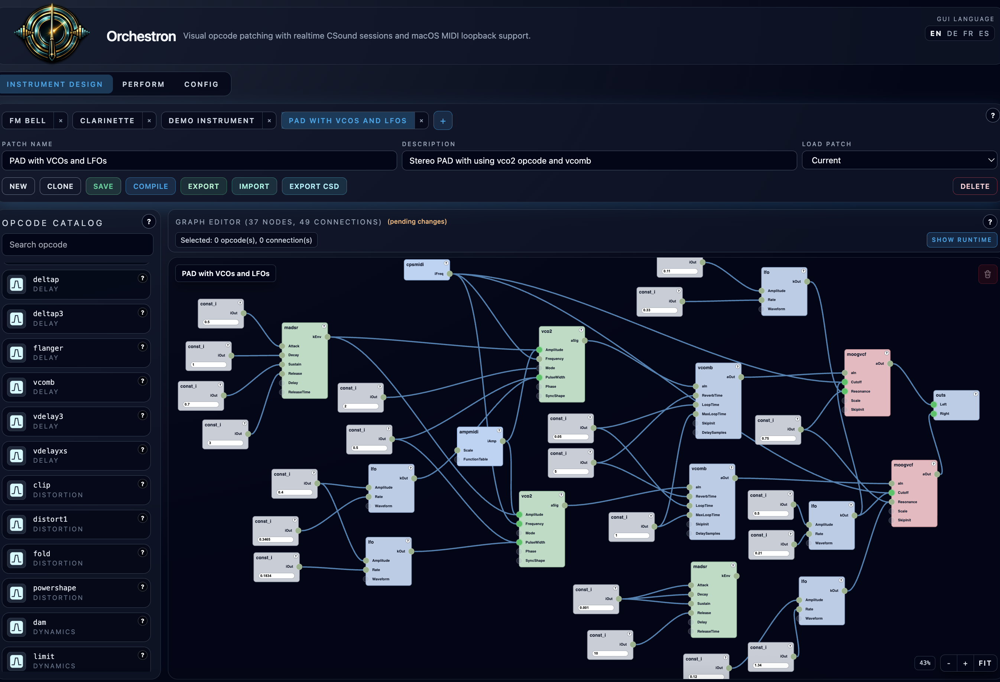
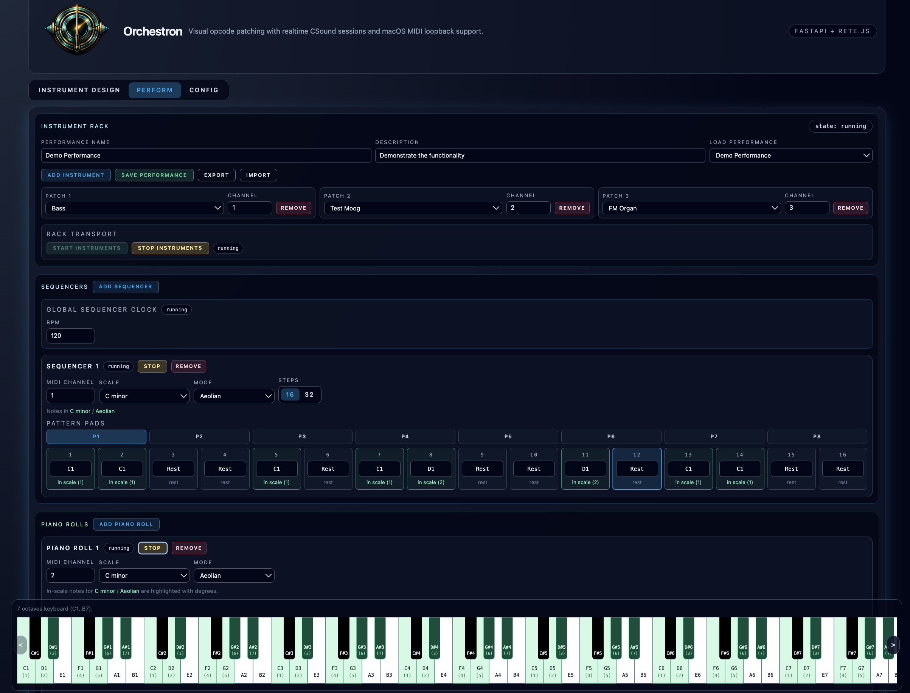
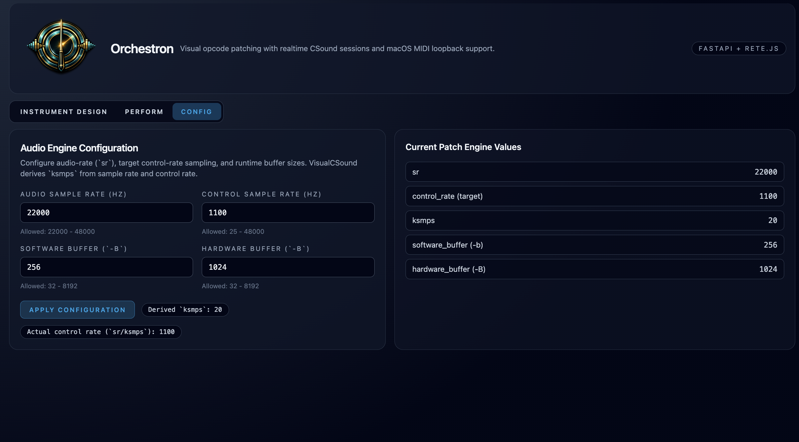
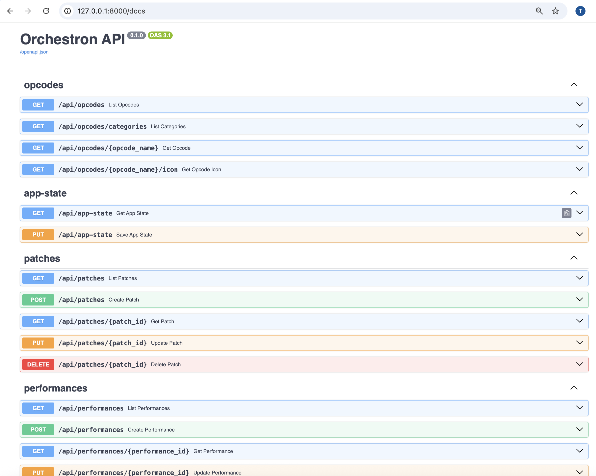

# Orchestron

Here’s the strange, delightful thing about music software: most of it assumes the instrument already exists. Then it gives you knobs. "Orchestron" flips that around.

You don’t load a synthesizer.
You invent one.

Orchestron is a visual instrument workshop built on the power of Csound — not a preset browser, not a plugin rack, not a timeline with tracks stacked like office paperwork. You design sound from signal flow upward. Oscillators, envelopes, filters, physical models, control signals — connect them, and the instrument comes alive while you hear it.

- Backend: FastAPI + CSound Python integration
- Frontend: React + TypeScript + Tailwind + Rete.js

## Built With Codex

This application was built using the Codex App with `GPT-5.3-Codex` and **Extra High** reasoning effort.

## Screenshots

### Instrument Design



### Perform



### Config



### FastAPI Backend



## Quick Start

### Use the Makefile

Build the app:

```bash
make
make run
```

### Backend

```bash
uv pip install -e '.[dev]'
uvicorn backend.app.main:app --reload
```

### Frontend

```bash
cd frontend
npm install
npm run dev
```

### Backend Serving Built Frontend

Build frontend once, then serve it from the backend at `/client`:

```bash
cd frontend
npm install
npm run build
cd ..
uvicorn backend.app.main:app --reload
```

Default backend URL: `http://localhost:8000`
Default frontend URL: `http://localhost:5173`
Backend-served frontend URL: `http://localhost:8000/client`

## MIDI on macOS

Enable the **IAC Driver** in Audio MIDI Setup and route MIDI output from your DAW/software into the selected IAC bus.

## MIDI Pulse CLI (jitter probe)

This repository includes a native macOS MIDI pulse emitter to help isolate timing jitter outside the main app/Csound path.

Build:

```bash
make midi-pulse-build
```

List MIDI destinations:

```bash
./tools/midi_pulse --list
```

Send periodic notes:

```bash
./tools/midi_pulse --dest 0 --channel 1 --note 60 --interval-ms 10 --gate 0.25 --count 2000
```

Useful flags:
- `--dest <name|index>`: destination by index (from `--list`) or name
- `--report-every <N>`: periodic timing summary in milliseconds
- `--verbose`: per-note lateness output

## MIDI Stats CLI (receiver probe)

This repository also includes a native macOS MIDI receiver for measuring incoming event interval/jitter.

Build:

```bash
make midi-stats-build
```

List MIDI sources:

```bash
./tools/midi_stats --list
```

Receive and report every 200 matching events:

```bash
./tools/midi_stats --dest 0 --channel 1 --report-every 200
```
