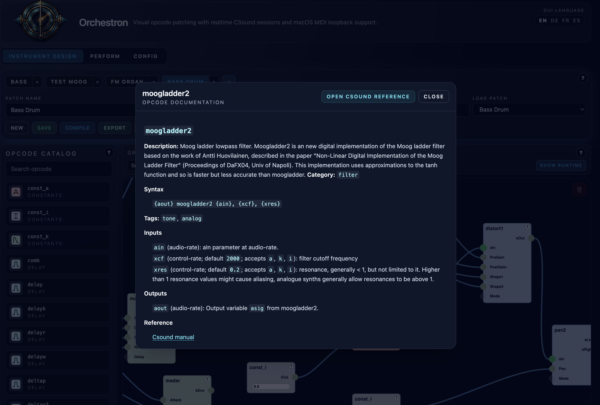
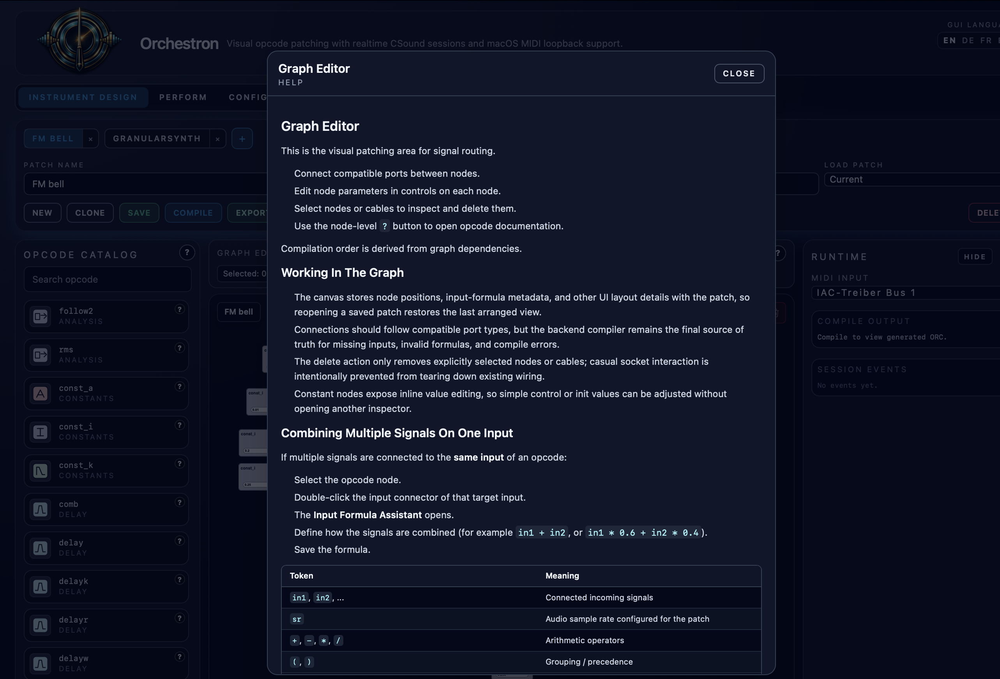
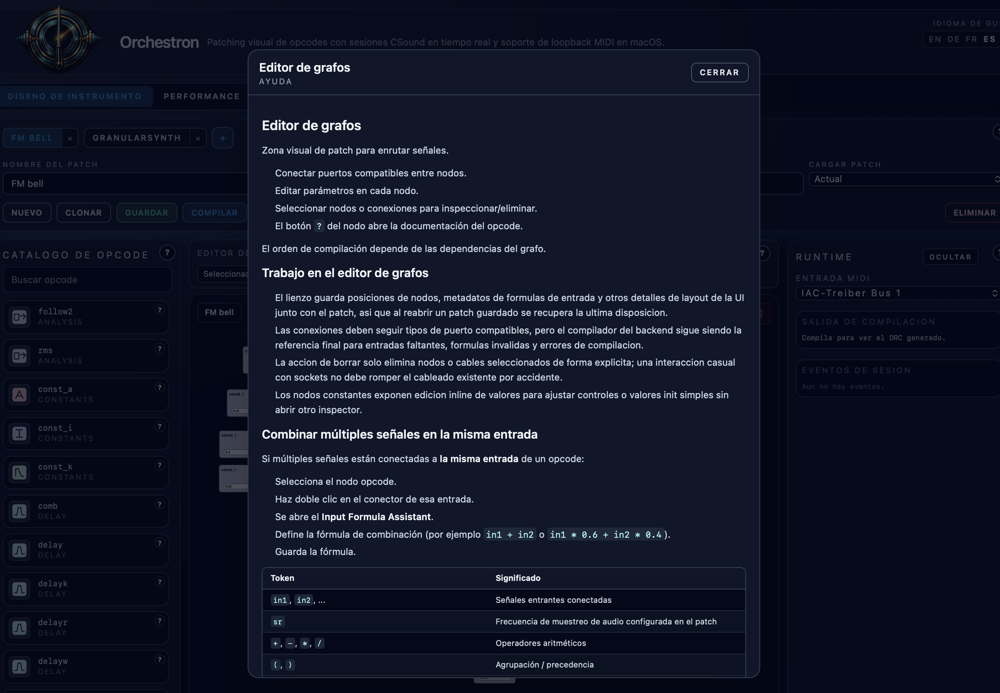
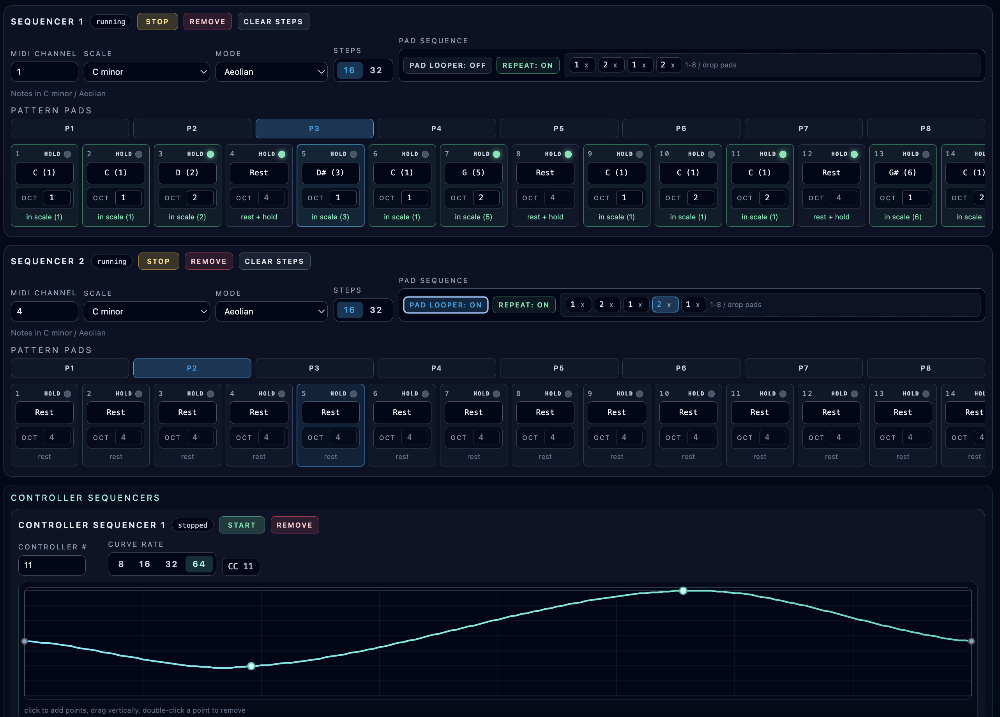

# Orchestron

Here’s the strange, delightful thing about music software: most of it assumes the instrument already exists. Then it gives you knobs. "Orchestron" flips that around.

You don’t load a synthesizer.
You invent one.

Orchestron is a visual instrument workshop built on the power of Csound — not a preset browser, not a plugin rack, not a timeline with tracks stacked like office paperwork. You design sound from signal flow upward. Oscillators, envelopes, filters, physical models, control signals — connect them, and the instrument comes alive while you hear it.

- Backend: FastAPI + CSound Python integration
- Frontend: React + TypeScript + Tailwind + Rete.js

## Built With Codex

This application was built using the Codex App with `GPT-5.3-Codex` and **Extra High** reasoning effort.

## Features

### General Features

Orchestron is a visual music and instrument-building application centered around Csound as the sound generation engine. Instead of starting from fixed instruments, you design instruments visually and perform them live inside the same app.

The application includes multilingual UI/help content and integrated help pages, so opcode references and usage guidance are available directly in the workflow without leaving the app.

### Instrument Design

The instrument design area combines an opcode catalog with a visual graph editor. You build an instrument by selecting Csound opcodes and connecting them into a signal/control graph.

Designed instruments can be exported for reuse, including export to a `.csd` file.








### Live Performance

The live performance area provides an instrument rack where instruments can be selected and assigned to MIDI channels. A sequencer can then drive those instruments, with scale and mode selection and note entry that supports choosing notes both in-scale and out-of-scale.

A controller sequencer lets you define a curve that is sampled during playback and emitted as MIDI control messages for a selected controller number.

The piano roll follows the active scale/mode (from the running sequencer) and highlights keys by scale degree. When multiple sequencers run with different scales/modes, only keys shared by both scales/modes are highlighted, which supports interactive playing with clear harmonic guidance.

The MIDI controller panel provides 6 controllers that can each be assigned an individual controller number and operated interactively while playing.





### Configuration

The configuration view exposes audio settings and performance-related engine parameters, including audio sampling rate, control sampling rate, and buffer sizes.


### Backend

Orchestron is a two-tier application with a FastAPI backend handling the service layer and integration points for the frontend and Csound engine.


## Quick Start

### Requirements

- Csound must be installed on your system and available in your `PATH`.
- Install "uv", run "uv sync" to create the virtual python environment

### Use the Makefile

Build the app:

```bash
uv sync # create python virtual env
make
make run
```

### Running in Docker

Run the backend in browser-audio streaming mode (WebRTC) with Docker Compose:

```bash
docker compose up --build
```

Then open:

- Backend API: `http://localhost:8000`
- Backend-served frontend: `http://localhost:8000/client`

This Compose setup runs Csound in `streaming` mode and sends audio to the browser over WebRTC (via the bundled TURN service).

See `/Users/thuber/Projekte/VisualCSound/WEBRTC_STREAMING.md` for implementation details, latency tuning, and Docker-specific notes.

### Backend

```bash
# uv pip install -e '.[dev]'
uv sync
uvicorn backend.app.main:app --reload
```

### Frontend

```bash
cd frontend
npm install
npm run dev
```

### Backend Serving Built Frontend

Build frontend once, then serve it from the backend at `/client`:

```bash
cd frontend
npm install
npm run build
cd ..
uvicorn backend.app.main:app --reload
```

Default backend URL: `http://localhost:8000`
Default frontend URL: `http://localhost:5173`
Backend-served frontend URL: `http://localhost:8000/client`

## MIDI on macOS

Enable the **IAC Driver** in Audio MIDI Setup and route MIDI output from your DAW/software into the selected IAC bus.

## MIDI Pulse CLI (jitter probe)

This repository includes a native macOS MIDI pulse emitter to help isolate timing jitter outside the main app/Csound path.

Build:

```bash
make midi-pulse-build
```

List MIDI destinations:

```bash
./tools/midi_pulse --list
```

Send periodic notes:

```bash
./tools/midi_pulse --dest 0 --channel 1 --note 60 --interval-ms 10 --gate 0.25 --count 2000
```

Useful flags:
- `--dest <name|index>`: destination by index (from `--list`) or name
- `--report-every <N>`: periodic timing summary in milliseconds
- `--verbose`: per-note lateness output

## MIDI Stats CLI (receiver probe)

This repository also includes a native macOS MIDI receiver for measuring incoming event interval/jitter.

Build:

```bash
make midi-stats-build
```

List MIDI sources:

```bash
./tools/midi_stats --list
```

Receive and report every 200 matching events:

```bash
./tools/midi_stats --dest 0 --channel 1 --report-every 200
```
