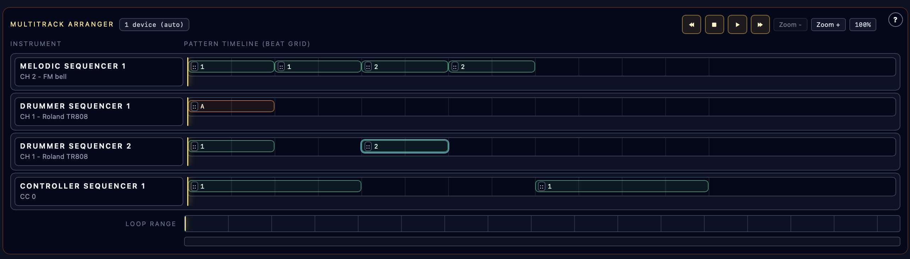
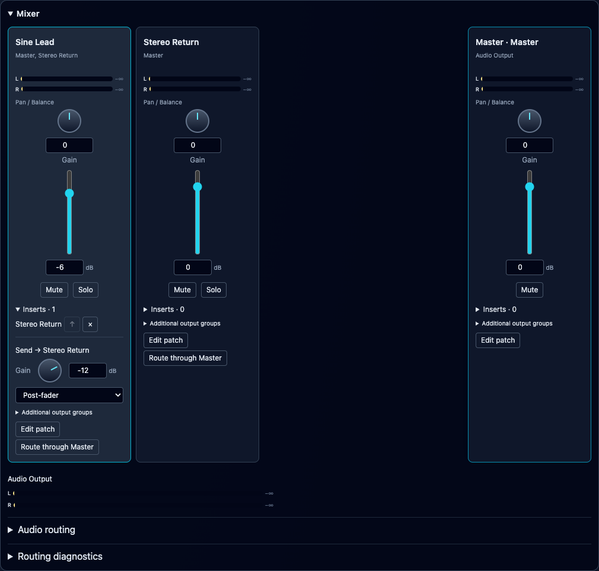

# Orchestron

Here’s the strange, delightful thing about music software: most of it assumes the instrument already exists. Then it gives you knobs. "Orchestron" flips that around.

You don’t load a synthesizer.
You invent one.

Orchestron is a visual instrument workshop built on the power of Csound — not a preset browser, not a plugin rack, not a timeline with tracks stacked like office paperwork. You design sound from signal flow upward. Oscillators, envelopes, filters, physical models, control signals — connect them, and the instrument comes alive while you hear it.

Read the complete user documentation in [user_documentation.md](documentation/user_documentation.md).

## Built With Codex

This application was built using the Codex App with `GPT-5.3-Codex`, `GPT-5.4`, `GPT-5.5`, `GPT-5.6-Sol` and `GPT-6-Astra` using **Extra High** reasoning effort. I started development and expected to hit a limit at some point where things fell apart, but that never happened up to now, given me a good intuition on how powerful today's coding agents have become...

## What you can create

Build a sound from the inside out. In **Instrument Design**, connect Csound building blocks, called opcodes, into a patch: an oscillator makes a tone, an envelope shapes its attack and decay, a filter changes its colour, and modulation brings it into motion. Follow the connections to see how each part contributes to the result.

Start with a playable instrument, a drumset, an audio effect, an audio output patch, or an empty canvas. Turn a promising experiment into a reusable template, keep several instruments open in tabs, and return to unfinished ideas later.

- **Synths and textures:** combine oscillators, filters, envelopes, physical models, and effects for basses, leads, bells, pads, and evolving soundscapes.
- **Sample-based sounds:** upload audio or SoundFonts, and use the table editor to build waveforms and shape how samples are played.
- **Drumsets:** give different notes their own synthesis voices with [If / Switch branches](documentation/instrument_design/control_flow.md), then sequence them together.
- **Effects:** design stereo processors to use as inserts, shared effects, or part of your Master chain.

*An instrument takes shape as a graph: this pad combines oscillators, envelopes, filters, and delay.*

Hover over an instrument's description in Instrument Design to read the full text in a tooltip.

Use [draft auditioning](documentation/instrument_design/runtime_panel_and_compilation.md#audition-a-draft) to hear an unfinished patch on its own or in the context of a performance before saving it. The [Instrument Design guide](documentation/instrument_design/instrument_design.md) walks through the editor, formulas, tables, and patch library.

## Build patterns and arrangements

Create melodies, bass lines, drum patterns, and movement in the same performance. Melodic sequencers offer scales, modes, individual notes, and chords; drummer sequencers let you shape each hit's velocity. Move individual notes, chords, and drum hits early or late with per-step timing controls, preserving the pattern's meter and length. Draw controller curves for repeating changes to MIDI-controlled parameters, and use beat-synchronized arpeggiators to drive existing MIDI instruments with editable rhythms, ties, ratchets and eight musical variation pads. Arpeggiators can follow their own arranger lanes or run independently in Live mode. Their Input Channel → Target Channel controls sit together in the top row, making the MIDI route visible immediately.

Arpeggiator steps show large note previews and scale-degree borders using the piano keyboard’s colours. Chord borders show separate colour segments; Scale Off keeps borders neutral. Hover over a step to read its full note preview and scale degrees.

Pattern pads hold variations you can launch while playing or chain with the Pad Looper. Each sequencer can use its own meter, grid, and beat ratio around a shared tempo. Explore patterns of different lengths, odd meters, and rhythms that move against one another.

*Melodic patterns and controller curves bring notes and movement into the same performance.*

Lay out those patterns in the **multitrack arranger** to build an introduction, repeat a phrase, bring drums in, or leave space for a change of mood. Melodic, drummer, and controller tracks share one timeline, with looping and navigation controls for working on a passage.

*Arrange note patterns, drum parts, and automation side by side.*

Explore the guides to [sequencer editing](documentation/performance/sequencer_tracks_and_steps.md), [pattern pads](documentation/performance/pattern_pads_and_pad_looper.md), [arpeggiators](documentation/performance/arpeggiators.md), and the [multitrack arranger](documentation/performance/multitrack_arranger.md).

## Perform and shape the mix

Performance descriptions show three lines with automatic wrapping. Scroll vertically through longer descriptions or hover over the field to read the full text.

Load instruments into the Perform rack, assign MIDI channels, and play from the on-screen keyboards or an external MIDI source. Scale highlighting provides harmonic guidance while you improvise. Manual MIDI controls and controller sequencers can each send to your chosen MIDI channels, with all 16 selected by default (OMNI). Assignable MIDI controls let you adjust sounds as you play; instruments can also expose their own [performance controls](documentation/performance/performance_controllers.md) for settings such as envelope times or distortion.

*Play a melody with harmonic guidance and reach for MIDI controls beneath the keyboard.*

Mix instruments and effect returns with volume faders, pan or balance, mute, solo, and meters. Add an insert to one instrument, send several instruments to a shared effect, and shape the combined sound through Master. Every performance has a fixed internal Master with its own controls and inserts, without adding an instrument to your library. A routing matrix and diagram help you follow where the audio goes.

The [performance creator skill](integrations/skills/orchestron-performance-creator/SKILL.md) can also configure Master routing, shared effects, mixer strips, and pre/post-fader sends through its CLI. It can inspect and edit per-note timing, or generate syncopated melodic/drum patterns with timing in YAML/JSON scores. Its optional reverb/compressor preset outputs through Master without adding a speaker instrument.

*An instrument strip sends audio to a shared return alongside the Master strip; playback is stopped in this view.*

Notes, controller curves, tempo, and arrangement edits can be applied while playback continues. Mixer controls stay available during performance; stop the instruments before changing rack assignments or audio connections. Collapsible panels let you focus on the part of the setup you are using.

See [Audio Mixer and Routing](documentation/performance/audio_mixer_and_routing.md) and [Editing During Playback](documentation/performance/live_status_and_safety_controls.md#editing-during-playback) for the full workflow.

## Learn and share

The interface and integrated help are available in **English, German, French, and Spanish**. Open a tool's **?** button for guidance in context, or explore an opcode's reference while building a patch.

*Help stays close to the task, with explanations of the editor and its controls in your chosen language.*

Save instruments and performances to your library, or export native bundles to back them up and share them with another Orchestron user. Sample assets travel with ZIP bundles. You can also export an instrument as a Csound `.csd` file, or export an arranged performance as a Csound render package using MIDI or an embedded score. Each performance render package includes instructions for producing an audio file.

Read about [instrument exchange](documentation/instrument_design/instrument_import_export.md), [performance exports](documentation/performance/performance_import_export.md), and [language and help settings](documentation/configuration/gui_language_and_integrated_help.md).

## Get started

### Install and open Orchestron

Follow the guide for your environment: [macOS](INSTALL.macos.md), [Linux](INSTALL.linux.md), [Windows](INSTALL.windows.md), or [Docker](INSTALL.docker.md). Once Orchestron is running locally, open [Orchestron in your browser](http://localhost:8000/).

### Make your first sound

1. Open **Instrument Design**, choose **New**, and select **Playable instrument**.
2. Give the patch a name and click **Save**.
3. Switch to **Perform**, click **Add Instrument**, and select your saved patch. Note its MIDI channel.
4. Add a piano-roll keyboard and set it to the same MIDI channel.
5. Press the piano roll's **Start** button, then click the keys to play. This starts the instruments without starting the arranger.
6. Use **Save Performance** to keep the setup.

You can also [import example instruments](examples/instruments/) or [load an example performance](examples/performances/). The [examples guide](examples/README.md) explains both routes.

### Connect and tune

The on-screen keyboards, sequencers, and MIDI controls work without external MIDI hardware. To connect a keyboard or DAW, follow [MIDI Setup and Inputs](documentation/configuration/midi_setup_and_inputs.md). On macOS, software-to-software MIDI can use the **IAC Driver** with the [host MIDI helper](host-midi-helper/README.md).

If audio crackles or drops out, start with the [browser audio latency guide](documentation/configuration/browser_clock_latency.md#practical-tuning-order). It explains which queue settings to raise for smoother playback and how to balance stability with responsiveness.
