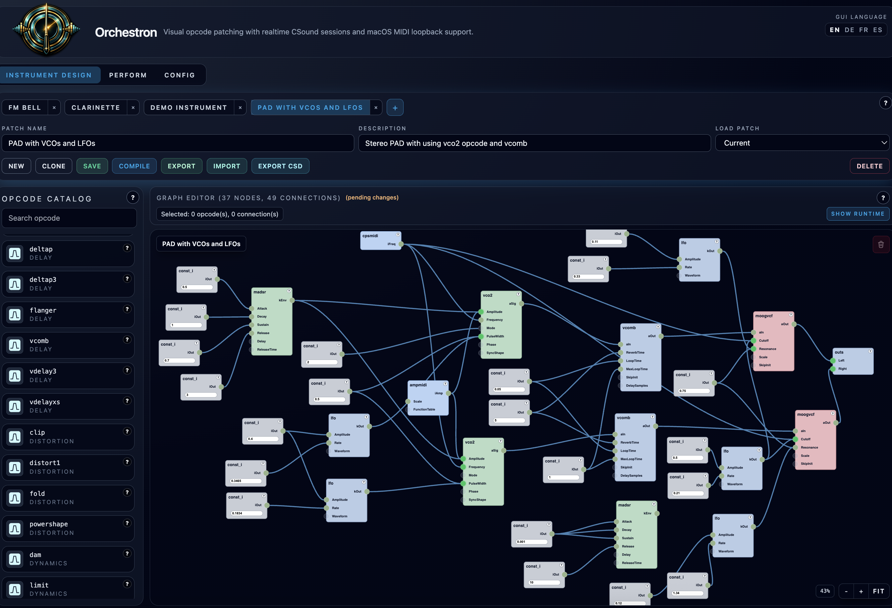
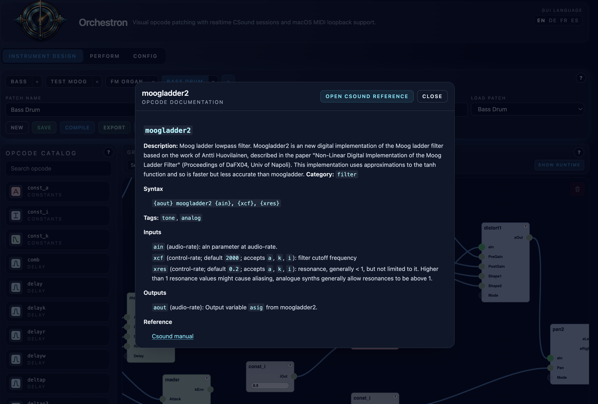
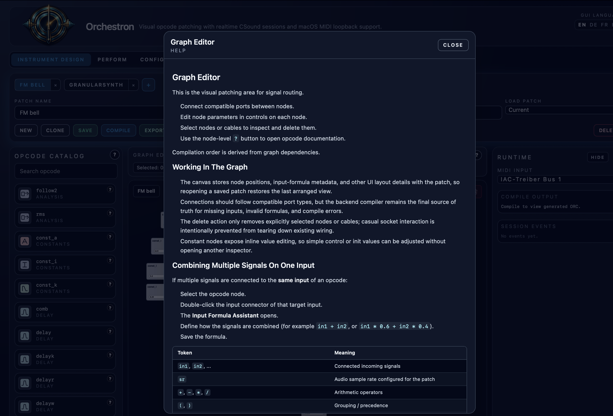
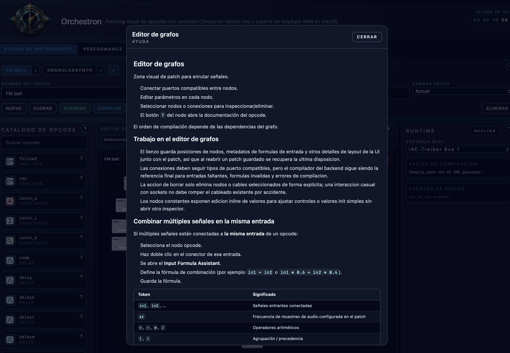
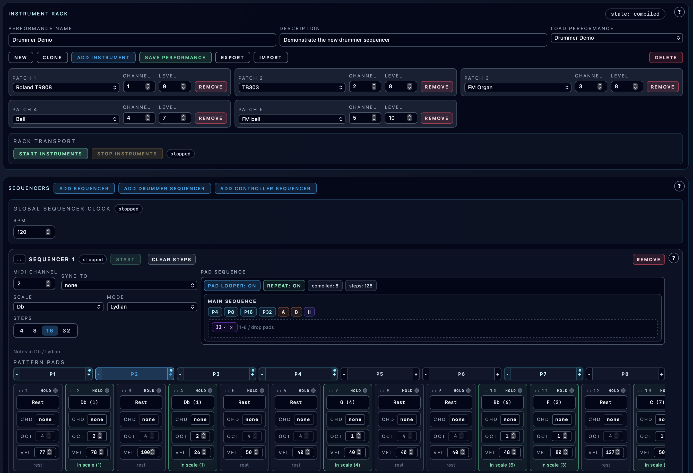
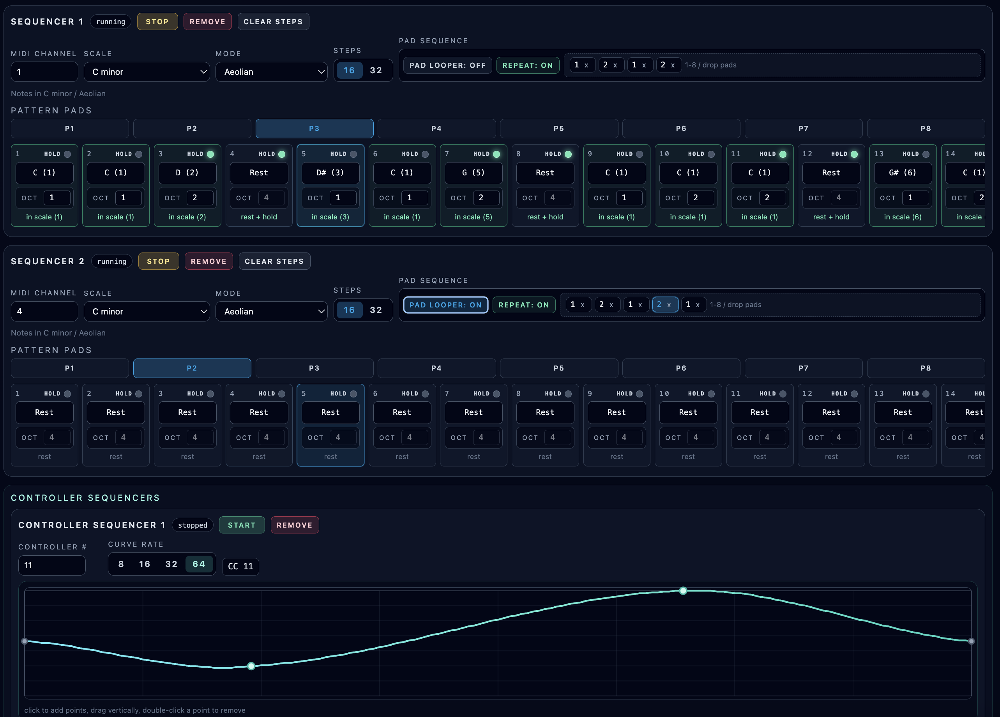
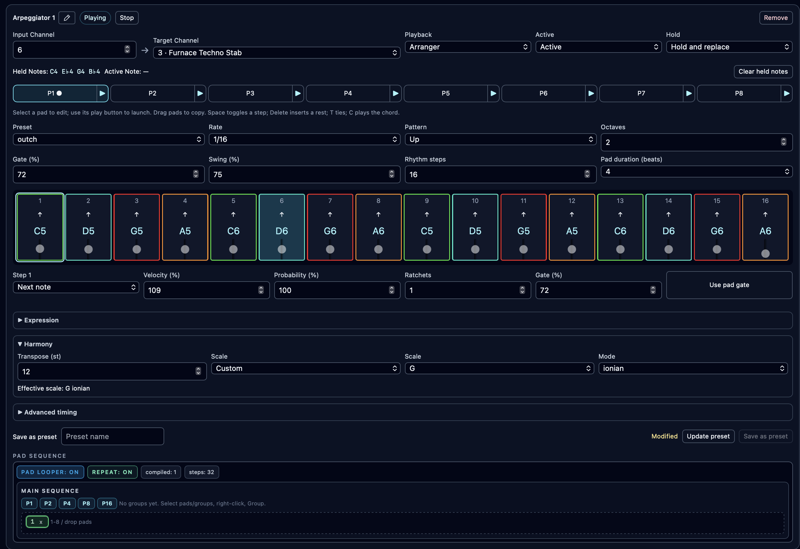
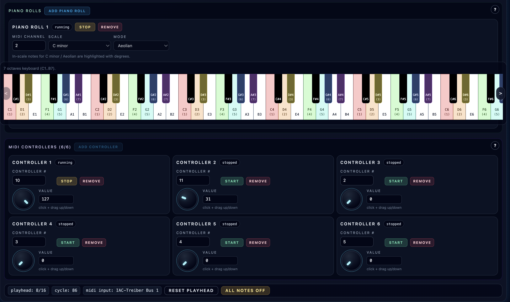
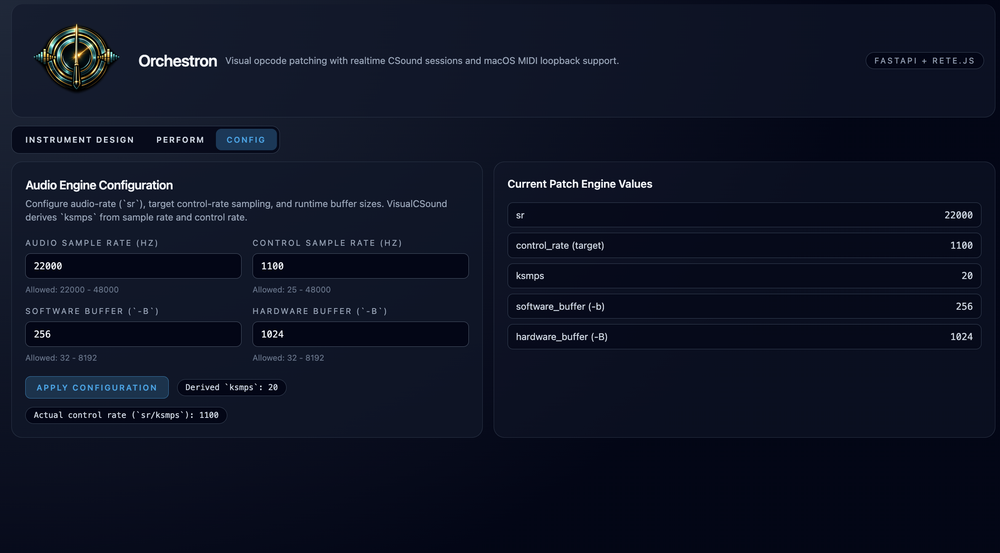
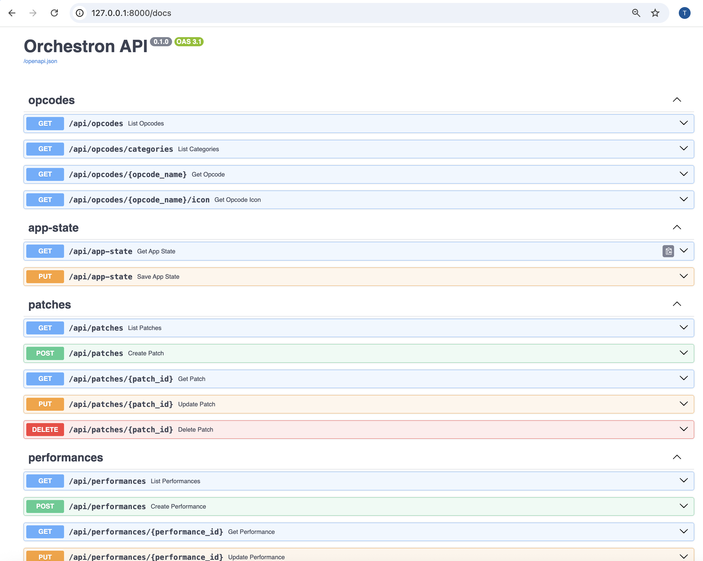

# Orchestron

Here’s the strange, delightful thing about music software: most of it assumes the instrument already exists. Then it gives you knobs. "Orchestron" flips that around.

You don’t load a synthesizer.
You invent one.

Orchestron is a visual instrument workshop built on the power of Csound — not a preset browser, not a plugin rack, not a timeline with tracks stacked like office paperwork. You design sound from signal flow upward. Oscillators, envelopes, filters, physical models, control signals — connect them, and the instrument comes alive while you hear it.

Read the complete user documentation in [user_documentation.md](documentation/user_documentation.md).

The [Audio Mixer and Routing guide](documentation/performance/audio_mixer_and_routing.md) covers Master, inserts, pre/post sends and routing repair with current screenshots. [Draft audition](documentation/instrument_design/runtime_panel_and_compilation.md#audition-a-draft) explains isolated and current-performance previews.

- Backend: FastAPI + CSound Python integration
- Frontend: React + TypeScript + Tailwind + Rete.js

## Built With Codex

This application was built using the Codex App with `GPT-5.3-Codex`, `GPT-5.4`, `GPT-5.5`, `GPT-5.6-Sol` and `GPT-6-Astra` using **Extra High** reasoning effort. I started development and expected to hit a limit at some point where things fell apart, but that never happened up to now, given me a good intuition on how powerful today's coding agents have become...

## Features

### General Features

Orchestron is a visual music and instrument-building application centered around Csound as the sound generation engine. Instead of starting from fixed instruments, you design instruments visually and perform them live inside the same app.

The application includes multilingual UI/help content and integrated help pages, with instrument-design, perform, and config help focused on the active tool, device, or engine settings so opcode references and usage guidance stay available directly in the workflow without leaving the app.

### Instrument Design

The instrument design area combines patch metadata, an opcode catalog, and a visual graph editor. You build an instrument by selecting Csound opcodes and connecting them into a signal/control graph, including numeric and string constant nodes for reusable literal values.

The catalog includes all 27 STK instrument opcodes, searchable with `stk`, with English/German/French/Spanish help. STK frequency and amplitude are init-rate; optional controller values accept control-rate modulation. Controller numbers are prefilled, and unset values preserve the instrument defaults. Playback requires Csound's `stkopd` plugin and the STK rawwave data used by sample-based models; see [STK usage](documentation/instrument_design/opcode_catalog_and_documentation.md#stk-instruments).

Designed instruments can be documented with patch descriptions up to 2048 characters and exported for reuse, including export to a `.csd` file. Patches can also be marked as templates so incomplete starter graphs can be saved without compile validation, then reused through `New from template`; template patches remain editable in Instrument Design but are hidden from the Perform instrument rack. Built-in playable instrument, drumset, audio effect, output/Master and empty templates are available even in an empty library. `Activation: MIDI notes / Continuous` controls scheduling independently of musical role; continuous sources do not require an inlet. Collapsible Stereo Input/Output blocks expose their ordinary `inleta`/`outleta` nodes, while `outs` remains identifiable as Direct Audio Output. Add Stereo Input/Output from the opcode catalog (click or drag) or the channel-mapping panel; creation and deletion keep the pair and mapping synchronized. The panel supports atomic channel renaming, explicit grouping of legacy channels with channel names stored inside the block, conversion of a selected `outs` with wiring and formulas preserved, and repair/removal of stale mappings. Grouping removes dedicated naming `const_s` nodes; shared constants remain available to other consumers without controlling the grouped names. Previously saved valid stereo groups receive the same cleanup when opened. Preview external port changes and repair affected performance routes in the mixer after saving.

**If / Switch and Drumset:** choose one synthesis case per note with one mono/stereo audio result. Drag catalog nodes or main-graph selections into expanded cases; hold Alt/Option at drag start to transfer existing case members. Transfers require connected endpoints and formula bindings to move together or already belong to the destination. Measured frames fit every parameter row, keep fixed top/left edges, and anchor Case Result at the bottom-right. Frames grow automatically and retain their size; drag Case Result to resize or shrink them within the content bounds. Sizes persist through save/reload and export/import; bright purple borders stay visible at every zoom. The drumset template maps 36/38/42 to kick/snare/hi-hat with overlapping decays. [Workflow and patch format (EN/DE/FR/ES)](documentation/instrument_design/control_flow.md).

**DE:** Katalogknoten in ausgeklappte Zweige ziehen; Alt/Option beim Ziehbeginn verschiebt Zweigmitglieder in einen anderen Bereich. Verbundene Endpunkte und Formelbindungen müssen mitwechseln oder bereits im Ziel liegen. Rahmen wachsen automatisch und behalten ihre Größe. Das Zweigergebnis unten rechts ziehen, um die Größe bis zu den Inhaltsgrenzen zu verkleinern. Größen bleiben beim Speichern und Export/Import erhalten; helle violette Rahmen bleiben bei jedem Zoom sichtbar. Das Schlagzeug nutzt 36/38/42 mit unabhängigem Ausklingen.

**FR :** Déposez les nœuds du catalogue dans les cas développés ; Alt/Option dès le début du glissement transfère leurs membres. Les extrémités connectées et liaisons de formule doivent être déplacées ensemble ou déjà appartenir à la destination. Les cadres grandissent automatiquement et conservent leur taille. Glissez le résultat en bas à droite pour les redimensionner, sans dépasser les limites du contenu. Les tailles survivent à la sauvegarde et à l’export/import ; les bordures violet clair restent visibles à tout zoom. La batterie utilise 36/38/42 avec des décroissances indépendantes.

**ES:** Arrastra nodos del catálogo a casos expandidos; Alt/Opción desde el inicio del arrastre transfiere sus miembros. Los extremos conectados y vínculos de fórmula deben moverse juntos o pertenecer ya al destino. Los marcos crecen automáticamente y conservan su tamaño. Arrastra el resultado abajo a la derecha para redimensionarlos hasta los límites del contenido. Los tamaños se conservan al guardar y exportar/importar; los bordes violeta claro se ven con cualquier zoom. La batería usa 36/38/42 con decaimientos independientes.









### Live Performance

The live performance area provides an instrument rack where instruments can be selected and assigned to MIDI channels. A melodic sequencer can then drive those instruments, with scale and mode selection, note entry that supports choosing notes both in-scale and out-of-scale, and per-step chord choices including the standard `5` power-chord voicing (root + perfect fifth). Performances support up to 16 melodic, 16 drummer, and 16 controller sequencers. `tempoBPM` stays global, while every melodic sequencer, drummer sequencer, and controller sequencer now has its own meter (`2..7` over `4` or `8`), grid in steps per beat (`2`, `4`, or `8`), and beat ratio (`1:1`, `2:1`, `3:2`, `4:3`, `3:4`, `5:4`, `4:5`, `7:4`). That makes polymeter and true per-sequencer polyrhythm possible inside one performance.

The Perform page includes a collapsible mixer below the rack with instrument and return strips, a pinned Master, real audio faders, pan/balance knobs, mute/solo, pre/post sends, inserts and peak/RMS meters. Source routing, a stereo destination matrix and an expandable routing diagram share explicit connections. Rack/topology edits lock while instruments run; mixer controls stay live. Direct output bypasses Master and retains its own strip controls. See [Audio mixer and routing](documentation/performance/audio_mixer_and_routing.md).

Mixer settings persist in performance version 11 and app-state version 2, including native JSON/ZIP and both performance CSD modes. Legacy Level values migrate to dB and no longer scale MIDI velocity. Offline exports retain 48 kHz, `ksmps=1` and float WAV output. Instrument Design also offers temporary isolated/current-performance auditioning: prepare first, then explicitly stop and audition; closing restores the original state and playhead with transport stopped.

The `orchestron-performance-creator` CLI has parity with the rack's always-on routing workflow. `edit instruments list` discovers stable rack binding IDs and `inleta`/`outleta` labels; `edit routes add/remove/clear/list` builds arbitrary instrument-to-effect and effect-to-effect chains with backend validation and feedback-loop rejection. `edit add-standard-effects` remains an idempotent shortcut for the reverb, compressor, and speaker-output send/dry matrix. Use `edit create-runtime --start` for a new CLI-owned engine session and `edit rebuild-runtime` after rack or route changes.

A controller sequencer lets you define a curve that is sent to the backend sequencer and emitted there as timed MIDI Control Change messages for a selected controller number. Melodic and drummer pads are sized in beats (`1..8`), which makes one-bar pads possible in odd meters such as `3/4`, `5/4`, or `7/8`, while controller pads extend to `16` beats for longer repeating automation. Beat ratios change how quickly each sequencer advances across the shared transport without introducing float drift in the backend runtime clock, and running controller sequencers now queue pad changes on loop boundaries the same way the note sequencers do.

Arpeggiator devices act as backend-run virtual instruments. Each arpeggiator owns a unique input MIDI channel, consumes notes sent to that channel, and emits arpeggiated notes to a selected target instrument channel. They can be driven by melodic sequencers, piano rolls, drummer/external MIDI note sources, or any controller that sends notes to the arpeggiator input channel. Arpeggiator cards expose the same integrated multilingual `?` help flow as the other perform devices. Presets and user-saved arpeggiator settings are stored with performances.

Drummer sequencer LEDs show the current playing column across every drum row, and vertical velocity drags now display a live numeric readout in addition to the existing saturation-based feedback.

From the instrument rack you can now export either the native Orchestron performance bundle (`.orch.json` / `.orch.zip`) or an offline Csound render package (`.csd.zip`). `Export CSD (MIDI)` includes the compiled performance CSD, the arranger playback as MIDI, uploaded sample/SF assets, and a README with the exact `csound` command line. `Export CSD (SCORE)` embeds arranger notes and controller sequencer sweeps as standard Csound score events, omits the `.mid`, and rewrites supported MIDI opcodes for score playback. Both CSD render modes seed enabled manual MIDI Controller lane values at time 0 on each assigned instrument channel, then write 32-bit float WAV output to avoid baking 16-bit clipping into hot mixes. Always-on effect instruments are exported with `alwayson` and a finite score duration extended by the release tail buffer. GEN01 and `sfload` sample loading require uploaded or imported assets; raw backend filesystem paths are rejected before compile/start.

Implementation details for always-on effect instruments are documented in [EFFECT_INSTRUMENTS.md](EFFECT_INSTRUMENTS.md).

The multitrack arranger combines melodic sequencers, drummer sequencers, and controller sequencers in one shared timeline. Cassette-style transport controls start only sequencers with `Pad Looper` enabled and stop arranger-driven pad-loop sequencers without stopping manually started non-pad-loop sequencers or the rack instrument engine; `Play` also stops sequencers whose `Pad Looper` is off so arranger playback stays synchronized. Rewind/fast-forward move in shared `1-beat` transport blocks, double-clicking `Stop` resets to the selected loop start or step `0`, an optional loop selection repeats only the chosen arranger range down to a single beat, right-click menus can insert pads or existing group/super-group tokens and copy/paste selected phrase blocks into later gaps or the sequence end, and the section now exposes the same integrated `?` help flow as the other perform devices.

The piano roll follows the active scale/mode (from the running melodic sequencer) and highlights keys by scale degree. When multiple melodic sequencers run with different scales/modes, only keys shared by both scales/modes are highlighted, which supports interactive playing with clear harmonic guidance. Piano roll `Start` is independent from the arranger transport and can start the instrument engine without starting arrangement playback.

The [`perf_controller` virtual opcode](documentation/performance/performance_controllers.md) adds independent I-rate knobs to each rack instrument for ADSR times, distortion, and other performance settings. Controls support linear/logarithmic scales, precise entry, and reset to patch defaults. New notes use changed values; continuous instruments require a rack restart. Save Performance, native bundles, and both Csound exports preserve the settings.

The MIDI controller panel provides 6 controllers that can each be assigned an individual controller number and operated interactively while playing.









### Configuration

The configuration view exposes audio settings and performance-related engine parameters, including audio sampling rate, control sampling rate, and buffer sizes.



### Backend

Orchestron is a two-tier application with a FastAPI backend handling the service layer and integration points for the frontend and Csound engine. A detailed backend and endpoint reference lives in [BACKEND.md](BACKEND.md).

Bundle imports are size-limited before parsing. Defaults are 256 MiB for the compressed request body (`VISUALCSOUND_BUNDLE_IMPORT_MAX_BYTES`), 8 MiB for import JSON (`VISUALCSOUND_BUNDLE_IMPORT_JSON_MAX_BYTES`), 512 ZIP entries (`VISUALCSOUND_BUNDLE_IMPORT_ZIP_MAX_MEMBERS`), and 256 MiB total uncompressed ZIP content (`VISUALCSOUND_BUNDLE_IMPORT_ZIP_MAX_UNCOMPRESSED_BYTES`). Persistent JSON documents are also capped before storage: app state defaults to 8 MiB (`VISUALCSOUND_APP_STATE_MAX_BYTES`), patch graphs to 4 MiB (`VISUALCSOUND_PATCH_GRAPH_MAX_BYTES`), patch UI layout metadata to 1 MiB (`VISUALCSOUND_PATCH_UI_LAYOUT_MAX_BYTES`), performance configs to 8 MiB (`VISUALCSOUND_PERFORMANCE_CONFIG_MAX_BYTES`), and individual nested persisted JSON strings to 64 KiB (`VISUALCSOUND_PERSISTED_JSON_STRING_MAX_BYTES`). GEN node table configuration is also semantically capped before storage and Csound emission: table size is limited to 4,194,304 samples, `tableSize=0` is allowed only for `GEN01`, raw/structured argument lists are limited to 512 entries, raw argument text is limited to 8192 characters, and raw argument tokens are limited to 512 characters. Individual uploaded or bundled GEN audio/SoundFont assets are limited by `VISUALCSOUND_GEN_AUDIO_ASSET_MAX_BYTES` (64 MiB by default), and persistent generated-asset storage is capped by `VISUALCSOUND_GEN_AUDIO_ASSETS_MAX_TOTAL_BYTES` (1 GiB by default) and `VISUALCSOUND_GEN_AUDIO_ASSETS_MAX_COUNT` (1024 assets by default). Startup and quota-retry garbage collection removes unreferenced generated assets older than `VISUALCSOUND_GEN_AUDIO_ASSET_GC_MIN_AGE_SECONDS` (24 hours by default). Offline performance CSD export also rejects looping playback, playback ranges above 65,536 transport steps, oversized step note lists, and MIDI event budgets above 200,000 before synthesis starts. Browser-clock manual MIDI is also guarded by `VISUALCSOUND_BROWSER_CLOCK_MANUAL_MIDI_MAX_FUTURE_MS`, `VISUALCSOUND_BROWSER_CLOCK_MANUAL_MIDI_RATE_PER_SECOND`, `VISUALCSOUND_BROWSER_CLOCK_MANUAL_MIDI_BURST`, and `VISUALCSOUND_ARPEGGIATOR_PENDING_INPUT_MAX_EVENTS`. Session event WebSocket observers are bounded by `VISUALCSOUND_SESSION_EVENT_WS_MAX_SUBSCRIPTIONS_TOTAL`, `VISUALCSOUND_SESSION_EVENT_WS_MAX_SUBSCRIPTIONS_PER_SESSION`, `VISUALCSOUND_SESSION_EVENT_WS_CONNECT_RATE_PER_MINUTE`, and `VISUALCSOUND_SESSION_EVENT_WS_CONNECT_RATE_BURST`.



## Quick Start

Choose the installation guide that matches your environment. The platform guides cover native development setup, and the Docker guide covers the containerized deployment workflow. All supported runtimes now use the same browser-clock audio path.

- [macOS installation](INSTALL.macos.md)
- [Linux installation](INSTALL.linux.md)
- [Windows installation](INSTALL.windows.md)
- [Docker installation](INSTALL.docker.md)

To make sound quickly, open [http://localhost:8000/](http://localhost:8000/) (it redirects to `/client`), then in `Instrument Design` import an instrument from [`examples/instruments/`](examples/instruments/). Switch to the `Perform` panel, add the instrument to the performance, add a piano roll keyboard if it is not already visible, set its MIDI channel to match the instrument channel, then go to the piano keyboards, press `Start`, and play.

**Troubleshooting**: if audio output is chopped, increase the hardware and software buffer sizes in the configuration settings.

All runtimes now use `browser_clock` mode: a dedicated browser audio worker owns the PCM WebSocket, render refills, and SharedArrayBuffer writes, while `AudioContext` + `AudioWorklet` own final playback. The backend renders Csound blocks on demand with `performKsmps()` and returns PCM-timed transport markers, so React highlighting observes audible state without participating in the audio refill path. Internal app MIDI always uses an engine-local timestamped scheduler through the built-in `internal:loopback` path, so sequencers, piano rolls, and manual controller lanes work even when no OS MIDI devices exist. The session `MIDI Input` binding is therefore for external hardware or DAW MIDI only. External MIDI is optional and arrives through the native Rust host bridge in [`host-midi-helper/`](host-midi-helper/README.md). Headless Csound performance messages are suppressed by default to keep render timing independent of Docker/stdout logging. Set `VISUALCSOUND_CSOUND_PERFORMANCE_LOGGING=true` temporarily when diagnosing Csound performance output.

Runtime session creation is bounded to protect Csound worker resources. Deployments can tune the global active-session cap with `VISUALCSOUND_SESSION_MAX_ACTIVE`, the per-client cap with `VISUALCSOUND_SESSION_MAX_ACTIVE_PER_CLIENT`, the create-rate token bucket with `VISUALCSOUND_SESSION_CREATE_RATE_PER_MINUTE` and `VISUALCSOUND_SESSION_CREATE_RATE_BURST`, idle cleanup with `VISUALCSOUND_SESSION_IDLE_TIMEOUT_SECONDS`, and session event WebSocket observer capacity/rate with `VISUALCSOUND_SESSION_EVENT_WS_MAX_SUBSCRIPTIONS_TOTAL`, `VISUALCSOUND_SESSION_EVENT_WS_MAX_SUBSCRIPTIONS_PER_SESSION`, `VISUALCSOUND_SESSION_EVENT_WS_CONNECT_RATE_PER_MINUTE`, and `VISUALCSOUND_SESSION_EVENT_WS_CONNECT_RATE_BURST`.

## Orchestron Agent CLI Skills

The patch skill includes an optional [Mel and log-STFT spectrogram utility](integrations/skills/orchestron-patch-creator/references/audio_validation.md) for final visual checks of rendered instrument auditions, including stereo channels and effect tails.

The agent-facing patch CLI lives in [`integrations/skills/orchestron-patch-creator/`](integrations/skills/orchestron-patch-creator/) and creates Instrument Design patches from structured specs, including patch graph input formulas such as `0.1 * in1`. Generated patches end in a mapped **Stereo Output** block with named `left`/`right` channels; route this group through the performance mixer to Master. The performance CLI lives in [`integrations/skills/orchestron-performance-creator/`](integrations/skills/orchestron-performance-creator/) and stages songs/performances through the backend, including stable rack assignments, arbitrary always-on audio routing, sequencers, pad loops, arranger material, runtime creation/rebuild, and patch formula edits on existing patches. See the skill-local references for effect routes, patch specs, score specs, and formula commands.

For per-performance sound customization, patch specs support [`performance_controllers`](integrations/skills/orchestron-patch-creator/references/performance_controllers.md) targeting named opcode inputs. The performance CLI provides [`edit performance-controllers list/set/reset`](integrations/skills/orchestron-performance-creator/references/performance_controllers.md) with stable binding and node IDs. It saves version-12 snapshots, preserves instance overrides in imports and runtimes, and uses `edit push-runtime` for live updates without rebuilding the rack. Commit separately to save; always-on instruments require restart to adopt new settings.

## MIDI on macOS

Enable the **IAC Driver** in Audio MIDI Setup and route MIDI output from your DAW/software into the selected IAC bus. When you want that external MIDI to reach VisualCSound, run the host bridge described in [`host-midi-helper/README.md`](host-midi-helper/README.md) so the backend can receive CoreMIDI events with host timestamps.

## MIDI Pulse CLI (jitter probe)

This repository includes a native macOS MIDI pulse emitter to help isolate timing jitter outside the main app/Csound path.

Build:

```bash
make midi-pulse-build
```

List MIDI destinations:

```bash
./tools/midi_pulse --list
```

Send periodic notes:

```bash
./tools/midi_pulse --dest 0 --channel 1 --note 60 --interval-ms 10 --gate 0.25 --count 2000
```

Useful flags:
- `--dest <name|index>`: destination by index (from `--list`) or name
- `--report-every <N>`: periodic timing summary in milliseconds
- `--verbose`: per-note lateness output

## MIDI Stats CLI (receiver probe)

This repository also includes a native macOS MIDI receiver for measuring incoming event interval/jitter.

Build:

```bash
make midi-stats-build
```

List MIDI sources:

```bash
./tools/midi_stats --list
```

Receive and report every 200 matching events:

```bash
./tools/midi_stats --dest 0 --channel 1 --report-every 200
```
