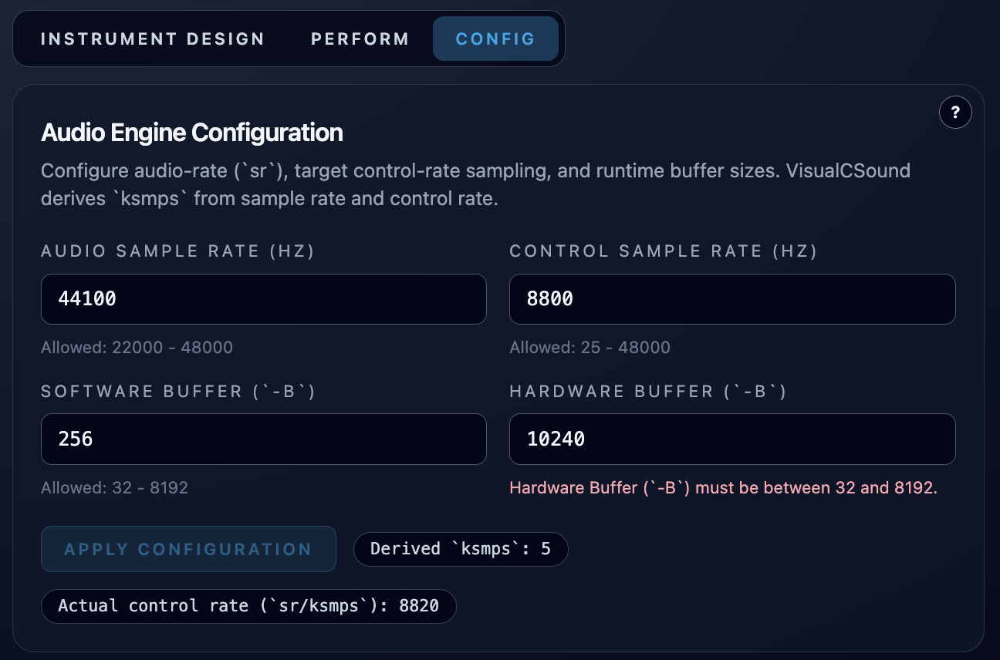

# Audio Engine Settings (Config Page)

**Navigation:** [Up](configuration.md) | [Prev](gui_language_and_integrated_help.md) | [Next](midi_setup_and_inputs.md)

The Config page controls patch-level Csound engine timing and buffer settings.

## Where These Settings Are Stored

Config page changes are stored in the current patch's `graph.engine_config`.

That means:

- different patches can use different engine settings
- switching patches can change the visible Config page values

## Editable Settings (Config Page)

### Audio Sample Rate (`sr`)

- Field label: `Audio Sample Rate (Hz)`
- Allowed range: **22000 .. 48000**
- Integer only

### Control Sample Rate (`control_rate` target)

- Field label: `Control Sample Rate (Hz)`
- Allowed range: **25 .. 48000**
- Integer only

This is the target control-rate value used to derive `ksmps`.

### Software Buffer (`-b`)

- Field label: `Software Buffer (-b)`
- Allowed range: **32 .. 8192**
- Integer only

### Hardware Buffer (`-B`)

- Field label: `Hardware Buffer (-B)`
- Allowed range: **32 .. 8192**
- Integer only

## Derived Values Shown In The UI

The Config page previews derived values before applying:

- Derived `ksmps`
- Actual control rate (`sr / ksmps`)

This helps you see the real runtime effect of your target control-rate choice.

## Current Patch Engine Values (Read-Only Panel)

The right-side panel shows the normalized engine values stored in the patch:

- `sr`
- `control_rate`
- `ksmps`
- `software_buffer`
- `hardware_buffer`

Use this panel to verify what will be used at compile/start time.

## Validation Behavior

The page validates:

- integer format
- allowed range

`Apply Configuration` is disabled until all visible values are valid.

## Apply Configuration

`Apply Configuration` writes the new engine settings into the current patch state.

Practical effect:

- future compile/start operations for the patch use the updated engine config
- the patch must still be saved if you want the change persisted in the patch library

## Other Engine Fields Present But Not Edited In UI

The patch engine config also contains values such as:

- `nchnls` (default `2`)
- `0dbfs` (default `1`)

These are part of the patch model, but the current Config page focuses on the user-facing timing and buffer controls listed above.

## Tuning Tips

- Lower buffers reduce latency but increase glitch risk.
- Higher buffers improve stability but increase latency.
- Use the Runtime panel and live testing to find a stable setting for your machine and patch complexity.

## Screenshots

  

<em>Config page audio engine settings in a valid state.</em>

  

<em>Config page validation messages with invalid values entered.</em>

**Navigation:** [Up](configuration.md) | [Prev](gui_language_and_integrated_help.md) | [Next](midi_setup_and_inputs.md)
