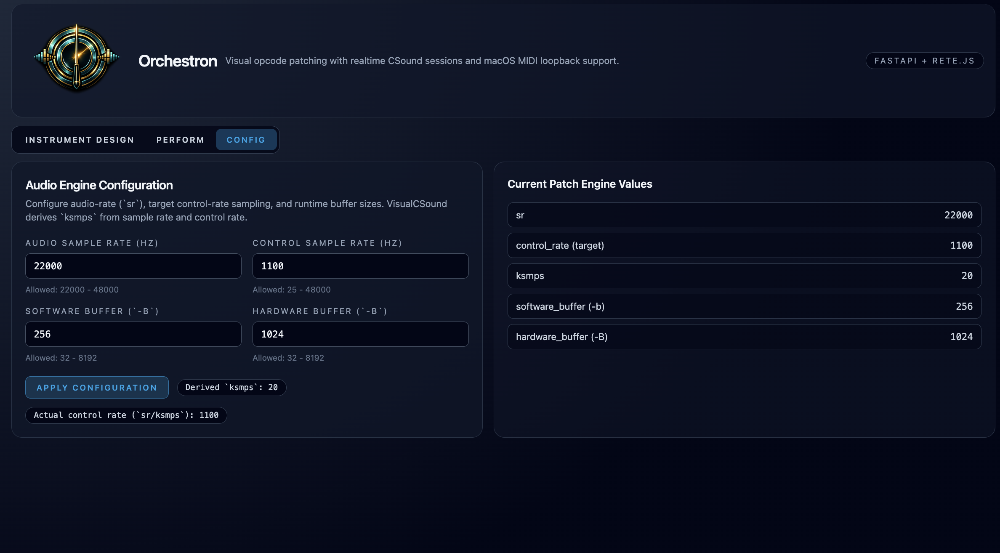
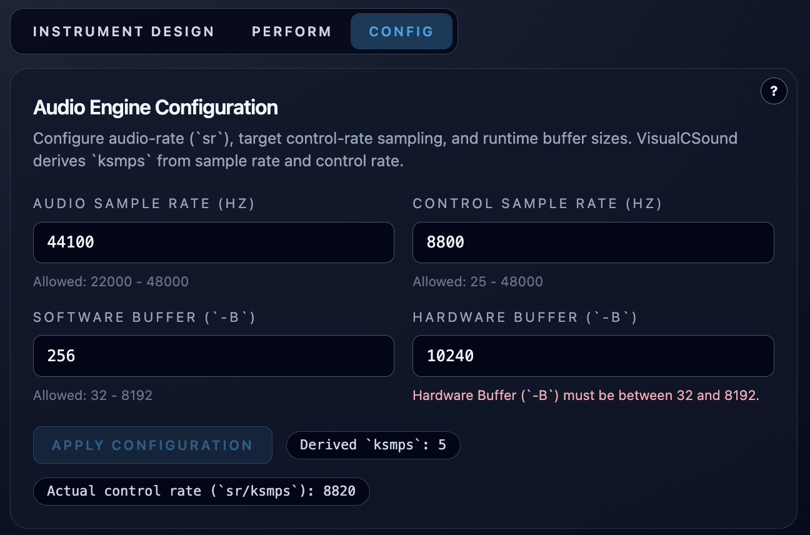

# Audio Engine Settings (Config Page)

**Navigation:** [Up](configuration.md) | [Prev](gui_language_and_integrated_help.md) | [Next](midi_setup_and_inputs.md)

The Config page controls both patch-level Csound engine settings and, when `browser_clock` audio is active, browser-clock latency settings for the current workspace.

## Where These Settings Are Stored

Config page changes are stored in the current patch's `graph.engine_config`.

That means:

- different patches can use different engine settings
- switching patches can change the visible Config page values

Browser-clock latency settings are different:

- they appear only when the backend runtime mode is `browser_clock`
- they are stored in app state, not in the patch
- applying them updates the active browser-clock controller without changing patch data

## Editable Settings (Config Page)

### Patch Engine Section

### Audio Sample Rate (`sr`)

- Field label: `Audio Sample Rate (Hz)`
- Allowed range: **22000 .. 48000**
- Integer only

### Control Sample Rate (`control_rate` target)

- Field label: `Control Sample Rate (Hz)`
- Allowed range: **25 .. 48000**
- Integer only

This is the target control-rate value used to derive `ksmps`.

### Software Buffer (`-b`)

- Field label: `Software Buffer (-b)`
- Allowed range: **32 .. 8192**
- Integer only

### Hardware Buffer (`-B`)

- Field label: `Hardware Buffer (-B)`
- Allowed range: **32 .. 8192**
- Integer only

## Derived Values Shown In The UI

The Config page previews derived values before applying:

- Derived `ksmps`
- Actual control rate (`sr / ksmps`)

This helps you see the real runtime effect of your target control-rate choice.

## Current Patch Engine Values (Read-Only Panel)

The right-side panel shows the normalized engine values stored in the patch:

- `sr`
- `control_rate`
- `ksmps`
- `software_buffer`
- `hardware_buffer`

Use this panel to verify what will be used at compile/start time.

## Browser-Clock Latency Section

When the backend is running in `browser_clock` mode, the Config page shows an additional section for browser-owned audio latency tuning.

See [Browser-Clock Latency](browser_clock_latency.md) for the Docker/browser-clock workflow explanation and the full UI screenshot of this section.

Editable fields:

- steady queue low water / high water (`ms`)
- startup queue low water / high water (`ms`)
- underrun recovery boost / maximum underrun boost (`ms`)
- maximum blocks per render request
- steady / startup / recovery parallel request limits
- immediate note render blocks
- immediate note render cooldown (`ms`)

These values control the browser PCM queue depth and render request behavior, which are the dominant latency/stability knobs on the Docker/browser-clock path.

### Field-By-Field Meaning

#### Steady Low Water / Steady High Water

- These define the normal browser PCM queue target after startup is complete.
- Lower values reduce live-play latency.
- Higher values make clicks and underruns less likely.

#### Startup Low Water / Startup High Water

- These define the larger queue target used while the stream is still priming after connect or after an underrun recovery phase.
- They are usually kept above the steady values so the stream can stabilize before dropping into lower-latency playback.

#### Underrun Recovery Boost / Max Underrun Boost

- When the browser detects underruns, VisualCSound temporarily adds extra queue headroom.
- `Underrun Recovery Boost` controls how much extra buffer is added per underrun event.
- `Max Underrun Boost` limits how far that temporary recovery buffer can grow.

#### Max Blocks Per Request

- Caps the maximum backend render chunk size requested in one browser-clock render request.
- Smaller values reduce head-of-line delay for live notes.
- Larger values reduce request overhead but can make live interaction feel less immediate.

#### Steady / Startup / Recovery Parallel Requests

- These limits control how many render requests may remain in flight at once.
- More parallelism can keep the queue full more aggressively.
- Too much parallelism can also create larger bursts and less predictable latency.

#### Immediate Note Render Blocks / Immediate Note Render Cooldown

- A live `note_on` sends a small urgent render request in addition to the normal refill logic.
- `Immediate Note Render Blocks` sets the size of that urgent render burst.
- `Immediate Note Render Cooldown` throttles how often these urgent requests can be sent.
- These controls help manual piano playing feel more responsive, but values that are too aggressive can reintroduce clicks.

### Practical Adjustment Order

1. Start with `steady low/high water`.
2. If clicks remain, raise the steady or startup watermarks slightly.
3. If latency still feels too high, reduce `max blocks per request` carefully.
4. Only then tune immediate note render and parallel request limits.

## Validation Behavior

The page validates:

- integer format
- allowed range
- high-water fields must be greater than their matching low-water fields

`Apply Configuration` is disabled until all visible values are valid.

## Apply Configuration

`Apply Configuration` writes the new engine settings into the current patch state.

Practical effect:

- future compile/start operations for the patch use the updated engine config
- the patch must still be saved if you want the change persisted in the patch library

`Apply Browser-Clock Settings` writes the browser-clock latency settings into app state and refreshes the active browser-clock controller if one is connected.

## Other Engine Fields Present But Not Edited In UI

The patch engine config also contains values such as:

- `nchnls` (default `2`)
- `0dbfs` (default `1`)

These are part of the patch model, but the current Config page focuses on the user-facing timing and buffer controls listed above.

## Tuning Tips

- Lower buffers reduce latency but increase glitch risk.
- Higher buffers improve stability but increase latency.
- Use the Runtime panel and live testing to find a stable setting for your machine and patch complexity.
- On the browser-clock path, start by adjusting browser-clock low/high water, render blocks, and parallel request limits before changing patch `-b/-B`.

## Screenshots

  

<em>Config page audio engine settings in a valid state.</em>

  

<em>Config page validation messages with invalid values entered.</em>

<em>The dedicated [Browser-Clock Latency](browser_clock_latency.md) chapter shows the browser-clock tuning section in detail.</em>

**Navigation:** [Up](configuration.md) | [Prev](gui_language_and_integrated_help.md) | [Next](midi_setup_and_inputs.md)
