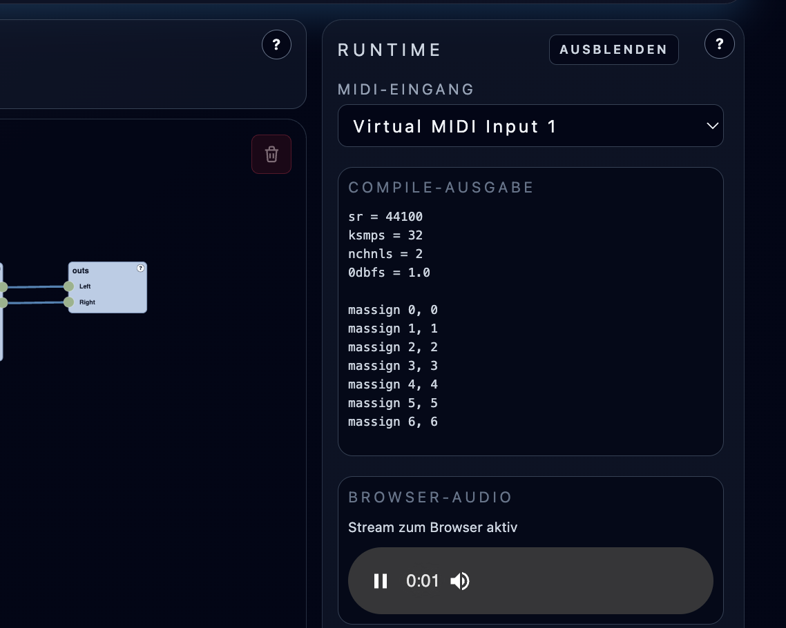

# Browser Audio Streaming (WebRTC)

**Navigation:** [Up](configuration.md) | [Prev](midi_setup_and_inputs.md) | [Next](persistence_and_defaults.md)

Orchestron supports two audio output modes:

- `local` - Csound outputs to a local realtime audio backend (DAC)
- `streaming` - Csound runs headless and audio is streamed to the browser via WebRTC

This page explains what users need to know when using browser audio streaming, especially in Docker/remote setups.

## Why Streaming Mode Exists

Streaming mode makes Orchestron usable in environments where local device passthrough is not practical, especially:

- Docker Desktop on macOS
- remote or containerized backend runs

## How To Enable Streaming Mode

Streaming mode is selected at backend startup, for example via:

- CLI argument `--audio-output-mode streaming`
- environment variable `VISUALCSOUND_AUDIO_OUTPUT_MODE=streaming`

Accepted user-friendly aliases such as `browser` / `webrtc` are normalized to `streaming` internally.

## What Changes In The UI (User View)

When a session starts in streaming mode:

- the Runtime panel shows a `Browser Audio` section
- Orchestron attempts to establish a WebRTC audio connection automatically
- an audio player appears in the Runtime panel when browser audio is available
- status text shows connection state (`connecting`, `live`, `error`)

When the backend runs in local mode:

- audio plays through the backend host's local audio device path
- the Runtime panel reflects local output mode instead of a live browser stream

## Docker Workflow (Recommended Streaming Use Case)

The repository's `docker-compose.yaml` is built around streaming mode and includes a TURN server service for reliable WebRTC connectivity between browser and backend container.

Practical workflow:

1. Start `docker compose up --build`
2. Open `http://localhost:8000/client`
3. Start instruments/session normally
4. Browser audio should connect automatically in the Runtime panel

## Browser Audio Troubleshooting

### Browser Audio Shows Error

Check:

- backend really started in `streaming` mode
- WebRTC dependencies are installed on backend (aiortc/av in streaming setup)
- TURN/ICE config if running across hosts/networks

### Browser Blocks Autoplay

Some browsers block autoplay until user interaction.

- Use the Runtime panel audio control to start playback manually if needed.

### Docker Remote Access / ICE Issues

If accessing from another device, TURN external IP configuration may be required. See `WEBRTC_STREAMING.md` for deployment-specific notes.

## Latency Tuning (Advanced)

The project includes WebRTC audio queue/frame tuning environment variables (documented in `WEBRTC_STREAMING.md`), for example:

- `VISUALCSOUND_WEBRTC_AUDIO_FRAME_MS`
- `VISUALCSOUND_WEBRTC_AUDIO_QUEUE_FRAMES_MAX`
- `VISUALCSOUND_WEBRTC_AUDIO_QUEUE_FRAMES_TARGET`
- `VISUALCSOUND_WEBRTC_AUDIO_FLUSH_ON_CONNECT`
- `VISUALCSOUND_WEBRTC_AUDIO_STARTUP_KEEP_FRAMES`

Lower-latency settings can improve responsiveness but increase dropout risk.

## When To Prefer Local Mode vs Streaming Mode

Prefer `local` when:

- backend and audio device are on the same machine
- you want the simplest realtime path

Prefer `streaming` when:

- running in Docker (especially on macOS Docker Desktop)
- using a remote backend
- you want browser-based audio output from the backend session

## Screenshots

  

<em>Browser audio streaming state in the Runtime panel (WebRTC mode).</em>

**Navigation:** [Up](configuration.md) | [Prev](midi_setup_and_inputs.md) | [Next](persistence_and_defaults.md)
