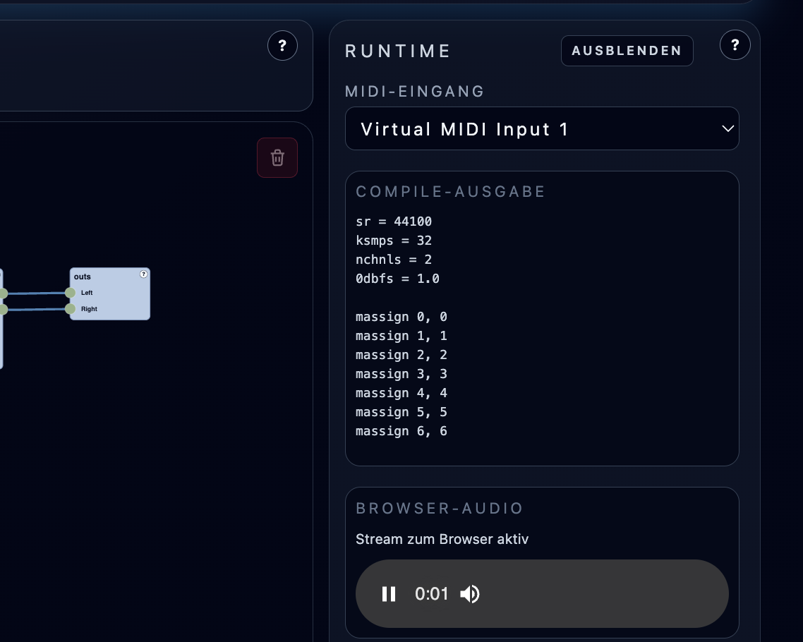

# Browser Audio Streaming (WebRTC)

**Navigation:** [Up](configuration.md) | [Prev](midi_setup_and_inputs.md) | [Next](persistence_and_defaults.md)

Orchestron supports two audio output modes:

- `local` - Csound outputs to a local realtime audio backend (DAC)
- `streaming` - Csound runs headless and audio is streamed to the browser via WebRTC
- `browser_clock` - Csound runs headless and the browser owns PCM buffering/playback via Web Audio

This page explains the two browser-audio modes. `browser_clock` is now the recommended Docker mode. `streaming` remains available when you specifically want the WebRTC transport.

## Why Streaming Mode Exists

Browser-output modes make Orchestron usable in environments where local device passthrough is not practical, especially:

- Docker Desktop on macOS
- remote or containerized backend runs

## How To Enable Streaming Mode

Browser audio mode is selected at backend startup, for example via:

- CLI argument `--audio-output-mode streaming`
- environment variable `VISUALCSOUND_AUDIO_OUTPUT_MODE=streaming`
- CLI argument `--audio-output-mode browser_clock`
- environment variable `VISUALCSOUND_AUDIO_OUTPUT_MODE=browser_clock`

Accepted user-friendly aliases such as `browser` / `webrtc` are normalized to `streaming` internally.
Accepted user-friendly aliases such as `browser-clock` / `pcm` are normalized to `browser_clock` internally.

## What Changes In The UI (User View)

When a session starts in `streaming` mode:

- the Runtime panel shows a `Browser Audio` section
- Orchestron attempts to establish a WebRTC audio connection automatically
- an audio player appears in the Runtime panel when browser audio is available
- status text shows connection state (`connecting`, `live`, `error`)

When a session starts in `browser_clock` mode:

- the Runtime panel still shows a `Browser Audio` section
- the browser opens a controller WebSocket and claims ownership of the PCM queue
- audio plays through `AudioContext` + `AudioWorklet`, not a WebRTC `<audio>` element
- sequencer runtime status is updated from render chunks instead of the old 80 ms REST poll

When the backend runs in local mode:

- audio plays through the backend host's local audio device path
- the Runtime panel reflects local output mode instead of a live browser stream

## Docker Workflow (Recommended Browser-Clock Use Case)

The repository's `docker-compose.yaml` now defaults to `browser_clock` mode. The browser becomes the master clock and requests PCM chunks from the backend as its queue drops below target.

Practical workflow:

1. Start `docker compose up --build`
2. Open `http://localhost:8000/client`
3. Start instruments/session normally
4. Browser audio should connect automatically in the Runtime panel and prime its PCM queue

## Browser Audio Troubleshooting

### Browser Audio Shows Error

Check:

- backend really started in the intended mode (`browser_clock` or `streaming`)
- for `browser_clock`, make sure COOP/COEP headers are preserved by any reverse proxy
- for `streaming`, verify WebRTC dependencies are installed on backend (aiortc/av) and TURN/ICE config is correct if running across hosts/networks

### Browser Blocks Autoplay

Some browsers block autoplay or suspend Web Audio until user interaction.

- In `streaming` mode, use the Runtime panel audio control if needed.
- In `browser_clock` mode, click/tap the page once so the AudioContext can resume.

### Docker Remote Access / ICE Issues

If you are using `streaming` across devices or networks, TURN external IP configuration may be required. See `WEBRTC_STREAMING.md` for deployment-specific notes.

## Latency Tuning (Advanced)

For `streaming`, the project includes WebRTC audio queue/frame tuning environment variables (documented in `WEBRTC_STREAMING.md`), for example:

- `VISUALCSOUND_WEBRTC_AUDIO_FRAME_MS`
- `VISUALCSOUND_WEBRTC_AUDIO_QUEUE_FRAMES_MAX`
- `VISUALCSOUND_WEBRTC_AUDIO_QUEUE_FRAMES_TARGET`
- `VISUALCSOUND_WEBRTC_AUDIO_FLUSH_ON_CONNECT`
- `VISUALCSOUND_WEBRTC_AUDIO_STARTUP_KEEP_FRAMES`

Lower-latency settings can improve responsiveness but increase dropout risk.

For `browser_clock`, latency is primarily controlled by the browser-side queue thresholds and `ksmps` render chunk requests rather than the WebRTC frame queue.

## When To Prefer Local Mode vs Browser Modes

Prefer `local` when:

- backend and audio device are on the same machine
- you want the simplest realtime path

Prefer `browser_clock` when:

- running in Docker, especially on macOS Docker Desktop
- you want the browser to be the master clock for audio buffering and sequencer status
- you want to avoid WebRTC/TURN setup entirely

Prefer `streaming` when:

- you specifically want the WebRTC media-track transport
- using a remote backend
- you want browser-based audio output but need to stay on the legacy streaming path

## Screenshots

  

<em>Browser audio streaming state in the Runtime panel (WebRTC mode). A refreshed browser-clock Runtime panel screenshot should be added separately.</em>

**Navigation:** [Up](configuration.md) | [Prev](midi_setup_and_inputs.md) | [Next](persistence_and_defaults.md)
