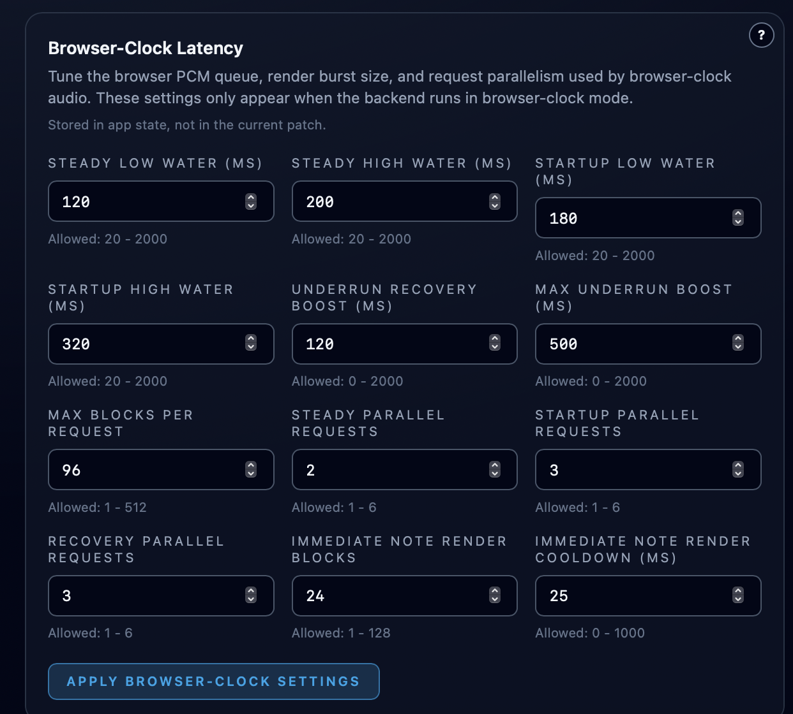

# Browser-Clock Latency

**Navigation:** [Up](configuration.md) | [Prev](browser_audio_streaming_webrtc.md) | [Next](persistence_and_defaults.md)

When Orchestron runs in Docker with backend audio mode `browser_clock`, the browser becomes the playback clock and requests PCM render chunks from the backend. In this setup, the most important latency and stability controls live in the Config page's `Browser-Clock Latency` section.

## When This Section Appears

The `Browser-Clock Latency` section is shown only when the backend was started in `browser_clock` mode, for example:

- `docker compose up --build` with the repository's default browser-clock Docker setup
- CLI argument `--audio-output-mode browser_clock`
- environment variable `VISUALCSOUND_AUDIO_OUTPUT_MODE=browser_clock`

The section is hidden in `local` mode and in legacy `streaming` (WebRTC) mode.

## Why These Settings Matter In Docker

On the Docker/browser-clock path, audio is not pushed to a local DAC on the backend host. Instead:

- the backend renders PCM blocks on demand
- the browser keeps a target queue of decoded PCM
- the browser decides when to request more audio

That makes the browser-clock queue settings the main tradeoff between low live-play latency and glitch resistance.

Lower values usually feel more immediate, but they also leave less headroom for:

- Docker scheduling jitter
- browser tab throttling or temporary main-thread stalls
- heavier patches that take longer to render

Higher values add safety margin, but manual playing and note feedback feel less direct.

## Main Control Groups

### Queue Targets

- `Steady Low Water` / `Steady High Water` define the normal browser PCM queue window after startup has stabilized.
- `Startup Low Water` / `Startup High Water` define the larger queue window used while the stream is priming or recovering.

If you hear underruns after connect or after transport restarts, start by increasing the steady or startup queue targets slightly.

### Recovery Headroom

- `Underrun Recovery Boost` adds extra queue headroom after an underrun is detected.
- `Max Underrun Boost` limits how large that temporary recovery buffer may grow.

These controls help the browser recover cleanly from brief dropouts without forcing a permanently larger steady-state latency.

### Render Request Size And Parallelism

- `Max Blocks Per Request` limits how much audio the browser asks for in one render request.
- `Steady Parallel Requests`, `Startup Parallel Requests`, and `Recovery Parallel Requests` control how many render requests may stay in flight in each state.

Smaller requests can improve responsiveness, while larger or more parallel requests can make it easier to keep the queue full on slower systems.

### Live Note Responsiveness

- `Immediate Note Render Blocks` sends a small urgent render burst after a live note-on event.
- `Immediate Note Render Cooldown` limits how often those urgent note-triggered bursts may happen.

These are the most direct controls for making manual keyboard or MIDI playing feel snappier in browser-clock mode.

## Practical Tuning Order

1. Start from the defaults shown by the Config page.
2. If the stream crackles or underruns, raise `Steady High Water` and `Startup High Water` first.
3. If latency still feels too high, lower the steady queue targets cautiously.
4. If live note response feels sluggish, reduce `Max Blocks Per Request` or adjust the immediate-note controls in small steps.
5. Apply the settings and test again with a realistic patch load.

Keep in mind that these settings are stored in app state for the current workspace. They are not saved into the patch itself.

## Screenshot

  

<em>The Config page's Browser-Clock Latency section, used when Orchestron runs headless in `browser_clock` mode and the browser owns audio playback.</em>

**Navigation:** [Up](configuration.md) | [Prev](browser_audio_streaming_webrtc.md) | [Next](persistence_and_defaults.md)
