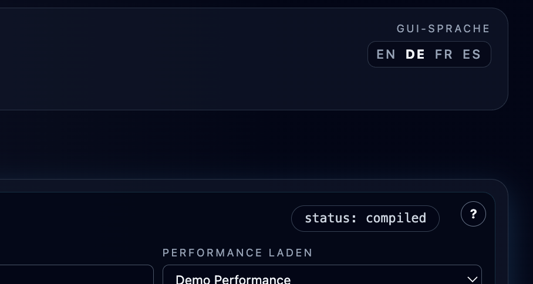

# GUI Language and Integrated Help

**Navigation:** [Up](configuration.md) | [Prev](configuration.md) | [Next](audio_engine_settings.md)

Orchestron includes multilingual UI labels and integrated documentation so you can stay inside the app while learning and working.

## GUI Language Selector

The language selector is in the top-right area of the main app header.

Supported languages:

- English
- German
- French
- Spanish

The selector is presented as quick language links (short labels) for fast switching.

## What Changes When You Switch Language

Language switching affects user-facing text such as:

- Page labels (`Instrument Design`, `Perform`, `Config`)
- Toolbar/button labels
- Context help pages (integrated help modals)
- Opcode documentation modal content (localized generated markdown)
- Many labels inside advanced editors (including the GEN editor)

## Integrated Help (`?` Buttons)

Orchestron provides context help buttons (`?`) across the UI.

Examples include:

- Instrument patch toolbar
- Opcode catalog
- Graph editor header/area
- Runtime panel
- Sequencer sections (rack, tracks, piano rolls, MIDI controllers)
- Config page sections

Clicking a context `?` opens a markdown help modal tailored to that UI area.

## Opcode Documentation (`?` On Opcode Node)

Placed opcode nodes provide a node-level `?` button that opens opcode documentation.

The modal includes:

- Localized description
- Inputs and outputs (with detailed port descriptions)
- Syntax/template summary
- Tags
- `Open Csound Reference` link to the official Csound documentation page for that opcode

## Modal Behavior

Both help modals and opcode documentation modals support:

- Close button
- Click outside modal to close
- `Esc` key to close

## Best Practice

Use context help for workflow guidance and opcode docs for technical/operator details.

This combination is faster than switching repeatedly between the app and external documentation while designing patches.

## Screenshots

  

<em>Top-right header language selector links.</em>

  

<em>Context help modal integrated into the workflow.</em>

  

<em>Integrated help and UI localization in multiple supported languages.</em>

**Navigation:** [Up](configuration.md) | [Prev](configuration.md) | [Next](audio_engine_settings.md)
