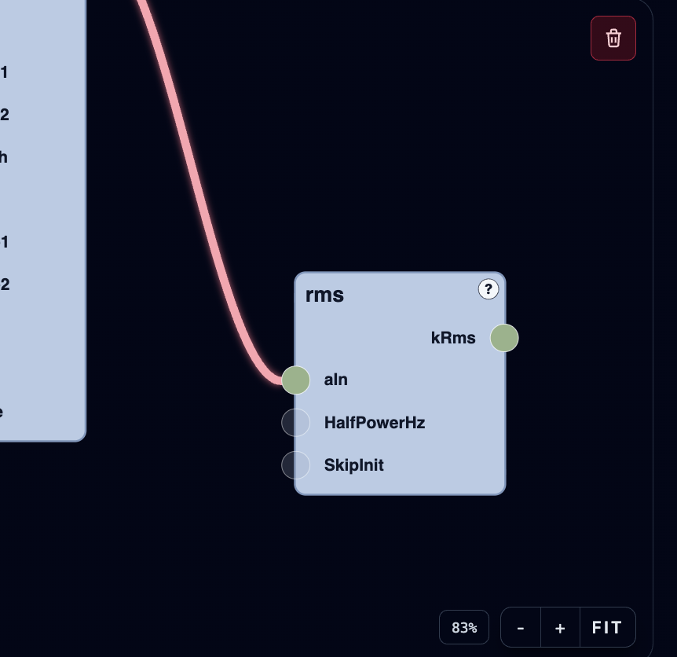
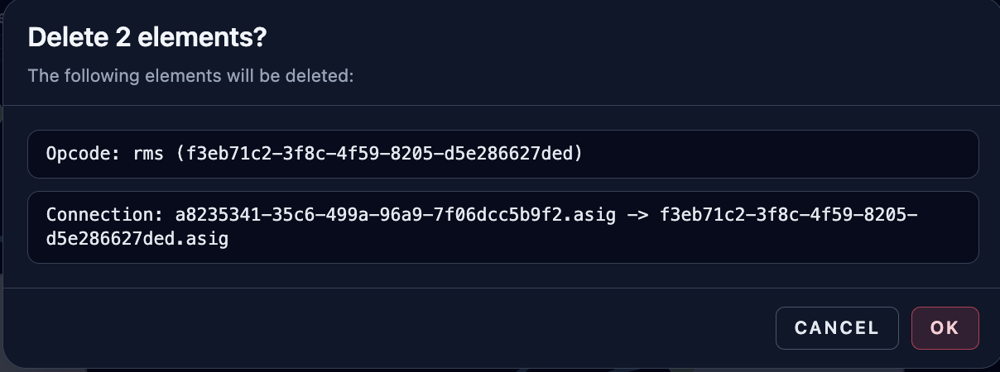

# Graph Editor

**Navigation:** [Up](instrument_design.md) | [Prev](opcode_catalog_and_documentation.md) | [Next](input_formula_assistant.md)

The graph editor is the central visual patching surface for instrument design.

## Core Graph Editing Features

- Typed input/output ports (audio, control, init, string, function-table)
- Node placement and repositioning (drag nodes on the canvas)
- Connection creation between compatible ports
- Connection and node selection highlighting
- Deletion of selected nodes/connections via explicit delete action
- Zoom controls and fit-to-graph navigation
- Node category color coding
- Inline constant value editing for `const_a`, `const_i`, `const_k`

## Canvas Navigation

The graph editor supports pan/zoom navigation and includes a zoom HUD in the lower-right corner:

- Zoom percentage display
- `-` zoom out
- `+` zoom in
- `Fit` to fit the current graph into view

If the graph is empty, `Fit` resets toward a centered default view.

## Node Appearance and Visual Cues

### Category Coloring

Nodes are color-coded by category (for example generator, filter, MIDI, constants, etc.) to help visually scan signal flow.

### Optional Inputs

Optional inputs are visually distinct from required inputs.

### Formula Highlight On Sockets

If an input socket has a saved Input Formula (combine formula), the socket is highlighted so you can immediately see custom combine logic exists.

## Adding Nodes

You can add nodes in two ways:

- Click from the opcode catalog
- Drag an opcode from the catalog and drop it into the graph canvas

Drag-and-drop placement is preferable for larger patches because it preserves your layout intent.

## Connections

### Creating Connections

- Connect outputs to compatible inputs.
- The backend compiler remains the source of truth for final type/compile validation.

### Selecting Connections

- Connections can be selected directly (not just nodes).
- Selected connections receive a visual highlight.
- Ctrl-based accumulation allows multi-select of connections and nodes.

### Connection Deletion Is Intentional

Orchestron prevents accidental edge removal during socket interaction.

- Connections are not removed by casual socket clicks/drags.
- To remove a connection, select it explicitly and use the delete action.

## Selection Behavior

- Click nodes to select.
- Ctrl-click accumulates node selections.
- Click connections to select them.
- Ctrl-click accumulates/deselects connection selections.
- Background click clears selection (when Ctrl is not held).

## Delete Selected Elements

The graph editor overlay includes a trash/delete button (top-right of the graph canvas area).

- Disabled when nothing is selected
- Enabled when at least one node or connection is selected

Deletion flow:

- If one item is selected, deletion can happen directly.
- If multiple items are selected, Orchestron opens a confirmation dialog listing all affected items (nodes and connections) before deletion.

## Node-Specific Controls

### Constant Nodes

The constant opcodes (`const_a`, `const_i`, `const_k`) provide inline editable values directly on the node.

### Documentation Button (`?`)

Nodes with documentation expose a `?` button to open the opcode documentation modal.

### GEN Button (for `GEN` node)

The `GEN` meta-opcode node shows a `GEN` button that opens the specialized GEN table editor.

## Layout Persistence

- Node positions are stored in the patch graph.
- The graph structure (nodes + connections) is part of the patch data.
- The visual layout and related UI metadata (for example input formulas, GEN node configuration) are stored in `graph.ui_layout`.

## Compile Implications

- Compilation order is derived from graph dependencies.
- Invalid wiring, missing required inputs, or invalid formulas surface compile diagnostics.
- Graph compile status is reflected in the instrument page header (`compiled`, `pending changes`, `errors`).

## Screenshots

  

<em>Graph editor detail showing selection state, delete button, and zoom controls.</em>

  

<em>Delete-selection confirmation dialog listing selected graph items.</em>

**Navigation:** [Up](instrument_design.md) | [Prev](opcode_catalog_and_documentation.md) | [Next](input_formula_assistant.md)
