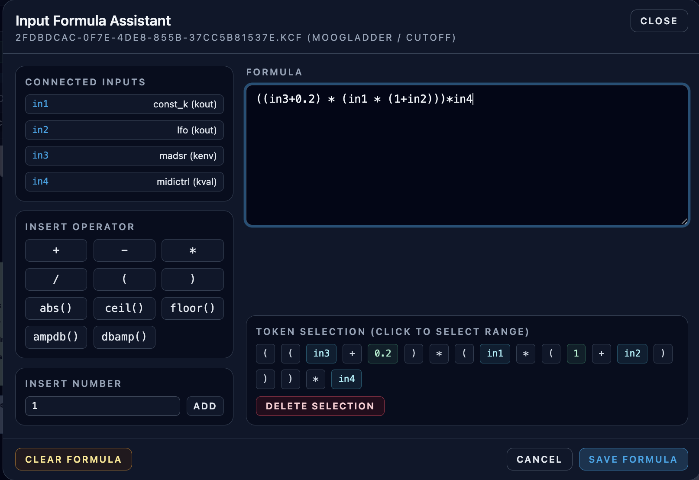

# Input Formula Assistant

**Navigation:** [Up](instrument_design.md) | [Prev](graph_editor.md) | [Next](gen_table_editor.md)

The Input Formula Assistant lets you define exactly how incoming signals are combined on a single target input.

## When To Use It

Most commonly, you use it when **multiple outputs are connected to the same input**.

Examples:

- Mix two modulation sources before feeding a filter cutoff input
- Scale one source more than another (`in1 * 0.8 + in2 * 0.2`)
- Apply utility transforms (`abs(in1)`, `dbamp(in1)`) before an input

It is also useful for advanced cases with only one or even zero connected inputs:

- One input: reshape or scale the signal (`ceil(in1)`, `in1 * 0.5`)
- Zero inputs: provide a constant expression (`0.25`, `ampdb(6)`) as a formula-driven value

## How To Open It

- Double-click an **input socket** in the graph editor.
- The assistant opens for that exact target node + target input port.

## What The Assistant Shows

### Connected Inputs (Token Mapping)

The left panel lists inbound connections to the target input and assigns tokens such as:

- `in1`
- `in2`
- `in3`

Each token shows source information (node/opcode/port) so you can see what signal you are referencing.

### Operator and Function Buttons

The assistant provides insertion buttons for:

- Operators: `+`, `-`, `*`, `/`
- Grouping: `(`, `)`
- Unary functions: `abs()`, `ceil()`, `floor()`, `ampdb()`, `dbamp()`
- Built-in literals: `sr` (configured audio sample rate)
- Custom numeric literals via the number entry field

### Formula Text Area

You can type directly into the formula field.

### Token Selection / Delete Helper

The assistant tokenizes the current expression and displays clickable tokens.

- Click a token to select that exact range in the text area.
- Use `Delete Selection` to remove the selected token/range quickly.

## Validation Rules

The formula must be syntactically valid before it can be saved.

Validation includes:

- Non-empty expression
- Valid numeric literals
- Supported characters/operators only
- Balanced parentheses
- Valid token ordering
- Known identifiers only (`inN` tokens, supported built-in literals like `sr`, or supported unary function names)

If validation fails:

- The formula text area border changes to an error style
- A list of validation errors is shown
- `Save Formula` is disabled

## Save / Clear / Cancel

- `Save Formula`: stores the expression and token bindings for that target input
- `Clear Formula`: removes the saved formula for the target input
- `Cancel` / `Close`: closes the dialog without changing the saved formula

## What Happens During Compile

- If multiple connections target one input and **no** formula is defined, Orchestron falls back to summing the inbound signals.
- If a formula exists, the compiler resolves the token bindings and compiles the expression.
- Formula validation also happens backend-side, so invalid formulas fail compile with diagnostics.

## Formula Examples

### Weighted Mix

```text
in1 * 0.7 + in2 * 0.3
```

### Gain Conversion

```text
dbamp(in1)
```

### Rectified Modulation

```text
abs(in1)
```

### Constant Override

```text
0.5
```

### Sample-Rate-Aware Expression

```text
sr * 0.5
```

## Screenshots

<p align="center">
  
</p>
<p align="center"><em>Input Formula Assistant with connected input tokens and editable formula.</em></p>

**Navigation:** [Up](instrument_design.md) | [Prev](graph_editor.md) | [Next](gen_table_editor.md)
