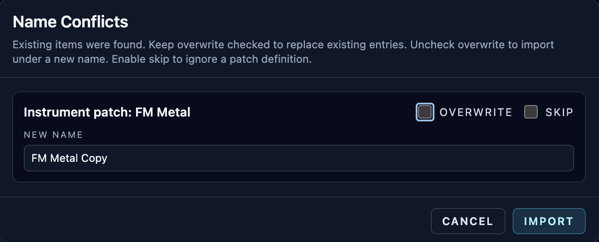

# Instrument Import / Export and CSD Export

**Navigation:** [Up](instrument_design.md) | [Prev](runtime_panel_and_compilation.md) | [Next](supported_opcodes.md)

This page documents all user-facing import/export options available from the Instrument Design page.

## Instrument Export Types

### 1. Orchestron Instrument Bundle (`Export` button)

The `Export` button creates an Orchestron instrument definition bundle containing the patch graph and metadata.

File extensions:

- `.orch.instrument.json` (JSON bundle)
- `.orch.instrument.zip` (ZIP bundle)

### JSON vs ZIP Export Selection

Orchestron chooses the format automatically:

- JSON export when no referenced uploaded GEN01 audio assets are present
- ZIP export when the instrument references uploaded GEN01 assets (so audio dependencies can be included)

### 2. Csound CSD Export (`Export CSD` button)

The `Export CSD` button compiles the patch and downloads a `.csd` file.

Use this when you want to run the generated instrument outside Orchestron in a Csound workflow.

## What Is In An Instrument Bundle

An instrument bundle contains:

- patch name
- patch description
- schema version
- full patch graph (`nodes`, `connections`, `ui_layout`, `engine_config`)

If a ZIP bundle is required, it also contains referenced GEN audio assets under an `audio/` folder in the archive.

## Instrument Import (`Import` button)

The import button accepts:

- standalone instrument bundle JSON
- standalone instrument bundle ZIP
- performance bundle JSON/ZIP (to extract included patch definitions)

This means you can import patches directly from a performance export without manually splitting files.

## Conflict Resolution (Patch Name Already Exists)

When importing one or more patch definitions and a patch name already exists, Orchestron opens a conflict dialog.

Per patch, you can choose:

- `Overwrite` (update existing patch)
- `Rename` (disable overwrite and provide a new target name)
- `Skip` (patch imports only)

The dialog validates name collisions before proceeding.

## GEN01 Audio Dependency Handling

For ZIP imports that include referenced GEN01 audio assets:

- Orchestron validates the archive structure
- Imports the audio files into backend storage automatically
- Restores the patch graph with the asset references intact

## Advanced Format Notes (for power users)

- Instrument ZIP exports contain exactly one root JSON file plus optional `audio/...` entries
- Missing referenced audio assets in a ZIP import cause import failure (prevents broken GEN01 references)

## Instrument Bundle vs Performance Bundle

Use the right export for the right task:

- Instrument bundle: share one patch design
- Performance bundle: share a full performance setup (instrument rack + sequencers + controllers + piano rolls + optional patch definitions)

See [Performance Import / Export](../performance/performance_import_export.md) for performance bundles.

## Screenshots

  

<em>Patch import conflict dialog with overwrite/rename/skip decisions.</em>

**Navigation:** [Up](instrument_design.md) | [Prev](runtime_panel_and_compilation.md) | [Next](supported_opcodes.md)
