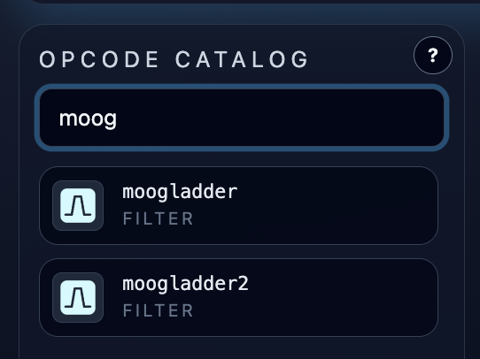

# Opcode Catalog and Integrated Documentation

**Navigation:** [Up](instrument_design.md) | [Prev](patch_toolbar_and_tabs.md) | [Next](graph_editor.md)

The opcode catalog is the source list of all supported building blocks you can place in the graph editor.

## What The Catalog Supports

- Search by opcode name
- Search by category
- Search by description text
- Search by tags
- Click to add an opcode to the graph
- Drag-and-drop an opcode into the graph canvas at a chosen position

## Search Behavior

The search field filters on these opcode fields:

- `name`
- `category`
- `description`
- `tags`

This makes it easy to find opcodes by function (for example `filter`, `midi`, `reverb`, `soundfont`) even if you do not remember the exact Csound opcode name.

## Adding Opcodes

### Click To Add

- Clicking an opcode row inserts the node into the graph using the app's add-node behavior.
- This is fastest when exact placement is not important yet.

### Drag-and-Drop To Place

- Drag an opcode from the catalog and drop it into the graph canvas.
- The graph editor computes the drop location and places the node there.
- While dragging over the graph, the canvas highlights to confirm drop targeting.

## Visual Information In The Catalog

Each catalog entry shows:

- Opcode icon (backend-served icon asset)
- Opcode name
- Category label

These same categories influence node coloring in the graph editor for quick visual grouping.

## Integrated Opcode Documentation (`?` on node)

After placing an opcode in the graph, use the node's `?` button to open the opcode documentation modal.

The opcode documentation modal provides:

- Localized description (English/German/French/Spanish)
- Category and syntax/template summary
- Input/output port descriptions (including optional/default/accepted types)
- Tags
- Direct link to the Csound reference page (`Open Csound Reference`)

## Context Help (`?` in page sections)

In addition to opcode-level docs, the app provides context help buttons for page sections (toolbar, catalog, graph, runtime, sequencer panels, config panels). These open integrated markdown help content in the currently selected GUI language.

See also:

- [GUI Language and Integrated Help](../configuration/gui_language_and_integrated_help.md)
- [Supported Opcodes](supported_opcodes.md) for the full opcode index table

## Screenshots

  

<em>Opcode catalog filtered by search text.</em>

  

<em>Integrated opcode documentation modal opened from a graph node.</em>

**Navigation:** [Up](instrument_design.md) | [Prev](patch_toolbar_and_tabs.md) | [Next](graph_editor.md)
