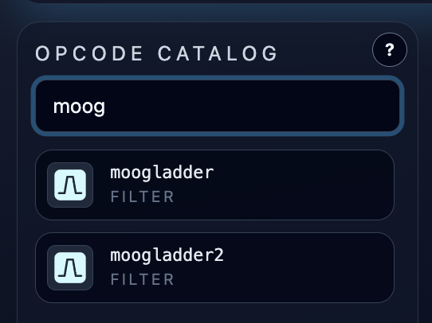

# Opcode Catalog and Integrated Documentation

**Navigation:** [Up](instrument_design.md) | [Prev](patch_toolbar_and_tabs.md) | [Next](graph_editor.md)

The opcode catalog is the source list of all supported building blocks you can place in the graph editor.

## What The Catalog Supports

- Search by opcode name
- Search by category
- Search by description text
- Search by tags
- Click to add an opcode to the graph
- Drag-and-drop an opcode into the graph canvas at a chosen position

## Search Behavior

The search field filters on these opcode fields:

- `name`
- `category`
- `description`
- `tags`

This makes it easy to find opcodes by function (for example `filter`, `midi`, `reverb`, `soundfont`) even if you do not remember the exact Csound opcode name.

## Adding Opcodes

### Click To Add

- Clicking an opcode row inserts the node into the graph using the app's add-node behavior.
- This is fastest when exact placement is not important yet.

### Drag-and-Drop To Place

- Drag an opcode from the catalog and drop it into the graph canvas.
- The graph editor computes the drop location and places the node there.
- While dragging over the graph, the canvas highlights to confirm drop targeting.

## Visual Information In The Catalog

Each catalog entry shows:

- Opcode icon (backend-served icon asset)
- Opcode name
- Category label

These same categories influence node coloring in the graph editor for quick visual grouping.

## Integrated Opcode Documentation (`?` on node)

After placing an opcode in the graph, use the node's `?` button to open the opcode documentation modal.

The opcode documentation modal provides:

- Localized description (English/German/French/Spanish)
- Category and syntax/template summary
- Input/output port descriptions (including optional/default/accepted types)
- Tags
- Direct link to the Csound reference page (`Open Csound Reference`)

## STK Instruments

Search for `stk` to find the 27 Synthesis Toolkit instruments in the `physical_modeling`, `fm`, and `oscillator` categories. They include strings, winds, percussion, voices, organs, and electric pianos. Each node produces one mono audio signal; connect it to both `outs` inputs for centered stereo output.

- `ifrequency` and `iamplitude` are init-rate inputs: frequency in Hz and note amplitude from 0 to 1. Use `cpsmidi` for note pitch; apply envelopes or gain after the audio output for continuous level changes.
- `STKDrummer` uses the frequency to select a drum sample. Connect `cpsmidi` and play MIDI drum notes. `STKDrummer`, `STKPlucked`, and `STKSitar` have no documented controller inputs.
- The other nodes expose the manual's controller number/value pairs in order. The controller number is prefilled with the documented number. Set or connect its paired `kv` value to enable that control. Both ports accept init-rate or control-rate sources, so controller values can change during a note.
- Unset controller values omit the entire pair and retain STK's instrument defaults. You can enable a later pair without filling earlier pairs. For example, set only `kv7` to `3` on `STKBandedWG` to send instrument preset controller `16` with value `3`.
- Most values range from 0 to 127, but preset selectors use model-specific ranges. `STKShakers` uses controller **1071**, not a MIDI CC in the 0–127 range, for its instrument selection. Check the node's `?` help for each controller's meaning.

Runtime requires the [Csound STK plugin (`stkopd`)](https://github.com/csound/plugins) and its rawwave data on the machine running the Csound backend. Set `RAWWAVE_PATH` to the installed rawwaves directory before starting the backend; some Csound builds do not register any STK opcodes without it. For example, an Apple Silicon Homebrew installation of STK uses `RAWWAVE_PATH=/opt/homebrew/opt/stk/share/stk/rawwaves/`. Catalog availability and successful graph compilation do not install this runtime dependency.

## Context Help (`?` in page sections)

In addition to opcode-level docs, the app provides context help buttons for page sections (toolbar, catalog, graph, runtime, sequencer panels, config panels). These open integrated markdown help content in the currently selected GUI language.

For the opcode catalog specifically, the integrated help now focuses on search/add workflow and on the distinction between catalog help and the node-level opcode documentation modal.

See also:

- [GUI Language and Integrated Help](../configuration/gui_language_and_integrated_help.md)
- [Supported Opcodes](supported_opcodes.md) for the full opcode index table

## Screenshots

  

<em>Opcode catalog filtered by search text.</em>

  

<em>Integrated opcode documentation modal opened from a graph node.</em>

**Navigation:** [Up](instrument_design.md) | [Prev](patch_toolbar_and_tabs.md) | [Next](graph_editor.md)
