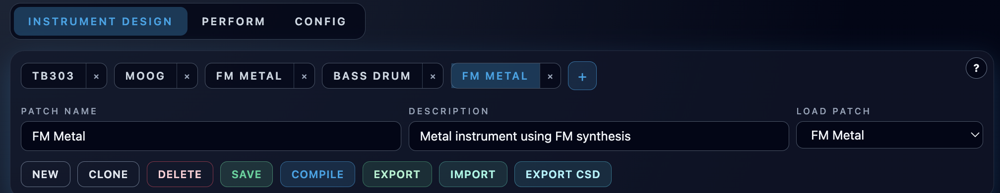

# Patch Toolbar and Instrument Tabs

**Navigation:** [Up](instrument_design.md) | [Prev](instrument_design.md) | [Next](opcode_catalog_and_documentation.md)

The patch toolbar is the main control surface for patch metadata, patch library operations, and instrument-level file actions.

## Patch Toolbar Layout

The toolbar includes:

- Instrument tabs (multiple editable patch workspaces)
- Patch metadata fields (`Patch Name`, `Description`)
- Patch picker (`Load Patch`)
- Action buttons (`New`, `Clone`, `Delete`, `Save`, `Compile`, `Export`, `Import`, `Export CSD`)

## Instrument Tabs

- Use the `+` button to add a new instrument tab.
- Each tab stores its own editable patch snapshot (graph + metadata).
- Tabs can be switched without losing the current edit state.
- Tabs can be closed with the `x` button.
- Tabs are persisted in app state (see Configuration chapter), so drafts can be restored after reload.

## Patch Metadata

- `Patch Name` is the display name used in the patch library and performance rack dropdowns.
- `Description` is a short user label for the patch.
- Metadata updates affect the current tab immediately, but they are not stored in the patch library until you save.

## Patch Library Loading

- `Load Patch` loads an existing saved patch from the backend patch library into the active tab.
- The dropdown shows saved patch names.
- Loading a patch replaces the active tab contents with that saved patch snapshot.

## Actions

### New

- Creates a fresh draft (empty graph) with default engine settings and the default name `Untitled Instrument`.
- This draft is not yet stored in the patch library until `Save` is used.

### Clone

- Creates a new saved patch by duplicating the current patch graph and metadata.
- If the name already exists, Orchestron generates a `(... copy)` style name.
- The cloned patch is loaded automatically after creation.

### Delete

- Deletes the currently saved patch from the patch library.
- Requires confirmation.
- After delete, Orchestron loads another available patch or creates a new draft if none remain.

### Compile

- Compiles the current instrument graph into generated Csound ORC/CSD artifacts.
- Updates compile status badge state.
- Does not save the patch automatically.

### Save

- Performs compile validation first.
- If compile succeeds, persists the patch to the backend patch library.
- If compile fails, save is blocked and the patch remains unsaved.

### Export / Import

- `Export` writes an Orchestron instrument definition bundle (`.orch.instrument.json` or `.orch.instrument.zip`).
- `Import` loads an instrument definition bundle and supports conflict handling (overwrite / rename / skip).
- Details are in [Instrument Import / Export and CSD Export](instrument_import_export.md).

### Export CSD

- Triggers compile and downloads the compiled `.csd` file.
- Useful for running the generated instrument outside Orchestron.

## Practical Notes

- `Compile` is the fast iteration action while designing.
- `Save` is the persistence action for the patch library.
- `Export` is the sharing/transfer action for Orchestron-specific instrument bundles.
- `Export CSD` is the interoperability action for raw Csound usage.

## Screenshots

  

<em>Patch toolbar with multiple instrument tabs, metadata fields, and patch actions.</em>

**Navigation:** [Up](instrument_design.md) | [Prev](instrument_design.md) | [Next](opcode_catalog_and_documentation.md)
