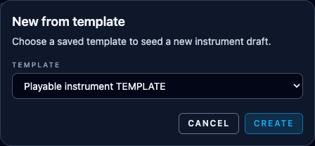
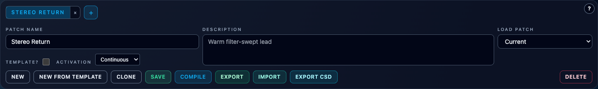

# Patch Toolbar and Instrument Tabs

**Navigation:** [Up](instrument_design.md) | [Prev](instrument_design.md) | [Next](opcode_catalog_and_documentation.md)

The patch toolbar is the main control surface for patch metadata, patch library operations, and instrument-level file actions.

## Collapse Patch Controls

Use Patch controls to collapse metadata and load/save/compile/import/export actions. Instrument tabs, including add and close, stay visible. Controls start expanded; your choice survives view switches until browser reload.

## Patch Toolbar Layout

The toolbar includes:

- Instrument tabs (multiple editable patch workspaces)
- Patch metadata fields (`Patch Name`, `Description`)
- Instrument Type selector
- Grouped, searchable patch picker (`Load Patch`)
- Action buttons (`New`, `Clone`, `Delete`, `Save`, `Compile`, `Export`, `Import`, `Export CSD`)

## Instrument Tabs

- Use the `+` button to add a new instrument tab.
- Each tab stores its own editable patch snapshot (graph + metadata).
- Tabs can be switched without losing the current edit state.
- Tabs can be closed with the `x` button.
- Tabs are persisted in app state (see Configuration chapter), so drafts can be restored after reload.

## Patch Metadata

- `Patch Name` is the display name used in the patch library and performance rack dropdowns for normal patches.
- `Description` is a three-line patch note field and accepts up to 2048 characters. Hover over the field to see the full description in a tooltip.
- `Template?` marks the patch as a reusable starter graph. Template patches show a `TEMPLATE` token beside their name and are excluded from Perform rack instrument choices.
- `Instrument Type` offers Percussion, Melody, Bass, Effects / Noise, and Continuous (always-on). Choosing Continuous enables always-on scheduling; every other type uses MIDI activation. Continuous patches run when added to the Perform rack and started. They may generate audio without an inlet. Receiving audio requires an actual inlet, independently of activation. Musical role is separate interface metadata.
- Metadata updates affect the current tab immediately, but they are not stored in the patch library until you save.

## Patch Library Loading

- `Load Patch` opens collapsed type groups with counts. Expand a group to see patch names in alphabetical order; template patches retain their marker. Patches already open in instrument tabs are excluded.
- Search matches names and descriptions across all groups, ignoring case and surrounding spaces. Enter at least **four characters**; results update after **500 ms without typing**. Matching groups expand automatically. Shortening the search below four characters restores browsing immediately.
- Use Tab or Up/Down to move through controls and Enter to expand a group or load a patch. Enter in an active search loads its first result. Escape or clicking outside closes the picker; closing resets search and group expansion.
- Loading replaces the active tab with the selected saved patch.

## Actions

### New

- Opens the built-in creation chooser: Playable instrument, Drumset, Audio effect, Audio Output, or Empty patch.
- Creates an unsaved draft with the selected starter graph and default engine settings.
- This draft is not yet stored in the patch library until `Save` is used.

### New from Template

- Opens the same chooser with the five built-in starters plus any saved templates.
- Creates a new unsaved normal patch with the chosen template's graph and description.
- Built-in choices remain available when the library has no saved templates.

### Clone

- Creates a new saved patch by duplicating the current patch graph and metadata.
- Preserves the `Template?` flag and Instrument Type from the source patch.
- If the name already exists, Orchestron generates a `(... copy)` style name.
- The cloned patch is loaded automatically after creation.

### Delete

- Deletes the currently saved patch from the patch library.
- Requires confirmation.
- After delete, Orchestron loads another available patch or creates a new draft if none remain.

### Compile

- Compiles the current instrument graph into generated Csound ORC/CSD artifacts.
- Updates compile status badge state.
- Does not save the patch or start audio automatically. Use [Audition](runtime_panel_and_compilation.md#audition-a-draft) in the graph header to hear an unsaved draft.

### Save

- Performs compile validation first for normal patches.
- If compile succeeds, persists the patch to the backend patch library.
- If compile fails, save is blocked and the patch remains unsaved.
- Template patches skip compile validation so incomplete starter graphs can be saved.
- Always-on patches still save as normal patch definitions; they run continuously only after they are added to a started Perform rack. A continuous source need not be an effect or have audio inlets.

### Export / Import

- `Export` writes an Orchestron instrument definition bundle (`.orch.instrument.json` or `.orch.instrument.zip`).
- `Import` loads an instrument definition bundle and supports conflict handling (overwrite / rename / skip).
- Details are in [Instrument Import / Export and CSD Export](instrument_import_export.md).

### Export CSD

- Triggers compile and downloads the compiled `.csd` file.
- Useful for running the generated instrument outside Orchestron.

## Practical Notes

- `Compile` is the fast iteration action while designing.
- `Save` is the persistence action for the patch library.
- `Export` is the sharing/transfer action for Orchestron-specific instrument bundles.
- `Export CSD` is the interoperability action for raw Csound usage.
- The integrated `?` help for this toolbar now focuses on tab-local draft state versus saved library state, plus the difference between `Compile`, `Save`, `Clone`, and export actions.

## Built-in creation choices

New and New from template offer Playable instrument (MIDI pitch/velocity, sine oscillator and madsr), Audio effect (stereo pass-through), Audio Output (stereo input to direct output), and Empty patch. These choices work without saved templates. Guided instruments connect to an fixed internal Master when added to a performance.

### Choose a starter

| Choice | Type, activation and audio interface | Next step |
| --- | --- | --- |
| Playable instrument | Melody; MIDI notes; named stereo output; pitch, velocity, sine oscillator and envelope | Save, add to Perform, and play its MIDI channel. |
| Drumset | Percussion; MIDI notes; named stereo output; analog drum voices | Save, add to Perform, and sequence its drum notes. |
| Audio effect | Continuous; named stereo input and output, initially pass-through | Add processing between the input and output before using it as an effect. |
| Audio Output | Continuous; stereo input to Direct Audio Output (`outs`) | Save for use as a custom output processor. |
| Empty patch | Melody; empty graph for custom design | Build and compile the required signal path. |

Role describes the patch's audio interface; Instrument Type determines whether it runs continuously or on MIDI notes. Audio effect and Audio Output starters use Continuous; use Effects / Noise for MIDI-triggered sound effects. Every performance has a fixed internal Master. It has no editable patch or rack assignment; add processing through its mixer inserts.

  

<em>New opens the starter chooser even when no saved templates exist.</em>

## Older patches and saved metadata

Existing always-on patches become Continuous without changing playback. Other older patches are classified from their names first, then descriptions: drum/percussion terms precede bass terms, followed by melodic and sound-effect terms. Unmatched patches default to Melody. Review the inferred Instrument Type and change it when needed; later name or description edits do not reclassify a patch.

Types are saved with the patch and retained in clones, templates, restored tabs, and instrument/performance JSON or ZIP bundles. New playable and empty patches default to Melody, drumsets to Percussion, and effect/output starters to Continuous.

## Screenshots

  

<em>Earlier toolbar with a continuous stereo-effect draft and library actions. Instrument Type now replaces Activation; an updated screenshot is pending.</em>

**Navigation:** [Up](instrument_design.md) | [Prev](instrument_design.md) | [Next](opcode_catalog_and_documentation.md)
