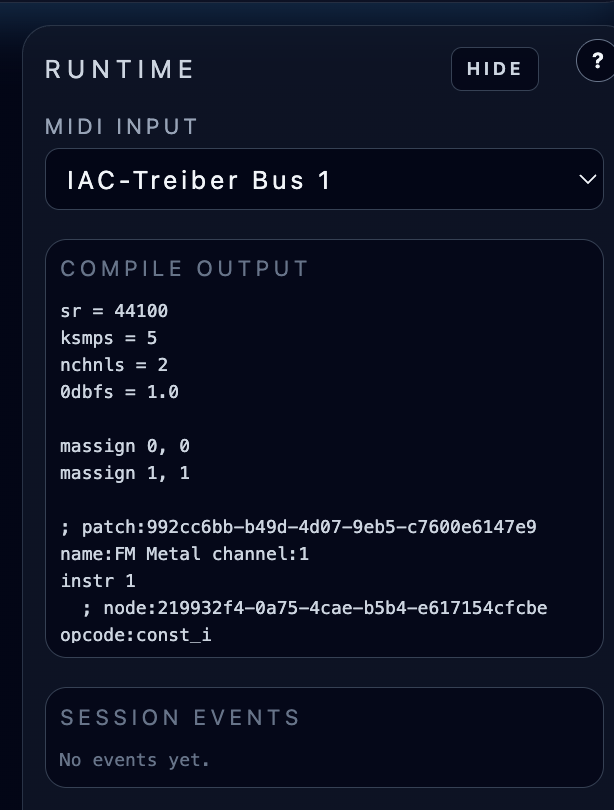

# Runtime Panel and Compilation Workflow

**Navigation:** [Up](instrument_design.md) | [Prev](gen_table_editor.md) | [Next](instrument_import_export.md)

The Runtime panel supports live testing of the current patch and exposes compile/runtime diagnostics.

## Runtime Panel Sections

- `MIDI Input` selector
- `Compile Output` (generated ORC)
- `Browser Audio` status/player (streaming mode only)
- `Session Events` log (recent backend/runtime events)

## MIDI Input Binding

Use the `MIDI Input` dropdown to bind an external MIDI input to the active runtime session.

- This is how external hardware/DAW MIDI reaches the running instrument session.
- The selected input is session-specific and also reflected on the Performance page status footer.

See [MIDI Setup and Inputs](../configuration/midi_setup_and_inputs.md) for OS-level MIDI setup guidance.

## Compile Output (Generated ORC)

After compiling a patch, the panel shows the generated ORC text.

This is useful for:

- Verifying the compiled signal chain
- Understanding how formulas/GEN/meta-opcodes are rendered
- Debugging compile issues with concrete generated code

## Session Events

The event list shows recent session events (most recent first, limited window in the UI).

Typical uses:

- Confirm that start/stop events happened
- Inspect runtime payloads and state transitions
- Diagnose issues during live testing

## Browser Audio (Streaming Mode)

When the backend session starts in `streaming` audio mode, the Runtime panel can show:

- Browser audio connection status (`connecting`, `live`, `error`)
- Error message when browser stream setup fails
- A built-in `<audio>` player control for the incoming WebRTC stream

If the backend is running in local DAC mode, this section reports local output behavior instead.

See [Browser Audio Streaming (WebRTC)](../configuration/browser_audio_streaming_webrtc.md) for the full streaming-mode guide.

## Runtime Panel Collapse / Show

To maximize graph editor space:

- Click `Hide` in the Runtime panel to collapse it
- Use `Show runtime` in the graph header to bring it back

This is especially useful on smaller displays or complex patches.

## Compile Status Badge (Graph Header)

The instrument page header above the graph displays a compile-state badge for the current patch/tab snapshot:

- `compiled` - the current graph snapshot matches the last successful compile
- `pending changes` - the graph changed since the last successful compile
- `errors` - the last compile for this exact snapshot failed

This helps you avoid assuming a graph is live-valid after edits.

## Recommended Test Loop

1. Edit the graph
2. Compile
3. Read compile output / diagnostics
4. Start or continue runtime testing with MIDI input
5. Save only after compile is clean

## Screenshots

  

<em>Runtime panel showing MIDI input selection, generated ORC output, and recent session events.</em>

  

<em>Runtime panel browser-audio section when backend audio output mode is streaming (WebRTC).</em>

**Navigation:** [Up](instrument_design.md) | [Prev](gen_table_editor.md) | [Next](instrument_import_export.md)
