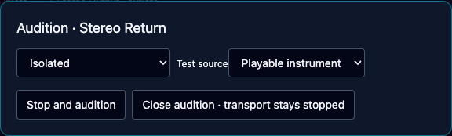
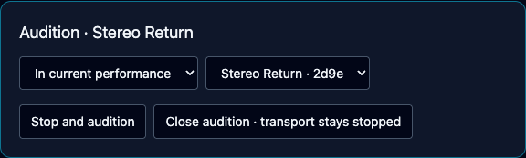
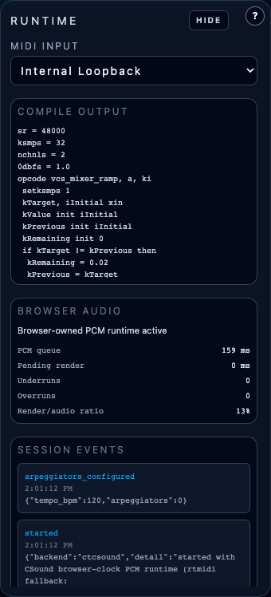

# Runtime Panel and Compilation Workflow

**Navigation:** [Up](instrument_design.md) | [Prev](gen_table_editor.md) | [Next](instrument_import_export.md)

The Runtime panel supports live testing of the current patch and exposes compile/runtime diagnostics for the unified browser-clock runtime.

## Runtime Panel Sections

- `MIDI Input` selector
- `Compile Output` (generated ORC)
- `Browser Audio` status for browser-clock mode
- `Session Events` log (recent backend/runtime events)

## MIDI Input Binding

Use the `MIDI Input` dropdown to bind an external MIDI input to the active runtime session.

- This is how external hardware/DAW MIDI reaches the running instrument session.
- `internal:loopback` is always available as the built-in app-only loopback.
- Internal sequencers, piano rolls, and manual controller lanes always go straight to the session engine and do not depend on this binding.
- The selected input is session-specific and also reflected on the Performance page status footer.

See [MIDI Setup and Inputs](../configuration/midi_setup_and_inputs.md) for OS-level MIDI setup guidance.

## Compile Output (Generated ORC)

After compiling a patch, the panel shows the generated ORC text.

This is useful for:

- Verifying the compiled signal chain
- Understanding how formulas/GEN/meta-opcodes are rendered
- Debugging compile issues with concrete generated code

A compilable patch must contain at least one audio output sink: either `outs` for direct stereo output or `outleta` for named audio routing into another instrument. This allows source instruments to feed always-on effects without also writing directly to the final stereo output.

## Session Events

The event list shows recent session events (most recent first, limited window in the UI).

Typical uses:

- Confirm that start/stop events happened
- Inspect runtime payloads and state transitions
- Diagnose issues during live testing

## Browser Audio

The runtime now always uses `browser_clock` audio mode, so the Runtime panel can show:

- Browser PCM queue/runtime status (`connecting`, `live`, `error`)
- Error message when the controller socket or AudioWorklet path fails
- No `<audio>` player, because playback is owned directly by the browser `AudioContext`

See [Browser-Clock Latency](../configuration/browser_clock_latency.md) for the browser-clock mode guide and tuning workflow.

## Runtime Panel Collapse / Show

To maximize graph editor space:

- Click `Hide` in the Runtime panel to collapse it
- Use `Show runtime` in the graph header to bring it back

This is especially useful on smaller displays or complex patches.

## Compile Status Badge (Graph Header)

The instrument page header above the graph displays a compile-state badge for the current patch/tab snapshot:

- `compiled` - the current graph snapshot matches the last successful compile
- `pending changes` - the graph changed since the last successful compile
- `errors` - the last compile for this exact snapshot failed

This helps you avoid assuming a graph is live-valid after edits.

## Recommended Test Loop

1. Edit the graph
2. Compile
3. Read compile output / diagnostics
4. Open Audition, choose a preview context, then Prepare audition
5. Use Stop and audition to hear the draft; close the preview when finished
6. Save only after compile is clean

The integrated `?` help for this panel now focuses on session-specific external MIDI binding, generated ORC inspection, runtime event feedback, and browser-clock PCM playback.

## Audition a draft

Compile validates the graph without starting audio. Audition offers Isolated and In current performance. An isolated effect receives the built-in test instrument or a selected saved source. Current-performance audition replaces one selected rack instance in a temporary snapshot; choose the instance explicitly when a patch appears more than once.

Prepare compiles the temporary preview before interrupting the performance. Stop and audition explicitly stops the original performance and starts the preview. Closing deletes the temporary session and restores the original performance state and playhead with transport stopped. Draft patches, test sources and preview routes are never saved into the library.

### Preview step by step

1. Click **Audition** in the graph header with the draft you want to hear.
2. Choose **Isolated** to test only this patch. For an effect, select **Test source**: the built-in Playable instrument or a saved source with suitable outputs. Isolated preview needs a stereo main output; source outputs must match the effect input count.
3. Alternatively choose **In current performance** and select the rack instance in **Source**. The short ID distinguishes instances of the same patch, including a return and a separate insert. The draft replaces only that selected instance in the temporary performance snapshot.
4. Click **Prepare audition**. Compilation errors appear in the dialog; fix the draft and prepare again. Preparation does not interrupt the original performance.
5. Click **Stop and audition** to stop the original engine and start the compiled preview. Note-triggered preview sources receive a test note (MIDI 60, velocity 96); current-performance mode also uses the performance sequencer configuration.
6. Click **Close audition · transport stays stopped**. The preview session is deleted and the original performance state/playhead is restored with transport stopped. Restart the performance explicitly when ready.

If you edit the draft after preparing, prepare again before listening. Preview is temporary: use Save separately to update the library patch.

  

<em>Isolated effect preview after successful preparation, ready for Stop and audition.</em>

  

<em>Current-performance preview targets one explicitly selected rack instance.</em>

## Screenshots

  

<em>Runtime panel showing MIDI input selection, generated ORC, active browser-owned PCM runtime, queue diagnostics and recent session events.</em>

**Navigation:** [Up](instrument_design.md) | [Prev](gen_table_editor.md) | [Next](instrument_import_export.md)
