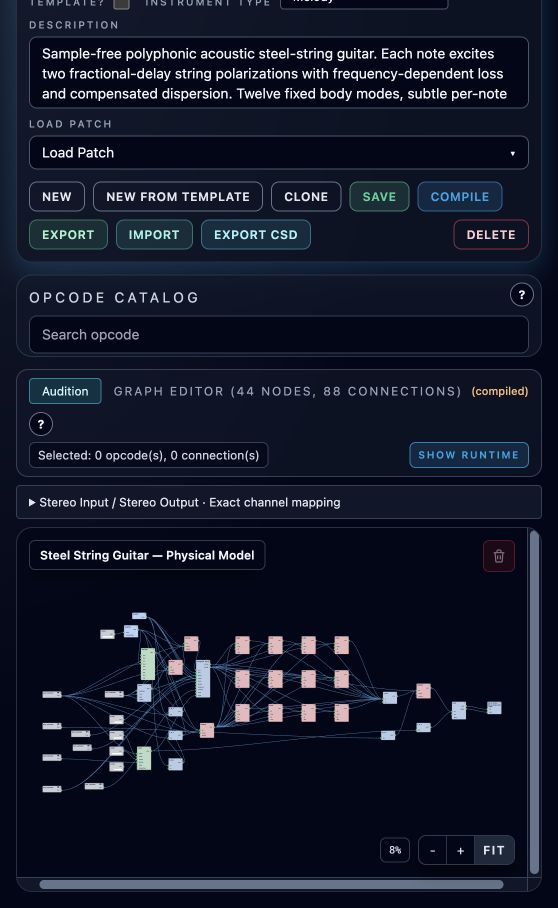
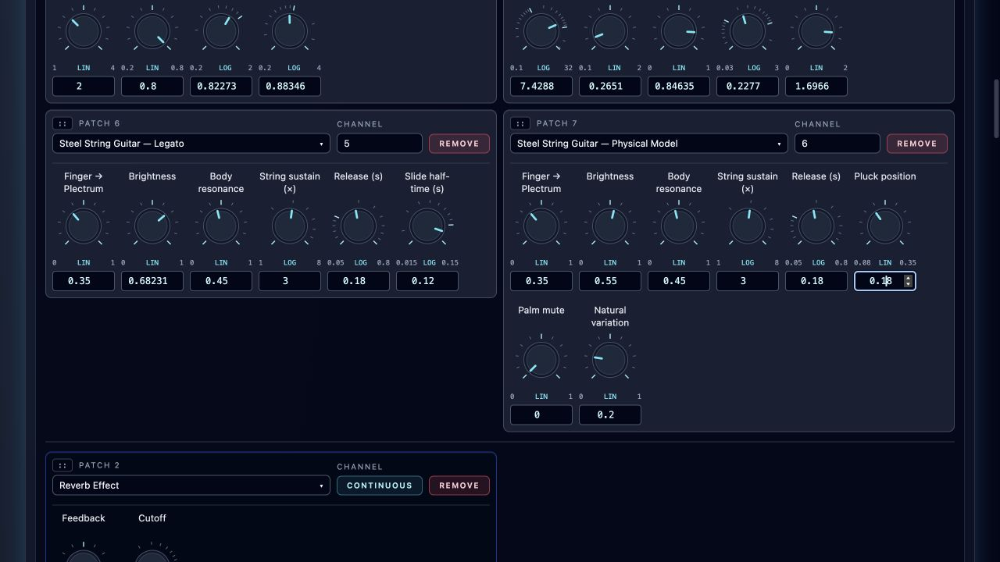

# Physical Steel-String Guitar

**Navigation:** [Up](instrument_design.md) | [Supported opcodes](supported_opcodes.md)

**Steel String Guitar — Physical Model** is a new polyphonic Melody instrument.
Each note has its own pluck and string state. Overlapping notes and manually timed
strums ring independently. The two existing steel-string guitars remain available.

Import `Steel_String_Guitar_Physical_Model.orch.instrument.json` from the
[example folder](../../examples/instruments/steel_string_waveguide/README.md),
add it to Perform, and route its Stereo Output to Master. The output is centered
and dry. Play E2–E6 for the intended register; use note lengths to control damping.
There is no legato, sample playback, convolution, reverb, or pitch-transposition stage.

## Playing controls

These are [per-instance performance settings](../performance/performance_controllers.md).
Changes apply to new notes; held notes retain their settings.

| Control | Range | Default | Effect |
| --- | --- | --- | --- |
| Finger → Plectrum | 0–1 | 0.35 | Sharper contact and more attack brightness toward Plectrum. |
| Brightness | 0–1 | 0.55 | Contact softness and high-frequency retention inside the string. |
| Body resonance | 0–1 | 0.45 | Amount of fixed wooden-body resonances. |
| String sustain | 1–8×, logarithmic | 3 | Nominal string decay multiplier. |
| Release | 0.05–0.8 s, logarithmic | 0.18 s | Damping and final body fade after note-off. |
| Pluck position | 0.08–0.35 | 0.18 | Contact location as a fraction of string length. |
| Palm mute | 0–1 | 0 | Shorter, darker decay. |
| Natural variation | 0–1 | 0.2 | Small changes to contact, position and energy. |

Velocity changes excitation energy, contact duration and brightness. Natural
variation does not move note timing or wobble pitch. Chords and strums use the
individual note timing you author.

## Editable synthesis

The graph exposes a displacement pulse, filtered noise, the string model, twelve
parallel body resonators, and final output shaping as separate blocks. The body
frequencies stay fixed from 95 Hz to 6.1 kHz. Mode gains compensate frequency,
sample rate and Q before radiation weighting; Q alone does not normalize their
resonant gain. A direct-string component preserves the fundamental, with a
restrained body blend and a release envelope after both paths.

The reference-informed revision preserves bass fundamentals with a 5 Hz DC
blocker. Two contact low-pass stages track note frequency, velocity, Finger →
Plectrum and Brightness to soften displacement excitation. A separate brief
filtered contact-noise path reaches the body without circulating in the string.
The observation position and excitation level across the register are also
retuned. The second polarization loses upper partials faster, while both retain
the same compensated fundamental. These changes keep all eight controller IDs,
ranges and defaults, and preserve the two older guitars.

The virtual `waveguide_string` node embeds a Csound UDO in the compiled orchestra.
Its two polarization loops use `delayr`, `deltap3`, and `delayw` with local
`setksmps 1`. Each loop has frequency-dependent damping, two short all-pass
sections, and conservative saturation. Delay length compensates the filters’
phase at the fundamental; no subsequent pitch correction is applied. The second
polarization has different decay and loss, without detuning or chorus.

### String interface

| Port | Rate | Meaning |
| --- | --- | --- |
| `aexc` | audio | External pulse/noise excitation. |
| `ifreq` | init | Fundamental, clamped to 20 Hz–sample rate/12. |
| `idecay` | init | Nominal loop T60, clamped to 0.05–30 s; filter loss adds damping. |
| `icutoff` | init | Loss cutoff, clamped to 100 Hz–0.45×sample rate. |
| `ipluck` / `ipickup` | init | Pluck and observation fractions, clamped to 0.02–0.48. |
| `idispersion` | init | All-pass dispersion, 0–1. |
| `ivariation` | init | Small per-voice contact/position/energy variations, 0–1. |
| `iseed` | init | Nonzero repeats internal variation; zero draws a seed per voice. |
| `kgate` | control | 0–1 damping gate. Falling values damp the feedback and outputs. |
| `astring` / `abridge` | audio | DC-blocked motion and bridge drive. |

Seeded internal variation is repeatable for identical excitation. External noise
has its own random state. Automatic seeds consume the orchestra random generator
without resetting it; restarting an orchestra may repeat its default random
sequence. All delay/filter state belongs to the individual voice. One helper
block is included per orchestra in standalone, mixer, live MIDI and both CSD
export modes. Native bundles retain the editable virtual node and require a
version of Orchestron with this opcode; CSD exports embed its implementation.

## Graph and controls

## Verification and previews

The example folder contains live host-MIDI, MIDI-file export and SCORE export
previews, controller extremes, register and velocity checks, repeated plucks,
chords, and authored strums. A matched whole-file RMS comparison plays the previous
`wgpluck2` guitar first, then this model. The gain values are recorded alongside
the audio; this does not change either instrument’s saved gain. The local
`revision/` folder also includes an attack-level-matched comparison with the
supplied western-guitar recording and the previous Physical Model. The recording
informs harmonic balance; its room, microphone and overlapping strings are not
replicated by the dry instrument.

Acceptance tests cover every semitone from E2 to E6 at parent block sizes 1, 16,
and 64, with 5-cent default and 10-cent extreme tolerances. They also cover
frequency-dependent decay, dispersion, velocity, independent releases, separate
rack instances, seed behavior, finite out-of-register output, equal stereo,
release silence and six-note headroom. Numerical and spectrogram results assess
specific properties; they do not establish subjective realism. Listening previews
are supplied for a separate musical judgment.

## References

- [Csound mode](https://csound.com/docs/manual/mode.html): body resonators and Q.
- [Csound deltap3](https://csound.com/docs/manual/deltap3.html): fractional delay taps.
- [Csound setksmps](https://csound.com/docs/manual/setksmps.html): local sample processing.
