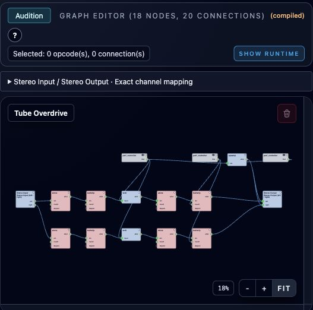

# Tube Overdrive

**Navigation:** [Instrument Design](instrument_design.md) | [Mixer and routing](../performance/audio_mixer_and_routing.md) | [Performance controllers](../performance/performance_controllers.md)

[Download Tube Overdrive](../../examples/instruments/Tube_Overdrive.orch.instrument.json)
and import it using **Instrument Design → Import**. This separate continuous
instrument adds warm stereo saturation with standard Csound opcodes. The original
**Overdrive** example remains available for comparison.



## Use as an insert

1. Import the instrument and open **Perform** with the instruments stopped.
2. Select the source strip in **Mixer**, choose **Tube Overdrive** in **Inserts…**, and click **Add**. It can also process the combined signal as a Master insert.
3. Set its performance controls, then start the instruments. **Restart the rack after changing a control**: this continuous effect reads settings at startup.
4. Adjust Output to match the untreated level when judging the sound. Save Performance to retain that instance's settings.

The stereo input and output use the exact channel names `left` and `right`.
The output is fully processed, with independent left/right signal paths. If used
as a return instead, mix the dry and processed signals using the routing and
send levels; the patch has no internal dry/wet control.

## Controls

| Controller | Minimum | Maximum | Default | Scale |
| --- | ---: | ---: | ---: | --- |
| Drive (dB) | 0 | 24 | 12 | Linear |
| Tone (Hz) | 2,000 | 12,000 | 6,500 | Logarithmic |
| Output (dB) | −18 | +6 | −3 | Linear |

**Drive** increases gain before saturation. Start around 3–6 dB for subtle color,
12 dB for moderate breakup, and 18–24 dB for stronger overdrive. Input level also
determines how hard the effect is driven. **0 dB Drive is not bypass.**

**Tone** sets the output low-pass cutoff: lower values soften the highs; higher
values retain more bite. **Output** trims the processed level. Partial gain
compensation reduces level changes as Drive increases, but does not equalize
perceived loudness. Positive output gain can exceed full scale; lower Output or
the downstream mixer gain if the meter clips.

These are per-instance performance settings, not MIDI CC automation. Their stable
IDs are `tube_drive_db`, `tube_tone_hz`, and `tube_output_db`. Native performance
bundles and both CSD export modes retain the selected settings.

## How the graph works

Both channels follow the same chain:

```text
Stereo Input → atone (20 Hz) → butterlp (12 kHz)
             → biased tanh → atone (10 Hz) → butterlp (Tone)
             → compensated Output gain → Stereo Output
```

The input filters remove subsonic energy and reduce very bright material entering
the nonlinear stage. The shaping formula is:

```csound
aShape = tanh(aPre * ampdb(iDriveDb) + 0.15)
aAC atone aShape - 0.148885033623318, 10
aTone butterlp aAC, iToneHz
aOutput = aTone * ampdb(iOutputDb - iDriveDb / 2)
```

The small bias makes the curve asymmetric, adding even harmonics alongside odd
harmonics. Subtracting `tanh(0.15)` keeps silence at zero; the following high-pass
removes DC generated by the signal. One shared `upsamp` node converts the computed
gain to audio rate for the output formulas. All processing uses existing opcodes
and input formulas, so the graph remains editable.

This is a tube-style coloration effect, not a model of a particular amplifier.
It has no cabinet simulation, power-supply sag, or oversampling. Filtering does
not remove aliasing already generated by the nonlinear stage. High notes and
strong Drive can expose this limitation; use the bright-signal comparisons in
the [example and validation guide](../../examples/instruments/tube_overdrive/README.md)
to judge the sound for your source.

References: [Csound tanh](https://csound.com/docs/manual/tanh.html),
[tube-distortion techniques](https://csoundjournal.com/ezine/winter1999/processing/index.html).
