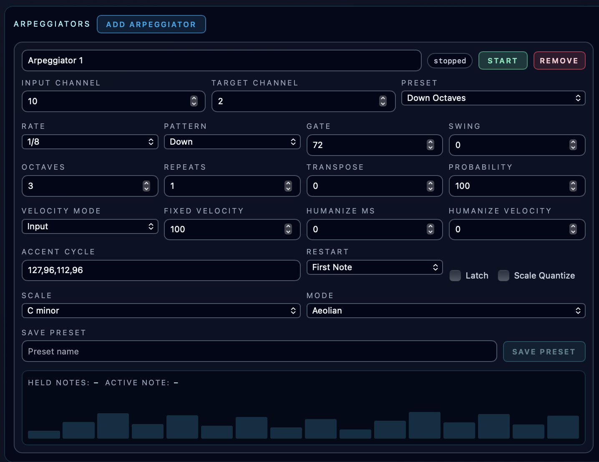

# Arpeggiators

**Navigation:** [Up](performance.md) | [Prev](controller_sequencers.md) | [Next](piano_rolls.md)

Arpeggiators are backend-run virtual instruments. They do not make sound by themselves. Instead, each arpeggiator listens on its own input MIDI channel, consumes notes sent to that channel, and generates arpeggiated notes on a selected target instrument channel.

This lets any note source in a performance drive an arpeggiator:

- melodic sequencers
- piano rolls
- drummer sequencers or external MIDI note sources
- any external controller routed through the selected session MIDI input

## Routing

Each arpeggiator has two important channels:

- `Input Channel`: the virtual instrument channel that other devices play into
- `Target Channel`: the existing instrument channel that receives the generated arpeggiated notes

Input channels must be unique across arpeggiators. The target channel cannot be another arpeggiator input channel, so arpeggiator chaining is intentionally disabled for now.

When an arpeggiator is stopped, notes on its input channel are still consumed but no arpeggiated notes are emitted. This keeps the virtual-channel routing predictable.

## Running Behavior

Arpeggiators run on the backend while the instrument engine session is running. They are not tied to the multitrack arranger transport.

If an arpeggiator is enabled and notes are held on its input channel, it continues stepping according to the configured rate, gate, swing, and tempo. This means a piano roll or external keyboard can hold a chord and hear the arpeggiator run even when the arranger transport is stopped.

## Presets and Settings

The arpeggiator panel includes built-in presets and lets you save user presets into the performance. Presets include the same kind of settings found on commercial arpeggiators:

- rate, gate, swing, octave range, and repeats
- patterns such as up, down, up/down, down/up, as-played, random, chord pulse, inside-out, and outside-in
- latch, restart behavior, probability, transpose, and scale quantize
- input, fixed, accent, or random velocity handling
- fixed velocity, accent cycle, velocity humanize, and timing humanize
- scale root, scale type, and mode for quantizing sources that do not provide their own scale

Built-in presets are always available. User-saved presets are stored inside the performance snapshot and move with exported/imported performances.

## Scale and Mode

When a melodic sequencer or piano roll drives an arpeggiator, the backend receives that source's current scale/mode context and uses it for scale quantization.

When the source does not provide scale information, such as a drummer sequencer or external MIDI controller, the arpeggiator uses its own selected scale root, scale type, and mode.

## Visualization

Each arpeggiator card shows:

- held input notes
- the active generated note
- a 16-step activity display that highlights the current arpeggiator step while notes are held

The visualization follows backend runtime status, so it reflects the actual arpeggiator running in the audio session rather than a frontend-only preview.

## Persistence

Saving a performance stores arpeggiator routing, enabled state, settings, and user presets. Transient runtime state such as currently held notes and active step is not persisted.

## Screenshots

  

<em>Arpeggiator panel with routing, preset controls, timing settings, and live activity display.</em>

**Navigation:** [Up](performance.md) | [Prev](controller_sequencers.md) | [Next](piano_rolls.md)
