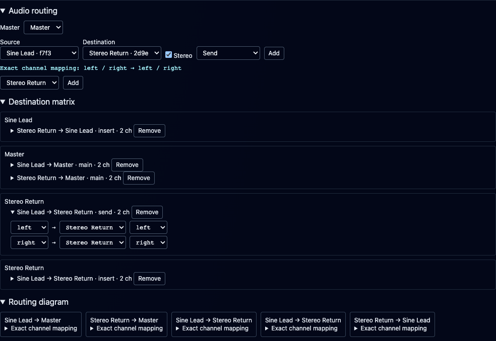

# Audio mixer and routing

**Navigation:** [Up](performance.md) | [Prev](instrument_rack_and_engine_transport.md) | [Next](sequencer_tracks_and_steps.md)

The collapsible mixer sits below the instrument rack. Select a strip to edit its outputs and sends. The pinned Master controls audio routed into it. A **Direct Audio Output** badge identifies paths that bypass Master; these still respond to their own strip's fader, balance, mute and solo.

Collapsing Mixer suspends its visual contents and meter subscriptions while audio controls and meter collection keep running. Nested sections suspend independently and remember their expansion state when their parent closes. Reopening restores routing selections, editor feedback and strip scroll position, and meters show the latest snapshot. See [Collapsible Panels](performance.md#collapsible-panels) for state lifetime and gesture cleanup.

## Build your first mix

1. In Instrument Design, choose **New → Playable instrument**, name the draft and **Save** it. Create and save an **Audio effect** when you need a processor. The built-in effect is a stereo pass-through starter; add your processing inside its graph.
2. In Perform, use **Add Instrument** and select the saved instrument. Set its MIDI channel. Guided instruments connect to the fixed internal Master automatically. For existing patches, inspect their destination labels and use **Route through Master** if needed.
3. Expand **Mixer** below the rack. Each strip header selects its source for the routing editor. The Master strip stays pinned at the right; scroll horizontally when the rack has many strips.
4. Start with 0 dB gain and centered Pan / Balance. Build routes and insert chains while stopped, then open **Routing diagnostics → Check routing**.
5. Click **Start Instruments** and play via a piano roll, sequencer or MIDI input. Change gain, balance, mute/solo and existing send settings while listening. Watch strip meters and the final Audio Output meter.
6. Use **Save Performance** to retain this mix. Stop the engine before adding/removing routes, replacing assignments or reordering inserts.

<p align="center">
  
</p>
<p align="center"><em>A stopped example mix: Sine Lead at -6 dB, a -12 dB post-fader send to Stereo Return, and pinned Master. The insert uses a separate instance of the same pass-through patch; no effect processing is implied by its name.</em></p>

## Signal flow

| Path | Processing order |
| --- | --- |
| Instrument | Summed voices → Perform inserts → pan/balance → fader → destination |
| Pre-fader send | After inserts → send amount → destination |
| Post-fader send | After pan/balance and fader → send amount → destination |
| Return | Summed inputs → effect patch → inserts → balance → return fader |
| Master | Incoming routes → internal stereo bus → inserts → balance → Master fader → Audio Output |

Effects drawn inside an instrument graph run per voice. Perform inserts receive summed voices. Each inserted effect is a dedicated rack instance. Reordering an insert changes explicit connections; if custom connections no longer form a simple chain, **Custom routing** preserves those connections.

Additional output groups retain their own port names and mappings. They share the owning strip's gain and mute; inserts process the designated main output. Custom routes can express other processing arrangements.

### Inserts versus shared returns

An **insert** processes one strip in series after its voices are summed. Select that strip, choose a saved continuous patch with audio inputs and outputs in the **Inserts…** selector below the routing controls, then click the adjacent **Add**. Open **Inserts** on the strip to inspect its chain. Click a processor name to edit its patch, **↑** to move it earlier, or **×** to remove that insert instance. Reusing one saved effect creates separate processing instances; an insert does not appear as a separate mixer strip.

A **return** is a continuous rack instance that can receive sends from several sources and has its own mixer strip. Add it with **Add Instrument**, connect its output to Master, then add sends from the source strips. For a parallel reverb/delay arrangement, design the return patch to output the desired wet signal; the starter pass-through would merely add another copy of the dry signal.

### Add a stereo send

1. Stop the engine. Add the saved effect as a rack instance and use its **Route through Master** button to connect its main output.
2. In **Audio routing**, choose the instrument under **Source** and the return under **Destination**.
3. Leave **Stereo** checked and verify **Exact channel mapping**, for example `left / right → left / right`. Choose **Send** in the Route selector and click the routing row's **Add**.
4. On the source strip, find **Send → [return name]**. New sends start at silence; enter a value such as -12 dB to hear the return.
5. Choose **Post-fader** when the send should follow the source's fader/balance, or **Pre-fader** for an independent send amount. The source's Mute still silences either kind of send.

Adding a send does not replace the main output route. Avoid adding duplicate connections: parallel paths sum and can increase output level. Up to 1,024 individual channel connections and 64 rack instances (including processors, excluding internal Master) are supported; a stereo pair uses two connections.

## Controls

- Faders span −60 to +12 dB, with an exact-silence position below −60. Clearing the numeric value selects silence. Double-click resets to 0 dB.
- Sends span silence to +6 dB. New sends start silent and post-fader. Pre/post can change during playback.
- Rotary controls support vertical dragging, arrow keys, Page Up/Down, Home/End, exact numeric editing and double-click reset. Shift-drag provides finer adjustment.
- Stereo balance preserves both channels at unity in the center and attenuates the opposite channel toward either side. Explicit mono-to-stereo routing uses equal-power pan. Custom mono mappings stay unchanged.
- Mute blocks all outgoing paths, including pre-fader sends. Processors keep running, allowing downstream tails to decay.
- Multiple solos are allowed. Solo preserves required upstream inputs and downstream processors. Soloing a return excludes its sources' unrelated dry branches. Mute takes precedence. Master has no Solo control.
- Gain, balance, send and mute/solo changes use finite 20 ms ramps. Playback starts at the saved values, without an initial fade.

Meters show stereo peak and RMS. CLIP indicates a peak at or above 0 dBFS; no automatic limiting, normalization or clipping is applied. The final **Audio Output** meter includes Master and direct paths. Connectivity diagnostics describe structure; meters measure actual audio activity.

## Routing and repair

Choose a source, destination and explicit channel mapping before adding a main route, send or custom connection. Stereo groups expand into their exact member ports. Uncheck **Stereo** to select one exact source port and destination inlet at a time, including custom or mono mappings. Group display names are not inlet names; legacy label suggestions never rename ports.

Open **Destination matrix** to inspect incoming routes grouped by destination. Expand a route row to change its source port, destination instance or destination port; **Remove** deletes that grouped connection. This is also where broken references can be repaired instead of discarding the performance.

Open **Routing diagram** to follow the same connections as source → destination cards. Expand **Exact channel mapping** on a card to inspect port names and processing stages. Click source/destination names to select routing endpoints; use the strip's **Edit patch** action to open its instrument graph.

<p align="center">
  
</p>
<p align="center"><em>The send's left and right mappings expanded in Destination matrix. Matrix and diagram show the same routes, including the dedicated insert's input and return-to-strip connections.</em></p>

**Route through Master** replaces the selected strip's main routes with stereo connections to the designated Master in this performance. Sends and custom routes are retained. Master is a fixed internal stereo output with volume, balance, mute, meters and effect inserts. It is always available, has no editable patch and occupies no library entry or rack slot. Its controls and inserts belong to the performance. **Audio Output** remains available as an editable starter for custom output processors.

New guided instruments connect to Master automatically. Loading an older performance preserves its authored direct/custom paths. Master gain or mute affects only paths routed into Master: a direct strip can still be audible. Check the **Direct Audio Output** badge and the final Audio Output meter when tracking down sound that remains after lowering Master.

Topology changes require stopping the engine. **Stop to edit routing** makes that action explicit. Existing mixer controls remain live. Invalid references and genuine feedback cycles block playback and CSD export. Broken routes remain available for repair. Unused ports, incomplete stereo pairs and parallel direct/processed paths are warnings.

### Troubleshoot routing and silence

Expand **Routing diagnostics** and click **Check routing** after editing connections. Diagnostics describe connectivity, while meters report measured sound. Clicking an instance-related diagnostic can open its patch for inspection. A **Muted or silent path** entry selects the corresponding strip.

| Symptom or diagnostic | What to check |
| --- | --- |
| Repair route / Missing reference | Restore the referenced patch or repair the destination and exact port names in Destination matrix. |
| Feedback cycle | Remove a connection that feeds a processing path back into itself. Playback and CSD export remain blocked until genuine cycles are resolved. |
| Connect an audio output / Select an audio source | Follow the source to an output sink; route audio into effects that require inputs. |
| Complete stereo mapping / Unused ports | Check both channel mappings and the declared audio groups. These structural warnings do not prove a patch is silent. |
| Review parallel output paths | Check whether both direct and processed copies intentionally reach the output. |
| Muted or silent path | Clear Mute or raise a fader/send from silence; also check active solos and whether the source is producing notes/audio. |
| CLIP | Reduce gain along the contributing paths. No limiter is applied automatically. |

<p align="center">
  
</p>
<p align="center"><em>A valid route can still be silent: here the Sine Lead strip is muted.</em></p>

## Persistence and compatibility

Performance configuration version 15 retains the internal Master introduced in version 14, with stable instance IDs, explicit routes, mixer strips, sends and insert ownership. Versions 1–14 remain readable. App state version 2 saves this same model. Save/Load, Clone and native JSON/ZIP bundles preserve the current settings. Mixer automation recording is not included.

Versions 1–10 convert old Level values using `20 * log10(level / 10)`, including continuous effects. Missing Level means 0 dB. Legacy inlet selection is resolved once and saved explicitly. Level no longer scales MIDI velocity; velocity-sensitive patches can therefore change timbre after migration. Authored note velocities remain unchanged.

Both performance CSD modes initialize the same routing, gain, balance, mute, solo and send settings without a browser. Offline rendering retains 48 kHz, `ksmps=1`, float WAV output and release tails. Live/offline settings match; different engine rates need not produce identical waveforms. A routed continuous source can render a finite range with no MIDI notes. Standalone instrument exports contain patch design and interface metadata, without Perform mixer settings.

## Control API

Session creation and validation accept `audio_graph` and `mixer`. `GET /api/sessions/{id}/mixer` returns desired values and revision; `PUT` accepts batched partial scalar updates and an optional expected revision. Stale revisions return 409. The active browser-clock controller can send the equivalent `mixer_update` message and receive `mixer_ack`/`mixer_error` replies. Updates are queued and applied at render-block boundaries. Meter frames carry engine sample timestamps and are delivered at most 15 times per second.

`POST /api/sessions/preview` accepts a session plus inline draft patch definitions. It creates a transient runtime without saving drafts into the patch library. Normal stop/delete session operations clean it up.

The performance CLI writes version 16 and preserves routing, mixer data, instance settings and existing insert chains. `--level` is deprecated and converts to audio gain. New CLI routes require exact destination inlet selection when names differ; `--inlet` makes that mapping explicit.

### Author a mix with the performance CLI

The performance creator skill can stage main/send routes, strip and Master controls, and atomic stereo send updates. From its directory, with a staged performance and the named effect patches available:

```bash
uv run orchestron_cli --json edit add-standard-effects --send-gain-db -12
uv run orchestron_cli --json edit routes list
uv run orchestron_cli --json edit mixer list
uv run orchestron_cli --json edit mixer strip set \
  --binding '$master' --gain-db -3
```

The optional preset routes dry instrument outputs and a shared reverb return through a compressor into Master. No speaker instrument is required. It redirects existing direct outputs without cloning patches; new sends default to silence unless an initial amount is supplied. Repeating the preset preserves matching route IDs and saved mixer settings.

For explicit routing, `edit routes add --kind main|send|custom` selects the path type. Quote `$master` and `$direct.left/right` in shell commands. Main routes capture direct output ports; send/custom routes alone leave their direct-output bypass active. Remove an exact connection with `edit routes remove --id ROUTE_ID`.

Use `edit mixer strip set --binding ID` for gain, balance, mute/solo (Master has no solo), and `edit mixer send set --route LEFT_ID --route RIGHT_ID` for a stereo send's gain and pre/post tap. Add `--gain-db silence` for exact silence. Omitted controls retain their saved values. Use the app for insert creation/reordering; the CLI preserves existing insert chains.

Validate and commit to save the mix. `edit push-runtime` applies mixer values to a matching live runtime; use `edit rebuild-runtime` after routing changes. Continuous-effect parameter overrides require rack restart, whereas ordinary mixer controls remain live. Full CLI examples are in the [performance creator skill](../../integrations/skills/orchestron-performance-creator/SKILL.md).

**Navigation:** [Up](performance.md) | [Prev](instrument_rack_and_engine_transport.md) | [Next](sequencer_tracks_and_steps.md)

## Upgrading existing Masters

On backend startup, the SQLite library is migrated before it is served. The migration creates a sibling `.before-internal-master-<timestamp>.bak` database backup before changing data. Repeated starts make no further changes after migration.

Known neutral Master graphs are replaced by the internal output while preserving each performance's routes, gain, balance, mute and inserts. Customized Masters retain their processing as ordinary rack instruments feeding the internal Master. Unreferenced neutral Master copies are removed from the library only after references in saved performances and app state have been migrated. Modified patches, edited drafts and patches still used elsewhere are retained.

A genuinely missing legacy patch stays visible for repair. While stopped, **Replace missing Master with internal output** transfers compatible stereo connections and saved Master controls; save the performance afterward. Unknown port mappings must first be repaired in the routing matrix.

To preview the migration manually with the backend stopped, run `uv run python -m backend.tools.migrate_internal_master --database backend/data/visualcsound.db`. Add `--apply` to create a backup and apply it. Use the actual database path for Docker or custom installations. To roll back, stop the backend and restore the backup together with the previous application version.
