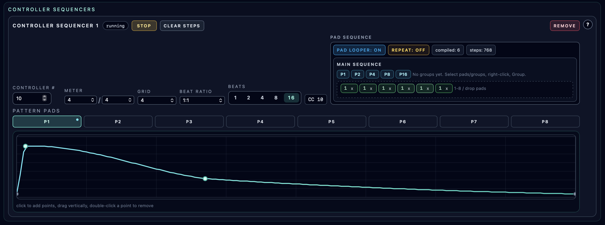

# Controller Sequencers

**Navigation:** [Up](performance.md) | [Prev](pattern_pads_and_pad_looper.md) | [Next](piano_rolls.md)

Controller Sequencers automate MIDI CC values using editable curves.

## What A Controller Sequencer Does

A controller sequencer samples a CC curve over a repeating length and emits MIDI Control Change messages during playback.

Typical uses:

- filter sweeps
- morph controls
- modulation depth animation
- macro movement synchronized to transport

## Adding / Removing Controller Sequencers

- `Add Controller Sequencer` creates a new controller sequencer card
- Each controller sequencer has a `Remove` button

## Per-Controller-Sequencer Controls

Each controller sequencer provides:

- Running/stopped state badge
- `Start` / `Stop` enable toggle
- `Controller #` (`0..127`)
- Curve rate selection (`8`, `16`, `32`, `64`)
- CC label preview (`CC N`)
- Curve editor

### Curve Rate (`8/16/32/64`)

This defines the repeat length for the curve sampling relative to transport steps and affects how quickly the curve cycles.

## Curve Editor Interactions

The curve editor is an interactive graph view (spline-based curve display and sampling).

Supported interactions:

- Click background to add a point (interior points only)
- Drag a point to change position/value
- Double-click an interior point to remove it
- Endpoints are boundary anchors (positions remain at start/end of the curve)

### Visual Playback Indicators (When Running)

When the main transport is running and the controller sequencer is enabled, the editor shows:

- a vertical playback position line
- a marker showing the currently sampled CC value on the curve

This makes it easy to understand exactly what value is being sent at each transport moment.

## Live Use Notes

- Controller sequencers run alongside note sequencer tracks.
- You can combine automated controller sequencers with manual MIDI controller knob lanes on the same performance page.
- If you automate the same CC number from multiple sources, the last-sent value wins at the MIDI receiver side (plan mappings accordingly).

## Screenshots

  

<em>Controller sequencer with curve editor, CC configuration, and playback indicator.</em>

**Navigation:** [Up](performance.md) | [Prev](pattern_pads_and_pad_looper.md) | [Next](piano_rolls.md)
