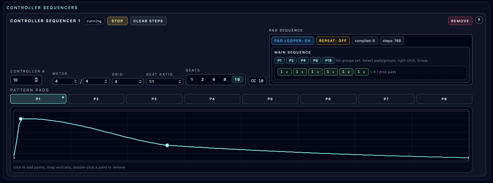

# Controller Sequencers

**Navigation:** [Up](performance.md) | [Prev](multitrack_arranger.md) | [Next](piano_rolls.md)

Controller Sequencers automate MIDI CC values using editable curves.

## What A Controller Sequencer Does

A controller sequencer sends its programmed CC curve to the backend sequencer, which samples that curve over a repeating length and emits timed MIDI Control Change messages during playback.

Typical uses:

- filter sweeps
- morph controls
- modulation depth animation
- macro movement synchronized to transport

## Adding / Removing Controller Sequencers

- `Add Controller Sequencer` creates a new controller sequencer card
- Each controller sequencer has a `Remove` button

## Per-Controller-Sequencer Controls

Each controller sequencer provides:

- Running/stopped state badge
- `Start` / `Stop` enable toggle
- `Controller #` (`0..127`)
- `Meter` (`2..7` over `4` or `8`)
- `Grid` (`2`, `4`, or `8`, steps per beat)
- `Beat Ratio` (`1:1`, `2:1`, `3:2`, `4:3`, `3:4`, `5:4`, `4:5`, `7:4`)
- Curve length in beats (`1..8`, plus `16`)
- CC label preview (`CC N`)
- Curve editor

### Curve Length (`1..8`, plus `16`, beats)

This defines the repeat length for the curve sampling relative to that controller sequencer's own timing. Keypoints stay normalized across the full pad duration, so the same curve shape stretches automatically when you choose a longer beat length.

`Beat Ratio` changes how quickly the controller sequencer moves through that curve relative to the shared transport. Faster ratios create repeating automation polyrhythms without changing the stored keypoint positions.

## Curve Editor Interactions

The curve editor is an interactive graph view (spline-based curve display and sampling).

Supported interactions:

- Click background to add a point (interior points only)
- Drag a point to change position/value
- Double-click an interior point to remove it
- Endpoints are boundary anchors (positions remain at start/end of the curve)

### Visual Playback Indicators (When Running)

When the main transport is running and the controller sequencer is enabled, the editor shows:

- a vertical playback position line
- a marker showing the currently sampled CC value on the curve

This makes it easy to understand exactly what value is being sent at each transport moment.

## Live Use Notes

- Controller sequencers run alongside melodic sequencers on the same backend transport clock.
- While transport is running, pad presses are queued and applied on the next controller-pad boundary.
- You can combine automated controller sequencers with manual MIDI controller knob lanes on the same performance page.
- If you automate the same CC number from multiple sources, the last-sent value wins at the MIDI receiver side (plan mappings accordingly).

## Screenshots

  

<em>Controller sequencer with curve editor, CC configuration, and playback indicator.</em>

**Navigation:** [Up](performance.md) | [Prev](multitrack_arranger.md) | [Next](piano_rolls.md)
