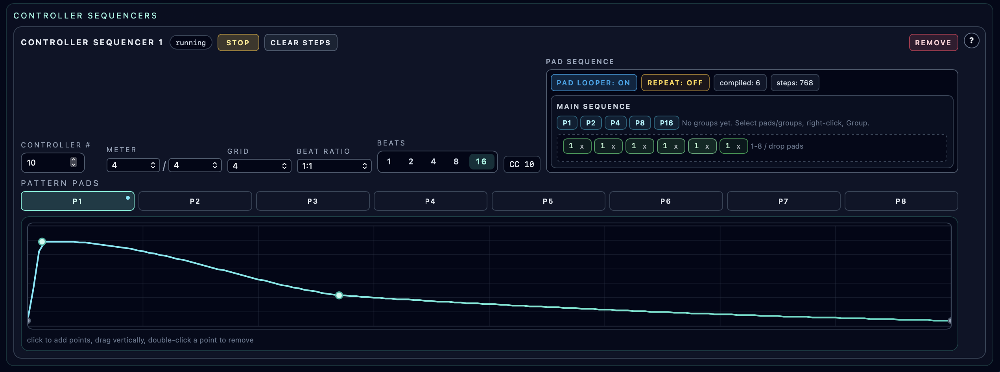

# Controller Sequencers

**Navigation:** [Up](performance.md) | [Prev](multitrack_arranger.md) | [Next](arpeggiators.md)

Controller Sequencers automate MIDI CC values using editable curves.

Use the pen beside the device name to rename it. See [Device Names](performance.md#device-names) for editing controls, validation, and import/export behavior.

## Collapse the Panel

The controller group collapses independently of melodic and drummer sequencers. Its header and Add button remain available even when empty; adding a controller sequencer expands the group. Panels start expanded and remember your choice across view switches until browser reload. Collapsing does not stop playback or discard edits.

## What A Controller Sequencer Does

A controller sequencer sends its programmed CC curve to the backend sequencer, which samples that curve over a repeating length and emits timed MIDI Control Change messages during playback.

Typical uses:

- filter sweeps
- morph controls
- modulation depth animation
- macro movement synchronized to transport

## Adding / Removing Controller Sequencers

- `Add Controller Sequencer` creates a new controller sequencer card
- A performance can contain up to 16 controller sequencers
- Each controller sequencer has a `Remove` button

## Per-Controller-Sequencer Controls

Each controller sequencer provides:

- Running/stopped state badge
- `Start` / `Stop` enable toggle; can be used manually while the multitrack arranger is stopped
- `Controller #` (`0..127`)
- **MIDI Channels** checkboxes, 1–16 in one row beside `Clear Steps`
- `Meter` (`2..7` over `4` or `8`)
- `Grid` (`2`, `4`, or `8`, steps per beat)
- `Beat Ratio` (`1:1`, `2:1`, `3:2`, `4:3`, `3:4`, `5:4`, `4:5`, `7:4`)
- Curve length in beats (`1..8`, plus `16`)
- CC label preview (`CC N`)
- Curve editor

### MIDI Channels

Check the channels that receive the curve's CC messages. All 16 are checked by default (OMNI); at least one must remain checked. The row scrolls horizontally on narrow screens. This is a device setting shared by all its pads.

Channel edits use the same 80 ms live-edit synchronization as curve edits and take effect at the next engine block without restarting transport or losing queued pads. The current curve value is sent to the new selection. Removed channels retain their last received value.

Selections survive Save/Load Performance, browser reload, native JSON/ZIP export/import, and both CSD export modes. Older performances without the setting load with all 16 channels checked.

### Curve Length (`1..8`, plus `16`, beats)

This defines the repeat length for the curve sampling relative to that controller sequencer's own timing. Keypoints stay normalized across the full pad duration, so the same curve shape stretches automatically when you choose a longer beat length.

`Beat Ratio` changes how quickly the controller sequencer moves through that curve relative to the shared transport. Faster ratios create repeating automation polyrhythms without changing the stored keypoint positions.

## Pattern Workspace

The **Playback source** toggle chooses **Arrangement** or **Manual pads**. New controller sequencers use Manual pads until their first item is placed on an arranger lane, which selects Arrangement. Later choices are saved with the performance. **Loop song** in the arranger controls repeating or stopping at the song end.

The always-visible workspace sits beside the musical controls, or below them on narrow screens. Drag pads into it, select several with Cmd/Ctrl-click, then Group or Supergroup. Reorder by dragging, split through the context menu, and Apply shared phrase changes explicitly. See [Pattern Workspace](pattern_pads_and_pad_looper.md#pattern-workspace) for editing, deletion and retained drafts.

Play loops the displayed assembly and outlines its current pad, phrase or rest. Hold a speaker for 250 ms to temporarily override it; release resumes the workspace at its current position. Stop restores prior playback. Controller curves and channel routing remain effective. Two zero-valued endpoints alone look empty; additional points or nonzero values highlight the pad. This is a content indicator: zero still sends a valid CC value.

## Curve Editor Interactions

The curve editor is an interactive graph view (spline-based curve display and sampling).

When all keypoints have the same value, the curve appears as a horizontal line across the editor. This also applies to the minimum (`0`) and maximum (`127`) CC values.

Supported interactions:

- Click background to add a point (interior points only)
- Drag a point to change position/value
- Double-click an interior point to remove it
- Endpoints are boundary anchors (positions remain at start/end of the curve)

### Visual Playback Indicators (When Running)

When the main transport is running and the controller sequencer is enabled, the editor shows:

- a vertical playback position line
- a marker showing the currently sampled CC value on the curve

This makes it easy to understand exactly what value is being sent at each transport moment.

## Live Use Notes

- Controller sequencers run alongside melodic sequencers on the same backend transport clock.
- Curve edits are combined after an 80 ms editing pause and prepared while the previous curve keeps playing. They take effect at the next engine block without resetting transport. The editor modifies the displayed pad even when the arranger selected it automatically.
- See [Editing During Playback](live_status_and_safety_controls.md#editing-during-playback) for failure handling and transport behavior.
- Pad clicks select the editing pad. While Manual pads is running, clicking another pad also queues it at the end of the current pattern: orange marks it while queued, then blue-green marks it when playing. Launch pad also queues the selected pad; the separate speaker previews it after a 250 ms hold.
- You can combine automated controller sequencers with manual MIDI controller knob lanes on the same performance page.
- If you automate the same CC number from multiple sources, the last-sent value wins at the MIDI receiver side (plan mappings accordingly).

## Screenshots

  

<em>Controller sequencer with curve editor, CC configuration, and playback indicator.</em>

**Navigation:** [Up](performance.md) | [Prev](multitrack_arranger.md) | [Next](arpeggiators.md)
