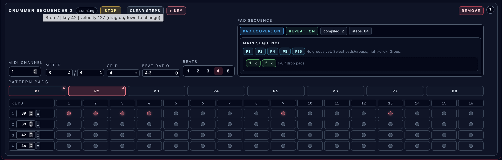

# Drummer Sequencers

**Navigation:** [Up](performance.md) | [Prev](sequencer_tracks_and_steps.md) | [Next](pattern_pads_and_pad_looper.md)

Drummer sequencers are drum-machine style step sequencers for fixed MIDI drum keys.

They are optimized for per-step drum hit programming instead of melodic note/chord entry.

Use the pen beside the device name to rename it. See [Device Names](performance.md#device-names) for editing controls, validation, and import/export behavior.

See [Sequencer timing](sequencer_timing.md) for triplets, beat grouping, editing behavior and legacy compatibility (EN/DE/FR/ES).

## Collapse the Panel

The drummer group collapses independently of melodic and controller sequencers. Its header and Add button remain available even when empty; adding a drummer sequencer expands the group. Panels start expanded and remember your choice across view switches until browser reload. Collapsing does not stop playback or discard edits.

## What Makes Them Different

Compared to melodic sequencers, drummer sequencers:

- use MIDI key numbers (`0..127`) per row (drum instrument selection)
- do not use scale / mode / chord controls
- do not use pad transpose edge buttons
- let you program multiple drum rows per step
- store velocity per active drum hit (per row + step)

## Adding / Removing Drummer Sequencers

- Use the `Add Drummer Sequencer` button in the sequencer section header to add a drummer sequencer card
- A performance can contain up to 16 drummer sequencers
- Each drummer sequencer card has its own `Remove` button

## Per-Drummer-Sequencer Controls

Each drummer sequencer card provides:

- sequencer state badge (running/stopped or queued start/stop state)
- `Start` / `Stop` (sequencer enable state; can be used manually while the multitrack arranger is stopped)
- `Remove`
- `Clear Steps`
- `+ Key` (add another drum row)
- `MIDI Channel` (`1..16`)
- `Meter` (`2..7` over `4` or `8`)
- `Subdivision` (1, 2, 3, 4, 6 or 8 steps per local meter beat)
- `Advanced timing → Playback speed` (`1:1`, `2:1`, `3:2`, `4:3`, `3:4`, `5:4`, `4:5`, `7:4`)
- `Pattern length` (every integer from 1–16 local beats; whole bars show both units)
- Playback source and upper-right pattern workspace (same as melodic sequencers)

## Drum Rows (`Keys`)

The left side of the drummer grid contains vertically stacked drum rows.

Each row has:

- row index label
- MIDI key input (`0..127`)
- row remove button (`x`)

### Auditioning Drum Keys While Editing

When the instrument engine session is running, changing a row key sends a short one-shot MIDI note preview on the drummer sequencer's MIDI channel.

This helps identify which drum sound is mapped to a given MIDI key number.

## Drum Step Grid (LED Matrix)

The grid is row-based:

- rows = selected drum keys
- columns = `beats * steps per beat`

This keeps the `Keys` column horizontally aligned with the LED rows.

### LED States

- inactive step: dark LED with visible border
- active step: red LED
- current playing column: highlighted across every drum row
- active step in the current playing column: flashing green LED

### Velocity (Per Hit)

Velocity is shown by LED color saturation (stronger color = higher velocity).

The LED border color stays visible even at low velocities, so low-velocity active hits remain distinguishable from inactive steps.

While dragging vertically on a hit, the UI also shows a live numeric `velocity: xx` readout next to the edited step.

### Editing Workflow

- Click an inactive LED to activate a hit
- Click an active LED (without dragging) to deactivate it
- Click and drag vertically on an LED to change velocity (`0..127`)
- While dragging, watch the live `velocity` readout for the exact value
- Keyboard:
  - `Enter` / `Space` toggles the hit
  - `Arrow Up` / `Arrow Down` adjusts velocity

## Early and Late Notes

Timing moves an individual attack by **−50% to +50% of one local step**, in 1% increments. Zero means **On grid**. The millisecond readout follows the current tempo, grid and beat ratio: at 120 BPM with 4/4, Subdivision 4 and speed 1×, −20% is 25 ms early. Timing belongs to each pad and does not change its length, meter or playback speed.

Moving a note also moves its release, preserving its length and any HOLD extension. A following attack can shorten the preceding note to avoid overlap. Chords move together. If neighboring attacks land at exactly the same instant, the later logical step wins.

An early first step plays before the boundary when the same pad repeats. On a fresh start or a different-pad launch it plays at the boundary instead. Queued stops, pauses and finite arrangement ends suppress repeat anticipation. A command received after an anticipated attack has already sounded cannot undo that attack.

Copying steps or pads preserves timing. Clear Steps resets it. Inactive drum cells retain their timing for reactivation. Old performances load on grid; Save/Load, browser restoration, native bundles and both CSD export modes preserve offsets. Timing edits during playback use the normal coalesced live-edit workflow.

Drag a hit **left/right** to adjust timing, or **up/down** to adjust velocity. The first drag direction locks the property until release; clicking without dragging still toggles the hit. Changed hits show a signed percentage and a displaced indicator.

Use **Left/Right** arrow keys for timing and **Up/Down** for velocity. Right-click a hit, or press **Shift+F10**, to open its Timing controls with a slider, numeric field and reset. The controls affect that hit in the displayed pad. Closing or collapsing the editor ends the gesture.

The performance CLI can discover tracks with `edit sequencers list` and inspect or change offsets with `edit step-timing list|set|reset`. Pads use 1–8; steps are zero-based. YAML/JSON scores also support per-note timing. See the [skill timing reference](../../integrations/skills/orchestron-performance-creator/references/step_timing.md) for the full workflow and examples.

## Pattern Pads and Reusable Phrases

Drummer sequencers support the same `#1..#8` pattern-pad workflow as melodic sequencers.

If a drummer sequencer is running, pad changes are queued to the next loop boundary. If it is stopped, pad changes apply immediately so you can edit another pad while the shared transport keeps running elsewhere.

Drummer pad length is stored in beats, while meter, grid, and beat ratio are configured per drummer sequencer.

This keeps drummer pads beat-based while still allowing one-bar patterns in odd meters such as `3/4`, `5/4`, or `7/8` by matching the pad beat count to the meter, while `Advanced timing → Playback speed` changes how fast the row pattern cycles against the shared transport without changing the stored beat length.

Edit pad contents here and assemble reusable groups/supergroups in the upper-right [pattern workspace](pattern_pads_and_pad_looper.md). Drop and reorder pads, Cmd/Ctrl-click to group selections, and right-click to ungroup. Apply commits edits to existing phrases; loose workspace items stay temporary. Play loops the assembly, and holding a speaker for 250 ms previews one item until release. Place saved phrases in the multitrack arranger. The Playback source toggle chooses Arrangement or Manual pads. New devices use Manual pads; the first item placed on their arranger lane selects Arrangement, and later source choices are saved. Loop song in the arranger controls repetition at the song end. Click selects a pad. While Manual pads is running, clicking another pad also queues all rows for the end of the current pattern. The queued pad has an orange outline, then turns blue-green when playing. While stopped or using Arrangement, clicks only select for editing. Launch pad remains available.

Differences vs melodic sequencer pads:

- no transpose edge buttons (`-` / `+`)
- pad content is drum-row hit data + per-hit velocities (not note/chord/theory state)

## Screenshots

  

<em>Drummer sequencer showing multiple drum rows, per-step hits, and velocity editing on the LED grid.</em>

## Typical Uses

- Kick / snare / hat step programming
- Percussion layers with multiple rows
- Switching between groove variations using pattern pads
- Automating drum pattern changes with the arranger while performing on piano roll/controllers

**Navigation:** [Up](performance.md) | [Prev](sequencer_tracks_and_steps.md) | [Next](pattern_pads_and_pad_looper.md)

## Ratchets and Velocity Ramps

Right-click a drum cell, or focus it and press **Shift+F10**, to open **Step properties**. Set **Ratchets** to 1–8: 1 is the normal single hit, and higher counts divide one local step into evenly spaced hits. An **×N** badge identifies the roll in the grid. At 120 BPM with Subdivision 4 in 4/4, four hits occur at 0, 31.25, 62.5 and 93.75 ms within a 125 ms step.

Enable **Velocity ramp** and choose **Final velocity** (0–127). The first hit uses the cell's velocity and the remaining hits interpolate to the final value. For four hits, 100 → 40 produces 100, 80, 60, 40. Zero-velocity hits are silent. Disable the ramp for constant velocity. At one hit the ramp controls are disabled, but their values are retained.

Timing shifts the whole roll while preserving its spacing. The next active cell in the same drum row cuts off unfinished repeats; an equal-time collision belongs to the later step. On a fresh start or a different-pad launch an early first roll starts at the boundary. On a confirmed same-pad repeat it can begin early, and a late final roll can finish across that boundary. A stop, seek, different pad, arrangement rest or finite end cancels unfinished rolls. A roll already in progress keeps its count, ramp and timing when those settings are edited; the next occurrence uses the prepared changes.

Editing these properties does not activate an inactive cell. Disabling and re-enabling a cell preserves them; copying pads and saving/exporting preserves them, including hidden steps. Clear Steps restores one hit without a ramp. The panel edits the displayed pad and closes when changing pads, collapsing the drummer section or removing the target. Escape also closes it. Existing click toggles, horizontal timing drags, vertical velocity drags and arrow-key editing remain available.

### Deutsch — Mehrfachanschläge

Rechtsklick oder **Umschalt+F10** öffnet **Schritteigenschaften**. **Mehrfachanschläge** (1–8) verteilen Anschläge gleichmäßig über einen Schritt; **×N** markiert den Wirbel. **Anschlagstärke-Verlauf** interpoliert von der Anschlagstärke der Zelle zur **Letzten Anschlagstärke** (0–127); 0 ist stumm. Bei einem Anschlag bleibt der Verlauf gespeichert, aber deaktiviert. Timing verschiebt den ganzen Wirbel; die nächste aktive Zelle derselben Zeile beendet ihn. Ein laufender Wirbel behält seine Einstellungen bis zum Ende. Stop, Sprung, ein anderes Pad oder eine Arrangement-Pause brechen ihn ab. Inaktive Zellen bleiben inaktiv; Kopien, Speichern und beide CSD-Exporte erhalten die Werte. Schritte löschen setzt sie zurück.

### Français — Répétitions rapides

Clic droit ou **Maj+F10** ouvre **Propriétés du pas**. **Répétitions rapides** (1–8) répartit les frappes régulièrement sur un pas ; **×N** indique le roulement. **Rampe de vélocité** interpole entre la vélocité de la cellule et la **Vélocité finale** (0–127) ; 0 est silencieux. Avec une seule frappe, la rampe reste mémorisée mais désactivée. Le placement décale tout le roulement ; la cellule active suivante de la même ligne l'interrompt. Un roulement commencé conserve ses réglages. Arrêt, déplacement, autre pad ou pause d'arrangement annulent les frappes restantes. Les cellules inactives restent inactives ; copies, sauvegardes et exports CSD conservent les valeurs. Effacer les pas les réinitialise.

### Español — Repeticiones rápidas

Clic derecho o **Mayús+F10** abre **Propiedades del paso**. **Repeticiones rápidas** (1–8) distribuye golpes equidistantes dentro de un paso; **×N** identifica el redoble. **Rampa de velocidad** interpola entre la velocidad de la celda y la **Velocidad final** (0–127); 0 es silencioso. Con un solo golpe, la rampa se conserva pero queda desactivada. El tiempo desplaza todo el redoble; la siguiente celda activa de la misma fila lo interrumpe. Un redoble iniciado conserva sus ajustes. Parada, salto, otro pad o pausa del arreglo cancelan los golpes restantes. Las celdas inactivas siguen inactivas; copias, guardado y exports CSD conservan los valores. Limpiar pasos los restablece.
