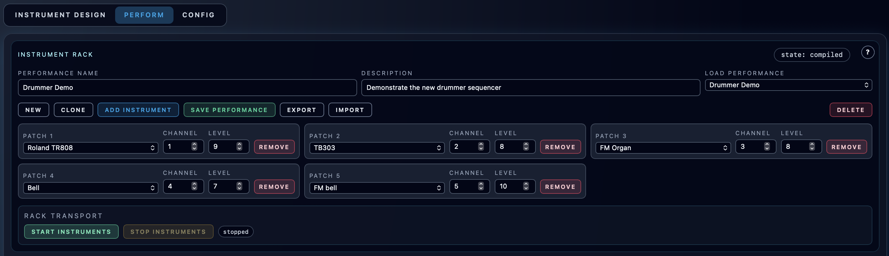

# Instrument Rack and Engine Transport

**Navigation:** [Up](performance.md) | [Prev](performance.md) | [Next](sequencer_tracks_and_steps.md)

The Instrument Rack is the top section of the Perform page and controls the live session, instrument assignments, and performance metadata.

## Performance Metadata and Library Actions

The rack includes fields and actions for the current performance:

- `Performance Name`
- `Description`
- `Load Performance` dropdown
- `Save Performance`
- `Clone`
- `Delete`
- `Export`
- `Import`

These actions operate on the performance configuration (instrument rack + sequencers + controllers + piano rolls), not on individual patch definitions.

## Instrument Assignments (Rack Slots)

Each rack entry lets you choose:

- A saved patch (`Patch N` dropdown)
- A MIDI channel (`1..16`)
- A level value (`1..10`)
- Remove action

While instruments are running, rack assignment changes are locked:

- `Add Instrument` is disabled
- Rack-slot `Remove` is disabled
- Patch and MIDI channel selectors are disabled
- `Level` remains active so you can rebalance the live mix without stopping the engine

### Add Instrument

- Use `Add Instrument` to create another rack slot.
- This enables multi-instrument performances driven by different MIDI channels.
- The button is unavailable while the engine is running; stop instruments before changing rack assignments.

## Rack Transport (Instrument Engine Control)

The rack transport controls the instrument runtime session itself.

Buttons:

- `Start Instruments`
- `Stop Instruments`

### `Start Instruments` / `Stop Instruments`

These start/stop the underlying instrument engine session.

Global arrangement transport now lives in the multitrack arranger section. There, cassette-style `Rewind`, `Stop`, `Play`, and `Fast forward` buttons start or stop all arrangement-driven sequencers together and move the shared playhead in `4-step` blocks. `Stop` preserves the current playhead position, and double-clicking `Stop` resets the playhead to the selected loop start or to step `0` when no loop is selected.

## Session State Badge

The rack shows current session state (localized label), for example:

- running
- stopped / idle

This is the state of the instrument engine session, not just the sequencer transport.

## Error Banner

If engine start/stop or transport actions fail, the Perform page shows an error banner below the rack transport section.

## Tips

- Save the performance after significant changes (rack assignments, sequencers, piano rolls, controller mappings).
- Use distinct MIDI channels per instrument unless you intentionally want multiple instruments layered on the same channel.

## Screenshots

  

<em>Instrument rack detail with performance metadata, assignments, and transport controls.</em>

**Navigation:** [Up](performance.md) | [Prev](performance.md) | [Next](sequencer_tracks_and_steps.md)
