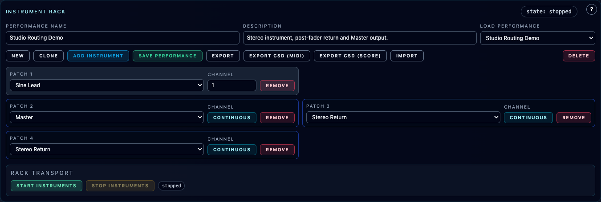

# Instrument Rack and Engine Transport

**Navigation:** [Up](performance.md) | [Prev](performance.md) | [Next](audio_mixer_and_routing.md)

The Instrument Rack is the top section of the Perform page and controls the live session, instrument assignments, and performance metadata.

## Performance Metadata and Library Actions

The rack includes fields and actions for the current performance:

- `Performance Name`
- `Description`
- `Load Performance` dropdown
- `Save Performance`
- `Clone`
- `Delete`
- `Export`
- `Export CSD (MIDI)`
- `Export CSD (SCORE)`
- `Import`

These actions operate on the performance configuration (instrument rack + audio routing/mixer + sequencers + controllers + piano rolls), not on individual patch definitions.

- `Export` writes an Orchestron `.orch.json` / `.orch.zip` performance bundle for backup, sharing, and re-import.
- `Export CSD (MIDI)` writes an offline-render ZIP with a compiled `.csd`, the arranger performance as `.mid`, bundled uploaded sample/SF assets, and a `README.txt` with the render command. `Export CSD (SCORE)` embeds notes and controller sweeps directly in the Csound score, omits the `.mid`, rewrites supported MIDI opcodes for score playback, and writes a matching no-`-F` render command. Both modes seed enabled manual MIDI Controller lane values at time 0 on each assigned instrument channel and use 32-bit float WAV output (`-f`) to preserve headroom. GEN01 and `sfload` sample files must be uploaded/imported assets; raw local `samplePath` values are rejected before compilation.

## Instrument Assignments (Rack Slots)

Each rack entry selects a saved patch and a MIDI channel (1–16), or displays Continuous activation. Up to 64 user patch instances are supported, including processors. Generated mixer stages do not occupy rack slots or MIDI channels. Use distinct MIDI channels for note-triggered instances.

Patches containing [`perf_controller`](performance_controllers.md) show tuning knobs below the patch/channel row. Knobs wrap to additional rows within the card, show LIN/LOG scales and current values, and remain editable while playing. New notes use updated values; continuous instruments adopt them after restarting the rack. Save Performance stores explicit overrides.

The separate [audio mixer](audio_mixer_and_routing.md) below the rack provides audio faders, pan/balance knobs, mute/solo, pre/post sends, inserts and meters. The old numeric Level field has been removed. Mixer gain affects held notes and external MIDI audio without changing note velocity.

While instruments run, adding/removing assignments, changing patch/channel assignments, and changing routing topology are locked. Existing mixer controls stay live. Use **Stop to edit routing** before changing connections or insert order.

### Add Instrument

- Use `Add Instrument` to create another rack slot.
- This enables multi-instrument performances driven by different MIDI channels.
- Continuous effects run as explicit rack instances. Adding an insert creates a dedicated instance automatically; simply saving an effect in the library does not start it.
- In the `orchestron-performance-creator` CLI, use `edit instruments list` to discover stable rack binding IDs and audio ports. Build arbitrary chains with `edit routes add/remove/clear/list`, or run `edit add-standard-effects` to add the standard reverb, compressor, and speaker-output send/dry matrix.
- The button is unavailable while the engine is running; stop instruments before changing rack assignments.

The CLI validates its staged rack through the same backend route resolver used by session creation and compilation. Run `edit validate`, then `edit create-runtime --start` to create a CLI-owned engine session. Because instrument assignments and Csound audio connections are fixed at compile time, use `edit rebuild-runtime` after changing the rack or its routes; `edit push-runtime` updates mixer, sequencer and arpeggiator settings when the compiled rack still matches.

## Rack Transport (Instrument Engine Control)

The rack transport controls the instrument runtime session itself.

Buttons:

- `Start Instruments`
- `Stop Instruments`

### `Start Instruments` / `Stop Instruments`

These start/stop the underlying instrument engine session.

Global arrangement transport now lives in the multitrack arranger section. There, cassette-style `Rewind`, `Stop`, `Play`, and `Fast forward` buttons drive sequencers that have `Pad Looper` enabled and move the shared playhead in `1-beat` transport blocks. Arranger `Play` stops sequencers whose `Pad Looper` is off, while arranger `Stop` stops only the pad-loop-driven sequencers; manually started non-pad-loop sequencers can keep running. The arranger `Stop` button does not stop the instrument engine; `Stop Instruments` in the rack does that. Double-clicking arranger `Stop` resets the playhead to the selected loop start or to step `0` when no manually running sequencer keeps transport active.

## Session State Badge

The rack shows current session state (localized label), for example:

- running
- stopped / idle

This is the state of the instrument engine session, not just the sequencer transport.

## Error Banner

If engine start/stop or transport actions fail, the Perform page shows an error banner below the rack transport section.

## Tips

- Save the performance after significant changes (rack assignments, sequencers, piano rolls, controller mappings).
- Use distinct MIDI channels for note-triggered rack instances.
- Use `sname` labels on source `outleta` nodes to name the available matrix channels. The label can be stored directly on the node or supplied by a direct `const_s` connection.

## Screenshots

  

<em>Instrument rack detail with performance metadata, assignments, and transport controls.</em>

**Navigation:** [Up](performance.md) | [Prev](performance.md) | [Next](audio_mixer_and_routing.md)
