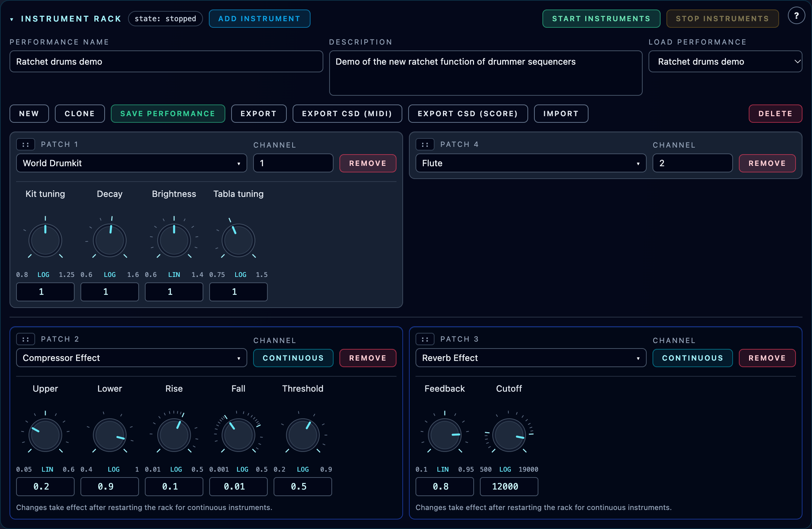

# Instrument Rack and Engine Transport

**Navigation:** [Up](performance.md) | [Prev](performance.md) | [Next](audio_mixer_and_routing.md)

The Instrument Rack is the top section of the Perform page and controls the live session, instrument assignments, and performance metadata.

## Compact Rack

When collapsed, the rack keeps Add Instrument and Start/Stop available. A single horizontally scrolling row shows MIDI channel and patch name for every instance, including duplicates; continuous instruments show Continuous instead of a channel. Long names have full-name tooltips. Note-triggered instruments appear first, followed by continuous instruments, with a thin vertical divider when both groups are present. The row follows the saved rack order; expand the rack to reorder instruments. Focus the row and use the arrow keys to scroll. Metadata, file actions and detailed controls return when expanded.

The header contains rack status, Add Instrument, Start/Stop, and help in both views. Collapse choices survive view switches until browser reload.

## Performance Metadata and Library Actions

The rack includes fields and actions for the current performance:

- `Performance Name`
- `Description`
- `Load Performance` dropdown
- `Save Performance`
- `Clone`
- `Delete`
- `Export`
- `Export CSD (MIDI)`
- `Export CSD (SCORE)`
- `Import`

These actions operate on the performance configuration (instrument rack + audio routing/mixer + sequencers + controllers + piano rolls), not on individual patch definitions.

- `Export` writes an Orchestron `.orch.json` / `.orch.zip` performance bundle for backup, sharing, and re-import.
- `Export CSD (MIDI)` writes an offline-render ZIP with a compiled `.csd`, the arranger performance as `.mid`, bundled uploaded sample/SF assets, and a `README.txt` with the render command. `Export CSD (SCORE)` embeds notes and controller sweeps directly in the Csound score, omits the `.mid`, rewrites supported MIDI opcodes for score playback, and writes a matching no-`-F` render command. Both modes seed enabled manual MIDI Controller lane values at time 0 on each assigned instrument channel and use 32-bit float WAV output (`-f`) to preserve headroom. GEN01 and `sfload` sample files must be uploaded/imported assets; raw local `samplePath` values are rejected before compilation.

## Instrument Assignments (Rack Slots)

Each rack entry selects a saved patch and a MIDI channel (1–16), or displays Continuous activation. Up to 64 user patch instances are supported, including processors. Generated mixer stages do not occupy rack slots or MIDI channels. Use distinct MIDI channels for note-triggered instances.

### Instrument Order

Note-triggered instruments appear above continuous (always-on) instruments. A thin horizontal line separates the groups when both are present.

With the instrument engine stopped, drag a card's `::` handle onto another card in the same group. An insertion line shows the destination: the upper half inserts before the target, and the lower half inserts after it. You can also focus the handle and use **↑/↓** to move one position within its group. Instruments cannot move across the divider. Press **Escape** to cancel a drag; collapsing the rack or starting the engine also cancels it.

The compact rack and mixer strips follow this order. Master stays pinned at the right of the mixer, and insert processors remain inside their owner's insert chain. Moving a rack card changes display order without changing MIDI channels, routing, insert processing order, or controller and mixer values. Autosave, Save/Load, Clone, and native export/import preserve the instrument order.

### Instrument Controls

Patches containing [`perf_controller`](performance_controllers.md) show five compact tuning knobs per standard rack-card row; extras wrap below. They remain editable while playing. New notes use updated values; continuous instruments adopt them after restarting the rack. Save Performance stores explicit overrides.

The separate [audio mixer](audio_mixer_and_routing.md) below the rack provides audio faders, pan/balance knobs, mute/solo, pre/post sends, inserts and meters. The old numeric Level field has been removed. Mixer gain affects held notes and external MIDI audio without changing note velocity.

While instruments run, adding/removing assignments, changing patch/channel assignments, and changing routing topology are locked. Existing mixer controls stay live. Use **Stop to edit routing** before changing connections or insert order.

### Add Instrument

- Use `Add Instrument` to create another rack slot.
- Open the slot's patch picker to browse instruments in collapsed type groups: Percussion, Melody, Bass, Effects / Noise, and Continuous (always-on). Expand a group to see its instruments alphabetically.
- Search names and descriptions across all types by entering at least four characters; results appear after a 500 ms typing pause. Clear the search to return to browsing. Template patches are excluded from the rack picker.
- This enables multi-instrument performances driven by different MIDI channels.
- Continuous effects run as explicit rack instances. Adding an insert creates a dedicated instance automatically; simply saving an effect in the library does not start it.
- The button is unavailable while the engine is running; stop instruments before changing rack assignments.

## Rack Transport (Instrument Engine Control)

The rack transport controls the instrument runtime session itself.

Buttons:

- `Start Instruments`
- `Stop Instruments`

### `Start Instruments` / `Stop Instruments`

These start/stop the underlying instrument engine session.

Global arrangement transport lives in the multitrack arranger section. Its `Rewind`, `Stop`, `Play`, and `Fast forward` buttons control Arrangement-source devices and move the song cursor in `1-beat` blocks. Arranger `Play` starts all Arrangement-source devices and preserves independently playing Manual pads. Arranger `Stop` stops Arrangement devices and clears temporary audition/workspace playback while preserving independent Manual pads and the instrument engine. `Stop Instruments` stops the engine. Double-clicking arranger `Stop` resets the song cursor to the selected loop start or step `0`, preserving manual pad phase. Device Play can start its chosen source and the engine while the arranger stays stopped; see [Playback source and audition](pattern_pads_and_pad_looper.md#playback-source-and-audition).

## Session State Badge

The rack shows current session state (localized label), for example:

- running
- stopped / idle

This is the state of the instrument engine session, not just the sequencer transport.

## Error Banner

If engine start/stop or transport actions fail, the Perform page shows an error banner below the rack transport section.

## Tips

- Save the performance after significant changes (rack assignments, sequencers, piano rolls, controller mappings).
- Use distinct MIDI channels for note-triggered rack instances.
- Use `sname` labels on source `outleta` nodes to name the available matrix channels. The label can be stored directly on the node or supplied by a direct `const_s` connection.

## Screenshots

  

<em>Live “Ratchet drums demo” rack: World Drumkit and Flute above the thin divider, with continuous compressor and reverb below. The :: handles reorder instruments within each group while the engine is stopped.</em>

**Navigation:** [Up](performance.md) | [Prev](performance.md) | [Next](audio_mixer_and_routing.md)
