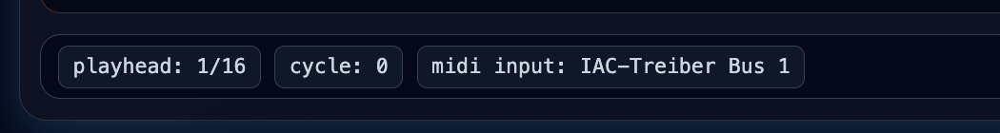

# Live Status and Safety Controls

**Navigation:** [Up](performance.md) | [Prev](performance_import_export.md) | [Next](../configuration/configuration.md)

The Perform page includes several status and safety controls for live operation.

## Footer Status Bar

At the bottom of the Perform page, Orchestron shows live status values such as:

- `playhead` position (`current step / step count`)
- `cycle` count
- active `midi input` name (or `none`)

This footer is useful during performance because it gives quick feedback without opening the Instrument Design runtime panel.

## Reset Playhead

`Reset Playhead` resets the UI playhead position to the start of the transport cycle.

Use it when:

- preparing to restart a pattern from a known position
- resynchronizing your visual reference during rehearsal/performance

## All Notes Off

`All Notes Off` sends note-off safety messages to configured channels used by the performance.

Use it when:

- you hear stuck notes
- a device missed a note-off
- you changed mappings while notes were held

## Track State Labels (Queued Changes)

A track's state badge can reflect queued actions that apply at the next cycle boundary, for example:

- starting @ step 1
- stopping @ step 1

This helps you understand why a track button press did not take effect immediately while transport is running.

## Error Banner (Transport / Runtime Errors)

The Perform page displays an error banner for problems such as:

- no active instrument session when trying to start sequencers
- trying to use a piano roll before instruments are started
- pad queue request failures
- controller send failures
- sequencer config sync failures

## MIDI Input Reference

The footer's MIDI input display reflects the session's bound MIDI input (selected in the Instrument Design Runtime panel). If it shows `none`, external hardware/DAW MIDI will not reach the session until a MIDI input is bound.

See [Runtime Panel and Compilation Workflow](../instrument_design/runtime_panel_and_compilation.md) and [MIDI Setup and Inputs](../configuration/midi_setup_and_inputs.md).

## Live Performance Safety Checklist

1. Confirm instrument session is running.
2. Confirm expected MIDI input is bound.
3. Check track/controller/piano-roll enable states.
4. Keep `All Notes Off` ready for emergency note cleanup.
5. Save the performance after major routing changes.

## Screenshots

  

<em>Footer status bar with playhead/cycle/MIDI input and the Reset Playhead / All Notes Off buttons.</em>

**Navigation:** [Up](performance.md) | [Prev](performance_import_export.md) | [Next](../configuration/configuration.md)
