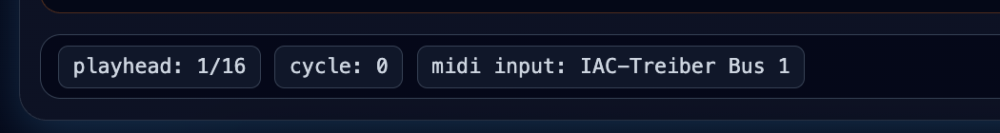

# Live Status 

**Navigation:** [Up](performance.md) | [Prev](performance_import_export.md) | [Next](../configuration/configuration.md)

The Perform page includes several status for live operation.

## Browser Audio Health

The Runtime panel shows queued PCM and pending-render milliseconds, underrun and overrun counters, and
the latest backend render-time/audio-time percentage while a browser-clock session is active.

Audio refills and PCM writes run in a Dedicated Worker. Sequencer step and pad updates are carried with
the rendered PCM and applied only when their target frame becomes audible. If the Perform page is hidden,
visual animation pauses and resumes from the current audible snapshot instead of replaying missed steps.

Performances are limited to 128 flattened backend note tracks. Each drummer row becomes one backend note
track, so the total includes melodic sequencers plus all drummer rows.

## Footer Status Bar

At the bottom of the Perform page, Orchestron shows live status values such as:

- `playhead` position (`current step / step count`)
- `cycle` count
- active `midi input` name (for example `internal:loopback` or a helper-provided device)

This footer is useful during performance because it gives quick feedback without opening the Instrument Design runtime panel.

## Track State Labels (Queued Changes)

A track's state badge can reflect queued actions that apply at the next cycle boundary, for example:

- starting @ step 1
- stopping @ step 1

This helps you understand why a track button press did not take effect immediately while transport is running.

## Error Banner (Transport / Runtime Errors)

The Perform page displays an error banner for problems such as:

- no active instrument session when trying to start sequencers
- trying to play piano roll notes before the instrument engine is ready
- pad queue request failures
- controller send failures
- sequencer config sync failures

## Editing During Playback

Notes, controller curves, tempo and arrangement edits keep the transport at its current position. Rapid edits are combined after an 80 ms pause; the previous configuration keeps playing while the update is prepared. The completed edit takes effect at the next engine block. Editing a displayed pad changes that pad, including when the arranger has selected it automatically.

Automatic pad changes, playhead movement and status updates do not resubmit the performance configuration. Queued pad launches still wait for their usual pad boundary. Stop cancels pending configuration application. Shortening a finite arrangement past the current position stops playback without rewinding.

If preparation fails, the error banner reports it and the previous configuration continues playing. Your edit remains in the editor. Make another edit or explicitly restart to try again; the app does not continuously retry a failed update. Saving and exporting retain the existing file formats.

## MIDI Input Reference

The footer's MIDI input display reflects the session's bound external MIDI input (selected in the Instrument Design Runtime panel). If it shows `internal:loopback`, internal app MIDI is still active, but external hardware/DAW MIDI will not reach the session until a helper-provided input is bound.

See [Runtime Panel and Compilation Workflow](../instrument_design/runtime_panel_and_compilation.md) and [MIDI Setup and Inputs](../configuration/midi_setup_and_inputs.md).

## Live Performance Safety Checklist

1. Confirm instrument session is running.
2. Confirm expected MIDI input is bound.
3. Check track/controller/piano-roll enable states.
5. Save the performance after major routing changes.

## Screenshots

  

<em>Footer status bar with playhead/cycle/MIDI input.</em>

**Navigation:** [Up](performance.md) | [Prev](performance_import_export.md) | [Next](../configuration/configuration.md)

## Definition audition

Audition is a session-only track override on the shared transport. A running track switches at its next pad/rest boundary after preparation succeeds; failures preserve current playback and edited drafts. Other tracks continue. Return to arrangement locates the authored sequence at the then-current song position, including pauses and finite endings. Stop audition clears the override and stops only that track.

Arranger Play clears all auditions before applying normal playback-source behavior. Arranger Stop clears/stops auditions while preserving independently started manual tracks. Seeks and loop wraps restart active auditions from their first token at the destination. Removing devices, replacing the performance or engine session, and engine shutdown clear transient audition state. Runtime status never becomes authored configuration.

## Temporary lane output controls

Arranger Mute/Solo gates a lane's future MIDI output without disabling its sequencer or changing its playhead, audition, repeat or playback source. Existing notes release normally. Drummer rows change together; multiple solos are supported and explicit mute wins. These controls are separate from mixer-strip controls, so lanes sharing one instrument remain independently controllable. See [lane Mute/Solo](multitrack_arranger.md#temporary-lane-mute-and-solo) for arpeggiator dependencies, controller values and reset behavior.
