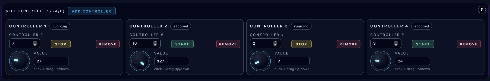

# MIDI Controllers

**Navigation:** [Up](performance.md) | [Prev](piano_rolls.md) | [Next](performance_import_export.md)

The MIDI Controllers panel provides manual CC control lanes with interactive knobs.

Use the pen beside the device name to rename it. See [Device Names](performance.md#device-names) for editing controls, validation, and import/export behavior.

## Collapse the Panel

Collapse the MIDI Controllers header to hide the knobs and their settings. The count, Add button and help remain available; adding a controller expands the group. Panels start expanded and remember your choice across view switches until browser reload. Collapsing does not stop playback or discard edits.

## Overview

This panel is for manual MIDI Control Change performance (hands-on CC control), separate from controller sequencer automation.

## Capacity

- Up to **6** controller lanes can be added

The `Add Controller` button is disabled after 6 lanes are present.

## Per-Controller Lane Controls

Each controller lane includes:

- Controller name label (`Controller N` if unnamed)
- Running/stopped state badge
- `Controller #` field (`0..127`)
- `Start` / `Stop` enable toggle
- `Remove` button
- Knob control (value `0..127`)
- Numeric value display

## Knob Interaction

The knob uses pointer drag interaction:

- Click and drag vertically to change the value
- Up increases the CC value
- Down decreases the CC value

The UI also shows a numeric value readout next to the knob for exact control.

## Live Sending Behavior

When a controller lane is enabled and the instrument session is running:

- changing the knob sends MIDI `control_change` messages immediately

This is ideal for expressive live performance adjustments.

## Manual Controllers vs Controller Sequencers

Use manual controller lanes when you want:

- direct, improvised control
- tactile-feeling UI knobs
- on-the-fly sweeps and tweaks

Use controller sequencers when you want:

- repeatable automation
- transport-synced movement
- curve-based modulation patterns

Both can exist in the same performance.

## Screenshots

  

<em>Manual MIDI controller lanes with knobs, CC numbers, and values.</em>

**Navigation:** [Up](performance.md) | [Prev](piano_rolls.md) | [Next](performance_import_export.md)
