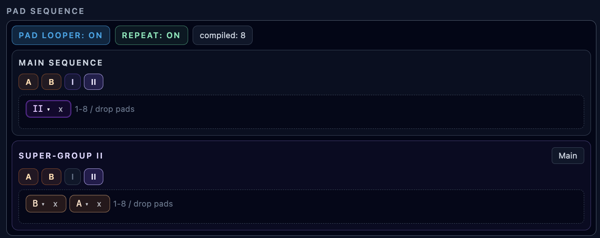

# Multitrack Arranger

**Navigation:** [Up](performance.md) | [Prev](pattern_pads_and_pad_looper.md) | [Next](controller_sequencers.md)

The **Multitrack Arranger** is a shared timeline view for pad-loop arrangements across all sequencer types. It appears on the Perform page when at least one melodic sequencer track, drummer sequencer, or controller sequencer exists.

## What It Arranges

The arranger shows one row per track:

- melodic sequencer tracks
- drummer sequencers
- controller sequencers

Each row includes:

- track title (`Sequencer N`, `Drummer Sequencer N`, `Controller Sequencer N`)
- track subtitle (MIDI channel + assigned patch name, or `CC N` for controller sequencers)
- a root pattern timeline aligned to a `4-step` grid

## Root Timeline Tokens

The root timeline displays arranged pattern tokens:

- pad tokens (`1..8`)
- group tokens (`A`, `B`, `C`, ...)
- super-group tokens (`I`, `II`, `III`, ...)

Pause tokens are part of the underlying data model, but they are hidden in the root timeline to keep the overview compact.

While the transport is running, a quantized playhead marker moves across the timeline.

## Root Timeline Editing

You can edit arrangement structure directly on each row:

- click to select a token
- use `Ctrl/Cmd/Shift + click` for additive multi-selection
- right-click to open the context menu

Context menu actions:

- `Group` (creates a lettered group)
- `Super-group` (creates a roman-numeral super-group)
- `Ungroup` (expands grouped content inline)
- `Remove` (deletes selected tokens)

### Drag Reorder in Root

Use the `::` handle on a token to drag it on the root timeline.

- drag moves are quantized to the `4-step` grid
- dragging a selected contiguous block moves that whole block
- dropping beyond current content can extend the timeline
- when needed, pause spans are re-materialized automatically to preserve timing structure
- quick swap is supported for single-token moves onto an adjacent non-pause token with matching length

## Group/Super-group Editor

Click a group or super-group token to open its nested editor.

In the opened editor, you can:

- return to root with `Main`
- append pads using `1..8`
- append pauses using `P4`, `P8`, `P16`, `P32`
- drag-and-drop tokens to reorder within the same container
- remove individual tokens with `x`
- right-click for `Group`, `Super-group`, `Ungroup`, `Remove`

The editor also shows `Total steps` for the opened container.

## Zoom and Timeline Navigation

Arranger timeline controls:

- `Zoom -` / `Zoom +`
- live zoom percent readout
- horizontal scroll via mouse wheel (and `Shift + wheel` support)
- bottom scrollbar for long timelines

## Keyboard Shortcuts

When a timeline container is focused:

- `1..8`: append corresponding pad token
- `Delete` / `Backspace`: remove current token selection

## Notes

- Arranger edits write directly into each track's pad-loop pattern state.
- The section currently shows `1 device (auto)` as the device summary.
- If no sequencer-type tracks exist, the multitrack arranger is hidden.

## Screenshot

  

<em>Nested sequence editing inside the multitrack arranger (groups and super-groups).</em>

**Navigation:** [Up](performance.md) | [Prev](pattern_pads_and_pad_looper.md) | [Next](controller_sequencers.md)
