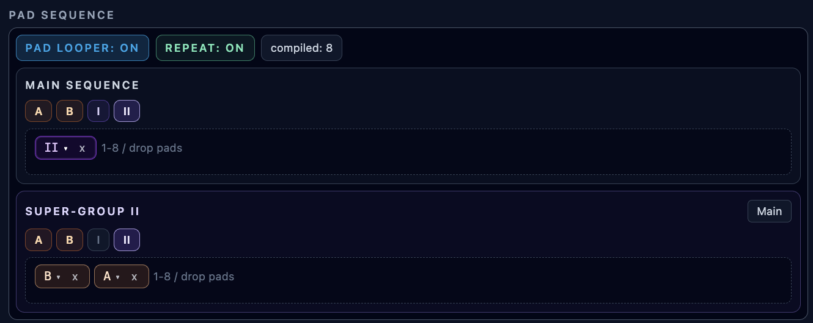
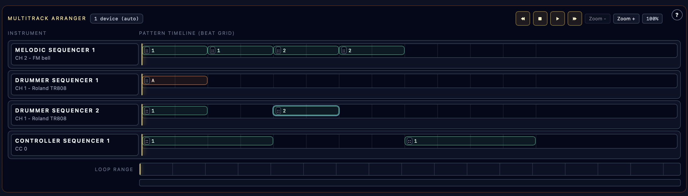

# Multitrack Arranger

**Navigation:** [Up](performance.md) | [Prev](pattern_pads_and_pad_looper.md) | [Next](controller_sequencers.md)

The **Multitrack Arranger** is a shared timeline view for pad-loop arrangements across all sequencer types. It appears on the Perform page when at least one melodic sequencer, drummer sequencer, or controller sequencer exists.

## What It Arranges

The arranger shows one row per track:

- melodic sequencers
- drummer sequencers
- controller sequencers

Each row includes:

- track title (`Melodic Sequencer N`, `Drummer Sequencer N`, `Controller Sequencer N`)
- track subtitle (MIDI channel + assigned patch name, or `CC N` for controller sequencers)
- a root pattern timeline aligned to the shared transport beat grid

## Root Timeline Tokens

The root timeline displays arranged pattern tokens:

- pad tokens (`1..8`)
- group tokens (`A`, `B`, `C`, ...)
- super-group tokens (`I`, `II`, `III`, ...)

Pause tokens are part of the underlying data model, but they are hidden in the root timeline to keep the overview compact.

The arranger always shows the current absolute playhead position, even while stopped.

## Arranger Transport

The arranger header provides cassette-style transport controls with icon buttons:

- `Rewind`: move the playhead `1` beat backward
- `Stop`: stop all instruments and sequencers while preserving the current playhead position
- `Play`: start all instruments and sequencers from the current playhead position
- `Fast forward`: move the playhead `1` beat forward
- `?`: open the integrated multilingual help modal for a concise arranger workflow summary

The transport controls the full performance arrangement, including melodic sequencers, drummer sequencers, and controller sequencers.

Double-click `Stop` to reset the playhead to the selected loop start. If no loop range is selected, the playhead resets to step `0`.

## Root Timeline Editing

You can edit arrangement structure directly on each row:

- click to select a token
- use `Ctrl/Cmd/Shift + click` for additive multi-selection
- right-click to open the context menu

Context menu actions:

- `Add pad` submenu (insert a pad token at the clicked pause gap, or append at the end)
- `Add group` submenu (insert an existing lettered group token)
- `Add super-group` submenu (insert an existing roman-numeral super-group token)
- `Copy` / `Paste` (duplicate selected pads/groups/super-groups; root pastes use a large-enough pause gap or the sequence end)
- `Group` (creates a lettered group)
- `Super-group` (creates a roman-numeral super-group)
- `Ungroup` (expands grouped content inline)
- `Remove` (deletes selected tokens)

### Drag Reorder in Root

Use the `::` handle on a token to drag it on the root timeline.

- drag moves are quantized to the shared transport beat grid
- dragging a selected contiguous block moves that whole block
- dropping beyond current content can extend the timeline
- when needed, pause spans are re-materialized automatically to preserve timing structure
- quick swap is supported for single-token moves onto an adjacent non-pause token with matching length

## Group/Super-group Editor

Click a group or super-group token to open its nested editor.

In the opened editor, you can:

- return to root with `Main`
- append pads using `1..8`
- append pauses using `P1`, `P2`, `P4`, `P8`, `P16`
- drag-and-drop tokens to reorder within the same container
- remove individual tokens with `x`
- right-click for `Add pad`, `Add group`, `Add super-group`, `Copy`, `Paste`, `Group`, `Super-group`, `Ungroup`, `Remove`

The editor also shows `Total steps` for the opened container, resolved from beat lengths on the shared transport grid.

## Zoom and Timeline Navigation

Arranger timeline controls:

- cassette-style transport buttons
- `Zoom -` / `Zoom +`
- live zoom percent readout
- horizontal scroll via mouse wheel (and `Shift + wheel` support)
- bottom scrollbar for long timelines

## Loop Range Selection

Above the horizontal scrollbar, the arranger shows a shared loop-range ruler quantized to beat blocks.

- drag on the ruler to define a playback range, including a single beat
- click the highlighted range to clear the selection
- the selected span is highlighted across all arranger rows
- when a range is selected, playback loops inside that range
- when no range is selected, playback continues until stopped; continuously looping tracks keep cycling according to their own repeat settings

## Keyboard Shortcuts

When a timeline container is focused:

- `1..8`: append corresponding pad token
- `Delete` / `Backspace`: remove current token selection

## Notes

- Arranger edits write directly into each track's pad-loop pattern state.
- Playback range selection is stored with the performance and restored when the performance is loaded again.
- The section currently shows `1 device (auto)` as the device summary.
- If no sequencer-type tracks exist, the multitrack arranger is hidden.

## Screenshot

  

<em>Nested sequence editing inside the pattern pad sequencer (groups and super-groups).</em>

  

<em>Multitrack arranger (track view, all instruments).</em>

**Navigation:** [Up](performance.md) | [Prev](pattern_pads_and_pad_looper.md) | [Next](controller_sequencers.md)
