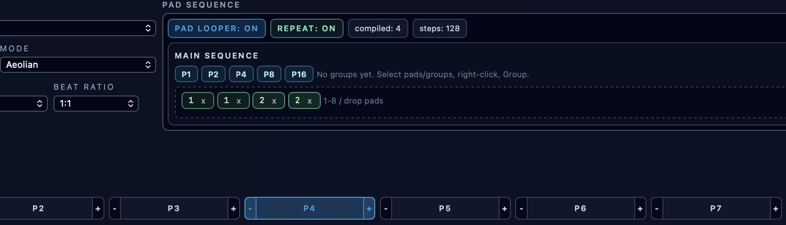

# Pattern Pads, Queued Switching, and Pad Looper

**Navigation:** [Up](performance.md) | [Prev](drummer_sequencers.md) | [Next](controller_sequencers.md)

Pattern pads are the per-track pattern banks (`P1..P8`). They support live switching, copying, and pad-loop sequencing for melodic and drummer sequencers (with transposition available on melodic sequencer pads only).

## Pattern Pads Overview

Each melodic sequencer track and drummer sequencer contains 8 pattern pads:

- `P1` to `P8`
- one active pad
- optional queued pad during live playback

Each pad stores the pattern content for that track:

- melodic sequencers: step notes/holds and related pad theory state used by pad operations
- drummer sequencers: per-row drum hits and per-hit velocities

## Pad States

Pad buttons use visual states to indicate:

- Active pad
- Queued pad (will switch on loop boundary)
- Idle pad

## Live Pad Switching (Queued On Boundary)

Pad press behavior depends on transport state:

- When sequencer transport is stopped: pad selection changes immediately
- When sequencer transport is running: the pad switch is queued and applied on the next loop boundary

This avoids mid-pattern timing glitches and keeps pattern changes musical.

## Pad Copy (Drag-and-Drop)

You can copy one pad onto another by dragging and dropping pad buttons.

What gets copied:

- step note/hold data
- pad scale/mode settings used by pad-aware behavior (as documented in the integrated help)

This is the fastest way to create variations.

## Pad Edge Transpose Buttons (`-` / `+`) (Melodic Sequencer Pads)

Melodic sequencer pad buttons include small edge buttons for transposition.

Drummer sequencer pads do **not** include transpose edge buttons.

### Short Press (Quick Click)

- Transposes stored notes within the current scale by one degree up/down
- Keeps the same scale root and mode

Use this for quick harmonic variants of the same pattern.

### Long Press (Hold, about 350 ms)

- Performs a diatonic key-step transpose (moves pad tonic/root to adjacent scale degree)
- Keeps the mode
- Updates the pad scale root accordingly

Use this to move the pattern to a new key center while preserving mode character.

## Pad Looper (Pad Sequence)

Each track includes a **Pad Looper** section that can play a sequence of pads automatically.

Controls:

- `Pad Looper: On/Off`
- `Repeat: On/Off`
- Pad Sequence entry area

### Building The Pad Sequence

You can add pad steps to the pad-loop sequence by:

- Clicking the sequence area and pressing keyboard `1..8`
- Dragging pad buttons into the sequence area

### Sequence Display

The pad sequence area shows:

- ordered pad numbers
- remove (`x`) button per sequence item
- current pad-loop position highlight while running

### Repeat Toggle

- `Repeat: On` loops the pad sequence continuously
- `Repeat: Off` runs through the programmed sequence without repeating behavior (per runtime handling)

## When To Use Pad Looper vs Manual Pad Presses

Use manual pad presses for performance improvisation.

Use pad looper when you want:

- repeatable song-form-like pattern changes
- scripted variation cycles
- hands-free movement through pad banks while you play piano rolls/controllers

## Screenshots

  

<em>Pattern pads with transpose edge buttons and pad-loop sequence controls.</em>

**Navigation:** [Up](performance.md) | [Prev](drummer_sequencers.md) | [Next](controller_sequencers.md)
