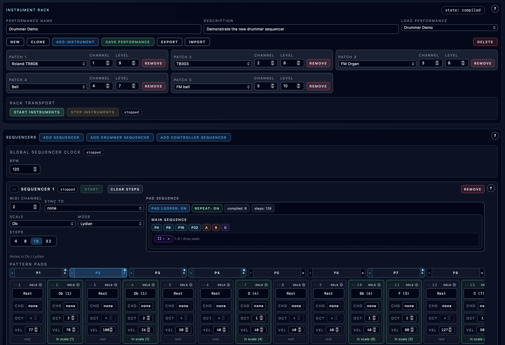

# Performance

**Navigation:** [Up](../user_documentation.md) | [Prev](../instrument_design/supported_opcodes.md) | [Next](instrument_rack_and_engine_transport.md)

This chapter covers the `Perform` page (labeled `Perform` / `Performance` depending language), where you build a playable multi-instrument setup and perform it live.

## What You Can Do Here

- Assemble an instrument rack from saved patches and assign MIDI channels
- Start/stop the instrument engine session
- Create multiple melodic sequencer tracks, drummer sequencers, and controller sequencers
- Use pattern pads with queued switching and pad-loop sequences
- Perform live with piano rolls and manual MIDI controller knobs
- Save/load/clone/delete performances
- Import/export performance bundles (with optional patch definitions)

## Chapter Contents

- [Instrument Rack and Engine Transport](instrument_rack_and_engine_transport.md)
- [Sequencer Tracks and Step Editing](sequencer_tracks_and_steps.md)
- [Drummer Sequencers](drummer_sequencers.md)
- [Pattern Pads, Queued Switching, and Pad Looper](pattern_pads_and_pad_looper.md)
- [Controller Sequencers](controller_sequencers.md)
- [Piano Rolls](piano_rolls.md)
- [MIDI Controllers](midi_controllers.md)
- [Performance Import / Export](performance_import_export.md)
- [Live Status and Safety Controls](live_status_and_safety_controls.md)

## Important Concept: Patch vs Performance

- **Patch (Instrument Design page):** one instrument graph
- **Performance (Perform page):** a full live setup that references one or more patches and stores sequencer/piano-roll/controller state

## Practical Workflow

1. Save at least one patch in Instrument Design.
2. Add instruments to the performance rack and assign channels.
3. Start instruments (engine session).
4. Build sequencer tracks / drummer sequencers / controller sequencers / piano rolls.
5. Save the performance.
6. Export the performance bundle for backup or sharing.

## Screenshots

  

<em>Performance page overview with instrument rack and sequencer sections.</em>

**Navigation:** [Up](../user_documentation.md) | [Prev](../instrument_design/supported_opcodes.md) | [Next](instrument_rack_and_engine_transport.md)
