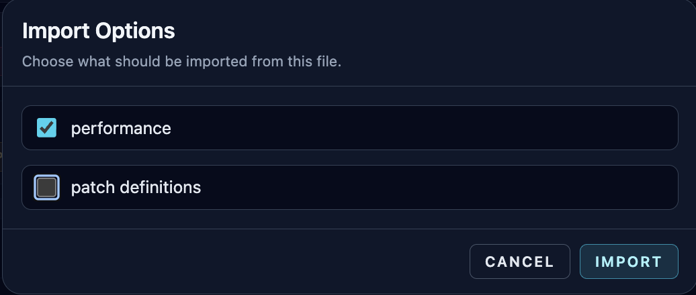
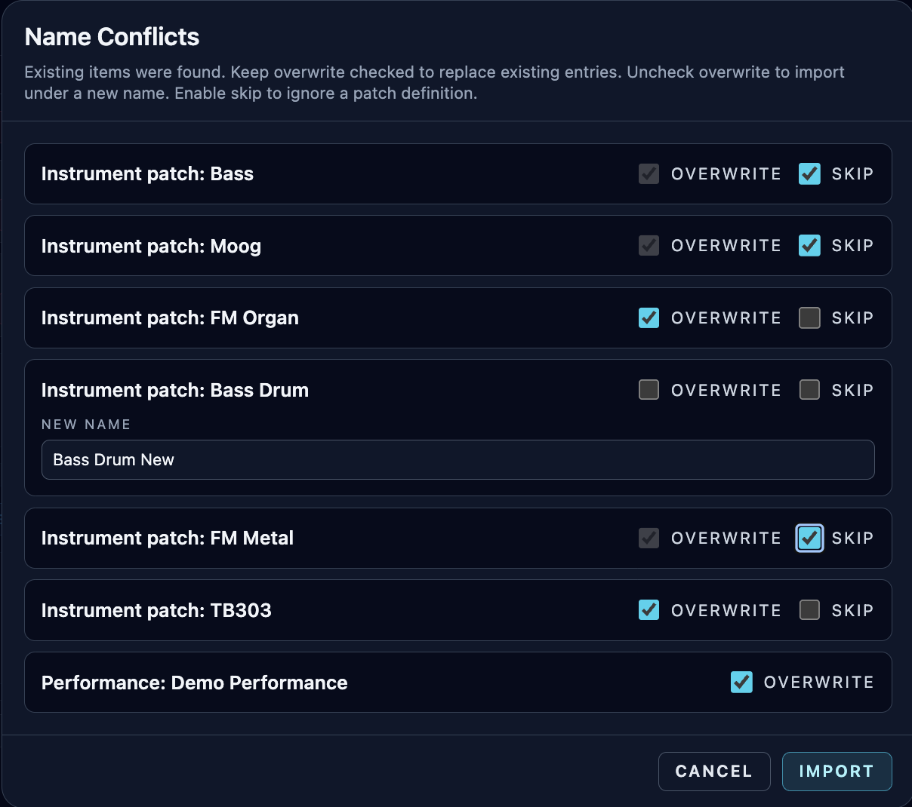

# Performance Import / Export

**Navigation:** [Up](performance.md) | [Prev](midi_controllers.md) | [Next](live_status_and_safety_controls.md)

Performance import/export lets you move complete live setups between machines or save versioned backups.

## Performance Export (`Export`)

The Performance page `Export` button creates an Orchestron performance bundle from the current performance workspace.

File extensions:

- `.orch.json`
- `.orch.zip`

## What Gets Exported

A performance export includes:

- Performance metadata (`name`, `description`)
- Sequencer/drummer-sequencer/piano-roll/controller/controller-sequencer configuration snapshot
- Instrument assignments
- Referenced patch definitions for the instruments currently assigned in the performance rack
- Patch names (included in the snapshot for easier remapping on import)

If any referenced patch contains uploaded GEN01 audio assets, export is automatically produced as a ZIP and includes those assets.

## Performance Import (`Import`)

The Performance page `Import` button supports two categories of files:

### 1. Full Orchestron Performance Export (recommended)

If the file matches the performance export format, Orchestron opens an import options dialog.

### 2. Raw/legacy sequencer snapshot JSON

If the file is not a full performance export bundle, Orchestron attempts to apply it directly as a sequencer configuration snapshot.

This is useful for advanced workflows and backward compatibility.

## Import Options Dialog (Performance Bundle)

When importing a full performance bundle, you can choose whether to import:

- `performance`
- `patch definitions` (if present in the bundle)

You may import either or both.

Typical uses:

- Import both (full environment restore)
- Import only patch definitions (extract instruments from a performance file)
- Import only performance (if the destination machine already has matching patches)

## Conflict Resolution Dialog

If names already exist, Orchestron opens a conflict dialog.

### For Patches

Per patch definition you can choose:

- Overwrite existing patch
- Rename and create a new patch
- Skip importing that patch

### For Performance

For the performance itself you can choose:

- Overwrite existing performance
- Rename and create a new performance

(Performance entries do not use `Skip` in the conflict dialog; skipping is handled via the import options step.)

## Patch ID Remapping During Performance Import

Performance bundles store instrument patch references. On import, Orchestron remaps patch IDs using:

1. Imported patch definitions (source ID -> newly created/updated destination patch ID)
2. Existing patch name matches (when patch definitions are not imported but patch names match)

This makes performance imports more portable across machines and patch databases.

## Import Validation (Resolvable Instruments Required)

A performance import fails if no instrument assignments can be resolved to available patches.

In that case:

- import patch definitions from the bundle, or
- create/match patches locally by name first

## Related Workflows

- Instrument bundle import/export is documented in [Instrument Import / Export and CSD Export](../instrument_design/instrument_import_export.md).
- You can also import patch definitions from a performance bundle on the Instrument Design page.

## Screenshots

  

<em>Performance import options dialog for importing performance and/or patch definitions.</em>

  

<em>Conflict dialog for imported patch/performance name collisions.</em>

**Navigation:** [Up](performance.md) | [Prev](midi_controllers.md) | [Next](live_status_and_safety_controls.md)
