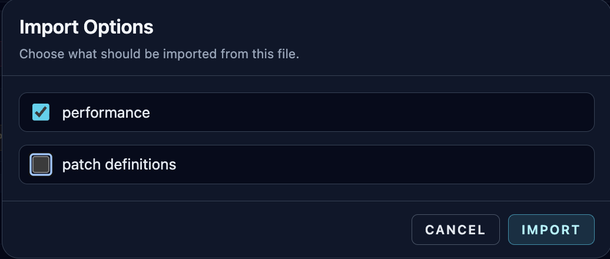
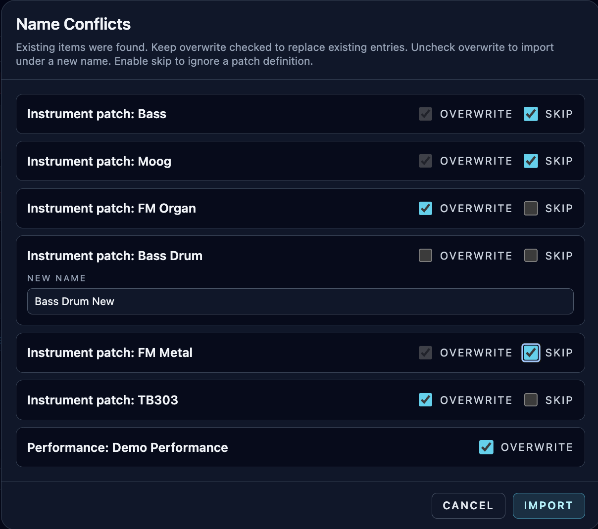

# Performance Import / Export

**Navigation:** [Up](performance.md) | [Prev](midi_controllers.md) | [Next](live_status_and_safety_controls.md)

Performance import/export lets you move complete live setups between machines or save versioned backups.

## Performance Export (`Export`)

The Performance page `Export` button creates an Orchestron performance bundle from the current performance workspace.

Use this export when you want to:

- Re-import the performance into Orchestron later
- Move a full performance setup to another machine
- Keep versioned backups of a performance together with its patch references

File extensions:

- `.orch.json`
- `.orch.zip`

## What Gets Exported

A performance export includes:

- Performance metadata (`name`, `description`)
- Sequencer/drummer-sequencer/arpeggiator/piano-roll/controller/controller-sequencer configuration snapshot
- Instrument assignments
- Referenced patch definitions for the instruments currently assigned in the performance rack
- Patch names (included in the snapshot for easier remapping on import)

If any referenced patch contains uploaded GEN01 audio assets or `sfload` SoundFont assets, export is automatically produced as a ZIP and includes those assets.

## Offline Render Export (`Export CSD`)

The Performance page `Export CSD` button creates a separate offline-render ZIP for Csound.

This export is different from the normal `Export` bundle:

- `Export` is for Orchestron import/export workflows
- `Export CSD` is for rendering outside Orchestron with standard Csound tools

This ZIP contains:

- A compiled `.csd` with every instrument currently used in the performance rack
- Offline render settings forced to `sr = 48000` and `ksmps = 1`
- A finite `f 0 ...` score duration sized for the exported arranger playback
- The arranger playback rendered as a `.mid` file from beginning to arrangement end
- Uploaded bundled sample audio / SoundFont files used by the exported instruments
- A `README.txt` with the exact Csound command line needed to render the package

Only assets stored through Orchestron's upload/import flow are bundled. GEN01 and `sfload` nodes must reference uploaded assets; compile, session start, and offline performance CSD export reject raw filesystem `samplePath` values instead of passing them to Csound.

Offline performance CSD export is bounded before synthesis starts: looping playback is rejected, playback ranges are limited to 65,536 transport steps, a single step can carry at most 16 notes, and the estimated MIDI event budget is limited to 200,000 events. MIDI generation also stops if it exceeds the event budget or takes more than 5 seconds.

ZIP layout:

- The ZIP contains a single top-level directory
- That directory has the same basename as the exported performance `.csd`
- Inside that directory you will find the `.csd`, `.mid`, `README.txt`, and `assets/` subdirectory

Typical extracted structure:

```text
Offline_Export/
  Offline_Export.csd
  Offline_Export.mid
  README.txt
  assets/
```

Typical use:

- Share a performance as a portable offline render package
- Render the arrangement outside Orchestron with stock Csound
- Archive a self-contained `.csd` + `.mid` + assets bundle for later mastering or batch rendering

Rendering workflow:

1. Click `Export CSD` on the Performance page.
2. Extract the downloaded ZIP.
3. Change into the bundled directory inside the extracted archive.
4. Run the command from `README.txt`, for example:

```bash
csound -d -W -o Offline_Export.wav -F Offline_Export.mid Offline_Export.csd
```

The exported `.csd` already includes matching `CsOptions`, so `csound Offline_Export.csd` also works after you change into that directory.

## Performance Import (`Import`)

The Performance page `Import` button supports two categories of files:

Bundle imports are bounded by backend request and ZIP limits before large archive members are decompressed. Defaults are 256 MiB compressed request body, 8 MiB import JSON, 512 ZIP entries, and 256 MiB total uncompressed ZIP content. Tune these with `VISUALCSOUND_BUNDLE_IMPORT_MAX_BYTES`, `VISUALCSOUND_BUNDLE_IMPORT_JSON_MAX_BYTES`, `VISUALCSOUND_BUNDLE_IMPORT_ZIP_MAX_MEMBERS`, and `VISUALCSOUND_BUNDLE_IMPORT_ZIP_MAX_UNCOMPRESSED_BYTES`; individual bundled audio/SoundFont assets still use `VISUALCSOUND_GEN_AUDIO_ASSET_MAX_BYTES`. Persistent generated-asset storage is capped by `VISUALCSOUND_GEN_AUDIO_ASSETS_MAX_TOTAL_BYTES` and `VISUALCSOUND_GEN_AUDIO_ASSETS_MAX_COUNT`; unreferenced generated assets older than `VISUALCSOUND_GEN_AUDIO_ASSET_GC_MIN_AGE_SECONDS` are eligible for garbage collection.

### 1. Full Orchestron Performance Export (recommended)

If the file matches the performance export format, Orchestron opens an import options dialog.

### 2. Raw/legacy sequencer snapshot JSON

If the file is not a full performance export bundle, Orchestron attempts to apply it directly as a sequencer configuration snapshot.

This is useful for advanced workflows and backward compatibility.

## Import Options Dialog (Performance Bundle)

When importing a full performance bundle, you can choose whether to import:

- `performance`
- `patch definitions` (if present in the bundle)

You may import either or both.

Typical uses:

- Import both (full environment restore)
- Import only patch definitions (extract instruments from a performance file)
- Import only performance (if the destination machine already has matching patches)

## Conflict Resolution Dialog

If names already exist, Orchestron opens a conflict dialog.

### For Patches

Per patch definition you can choose:

- Overwrite existing patch
- Rename and create a new patch
- Skip importing that patch

### For Performance

For the performance itself you can choose:

- Overwrite existing performance
- Rename and create a new performance

(Performance entries do not use `Skip` in the conflict dialog; skipping is handled via the import options step.)

## Patch ID Remapping During Performance Import

Performance bundles store instrument patch references. On import, Orchestron remaps patch IDs using:

1. Imported patch definitions (source ID -> newly created/updated destination patch ID)
2. Existing patch name matches (when patch definitions are not imported but patch names match)

This makes performance imports more portable across machines and patch databases.

## Import Validation (Resolvable Instruments Required)

A performance import fails if no instrument assignments can be resolved to available patches.

In that case:

- import patch definitions from the bundle, or
- create/match patches locally by name first

## Related Workflows

- Instrument bundle import/export is documented in [Instrument Import / Export and CSD Export](../instrument_design/instrument_import_export.md).
- You can also import patch definitions from a performance bundle on the Instrument Design page.

## Screenshots

<p align="center">
  
</p>
<p align="center"><em>Performance import options dialog for importing performance and/or patch definitions.</em></p>

<p align="center">
  
</p>
<p align="center"><em>Conflict dialog for imported patch/performance name collisions.</em></p>

**Navigation:** [Up](performance.md) | [Prev](midi_controllers.md) | [Next](live_status_and_safety_controls.md)
