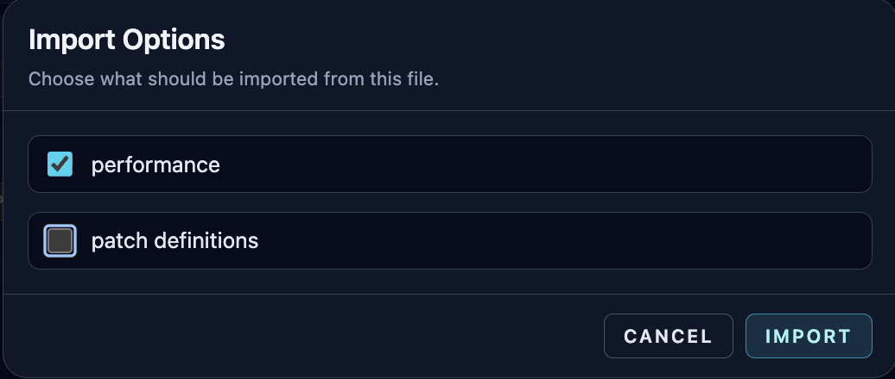
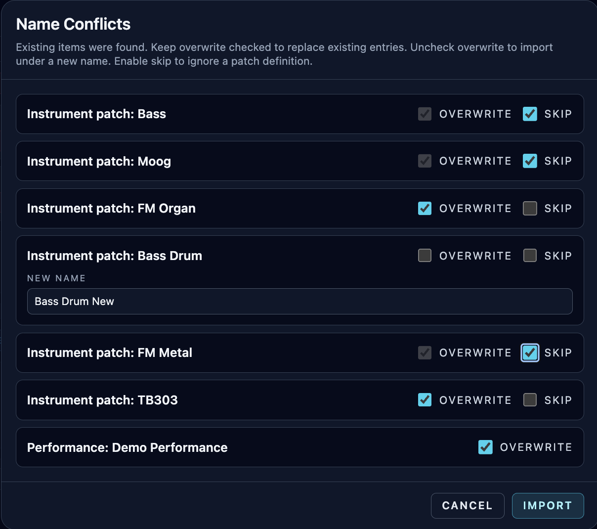

# Performance Import / Export

**Navigation:** [Up](performance.md) | [Prev](midi_controllers.md) | [Next](live_status_and_safety_controls.md)

Performance import/export lets you move complete live setups between machines or save versioned backups.

## Performance Export (`Export`)

The Performance page `Export` button creates an Orchestron performance bundle from the current performance workspace.

Use this export when you want to:

- Re-import the performance into Orchestron later
- Move a full performance setup to another machine
- Keep versioned backups of a performance together with its patch references

File extensions:

- `.orch.json`
- `.orch.zip`

## What Gets Exported

A performance export includes:

- Performance metadata (`name`, `description`)
- Custom names for all six performance device types, including names created through the CLI. Existing names are preserved on import; the GUI applies its name validation only when renaming a device.
- Sequencer/drummer-sequencer/arpeggiator/piano-roll/controller/controller-sequencer configuration snapshot
- Instrument assignments with stable instance IDs
- Explicit audio routes, internal Master settings, insert ownership, strip gain/balance/mute/solo, and send level/pre-post settings
- Referenced patch definitions for the instruments currently assigned in the performance rack
- Patch names (included in the snapshot for easier remapping on import)

If any referenced patch contains uploaded GEN01 audio assets or `sfload` SoundFont assets, export is automatically produced as a ZIP and includes those assets.

## Offline Render Export (`Export CSD (MIDI)` / `Export CSD (SCORE)`)

The Performance page provides two offline Csound render exports:

- `Export CSD (MIDI)` creates the traditional ZIP with a compiled CSD and a separate MIDI file.
- `Export CSD (SCORE)` creates a ZIP with the performance notes and controller sweeps embedded as Csound score events.
- Both CSD export modes seed enabled manual MIDI Controller lane values at time 0 on their selected MIDI channels (all 16 by default).

Both modes select instruments by device assignment and mixer routing:

- Include rack instances whose MIDI channel is assigned to a melodic sequencer, drummer sequencer, piano-roll keyboard or arpeggiator output. An arpeggiator input alone is not an instrument assignment.
- Device assignments count even when the device is stopped, disabled or has an empty pattern. Selection does not depend on whether a note happens during the exported arrangement.
- Include continuous (`always on`) instruments referenced by mixer routes, internal Master settings or insert ownership. Continuous generators with implicit direct audio output are also included.
- Omit other rack instances, routes and mixer controls belonging to those omitted instances, and assets used exclusively by omitted patches. Native `Export` still preserves the complete rack.

Each CSD starts with a comment header containing the performance title, description and creation timestamp, followed by an Orchestron attribution, a short summary of Orchestron's visual instrument design, performance devices, audio routing and portable Csound export features, plus the project GitHub link. Each exported instrument also has CSD comments containing its name, description, rack instance ID and Csound reference. Multiline descriptions remain comments on every line. Routing comments identify source/destination instruments and ports, raw/strip stages, insert ownership, Master processing, direct paths that bypass Master, pre/post-fader taps, and initial gain, balance, mute and solo settings. Mixer instruments are emitted in signal-flow order.

This export is different from the normal `Export` bundle:

- `Export` is for Orchestron import/export workflows
- `Export CSD (MIDI)` and `Export CSD (SCORE)` are for rendering outside Orchestron with standard Csound tools

The MIDI ZIP contains:

- A compiled `.csd` with the selected non-template device instruments and routed continuous instruments
- Offline render settings forced to `sr = 48000` and `ksmps = 1`
- WAV output written as 32-bit float (`-f`) so exported files preserve headroom instead of baking clipping into 16-bit samples
- Always-on effect instruments started with Csound `alwayson`
- A finite `f 0 ...` score duration sized for the exported arranger playback plus a release-tail buffer
- The arranger playback rendered as a `.mid` file from beginning to arrangement end
- Enabled manual MIDI Controller lane values written into the MIDI file at tick 0 on their selected MIDI channels (all 16 by default)
- Uploaded bundled sample audio / SoundFont files used by the exported instruments
- A `README.txt` with the exact Csound command line needed to render the package

The SCORE ZIP contains the same compiled instruments and bundled assets, but omits the `.mid` file. Instead, it embeds note events as score `i` statements, embeds controller sequencer sweeps and enabled manual MIDI Controller lane values as score-controlled CC setter events, and rewrites supported MIDI opcodes such as `cpsmidi`, `ampmidi`, `midi_note`, `notnum`, and `midictrl` for score playback. If export-time approximations are needed, such as best-effort `ampmidi` function-table mapping, the ZIP includes `WARNINGS.txt` and the README lists the warnings.

Only assets stored through Orchestron's upload/import flow are bundled. GEN01 and `sfload` nodes must reference uploaded assets; compile, session start, and offline performance CSD export reject raw filesystem `samplePath` values instead of passing them to Csound.

Offline performance CSD export is bounded before synthesis starts: looping playback is rejected, playback ranges are limited to 65,536 transport steps, a single step can carry at most 16 notes, and the estimated MIDI event budget is limited to 200,000 events. MIDI generation also stops if it exceeds the event budget or takes more than 5 seconds.

ZIP layout:

- The ZIP contains a single top-level directory
- That directory has the same basename as the exported performance `.csd`
- Inside the MIDI export directory you will find the `.csd`, `.mid`, `README.txt`, and `assets/` subdirectory
- Inside the SCORE export directory you will find the `.csd`, `README.txt`, optional `WARNINGS.txt`, and `assets/` subdirectory

Typical extracted structure:

```text
Offline_Export/
  Offline_Export.csd
  Offline_Export.mid
  README.txt
  assets/
```

Typical SCORE structure:

```text
Offline_Export/
  Offline_Export.csd
  README.txt
  WARNINGS.txt
  assets/
```

Typical use:

- Share a performance as a portable offline render package
- Render the arrangement outside Orchestron with stock Csound
- Archive a self-contained `.csd` + `.mid` + assets bundle, or a single inline-score `.csd` + assets bundle, for later mastering or batch rendering

Rendering workflow:

1. Click `Export CSD (MIDI)` or `Export CSD (SCORE)` on the Performance page.
2. Extract the downloaded ZIP.
3. Change into the bundled directory inside the extracted archive.
4. Run the command from `README.txt`, for example the MIDI export command:

```bash
csound -d -W -f -o Offline_Export.wav -F Offline_Export.mid Offline_Export.csd
```

For SCORE exports the command omits `-F`:

```bash
csound -d -W -f -o Offline_Export.wav Offline_Export.csd
```

The exported `.csd` already includes matching `CsOptions`, so `csound Offline_Export.csd` also works after you change into that directory.

## Performance Import (`Import`)

The Performance page `Import` button supports two categories of files:

Bundle imports are bounded by backend request and ZIP limits before large archive members are decompressed. Defaults are 256 MiB compressed request body, 8 MiB import JSON, 512 ZIP entries, and 256 MiB total uncompressed ZIP content. Tune these with `VISUALCSOUND_BUNDLE_IMPORT_MAX_BYTES`, `VISUALCSOUND_BUNDLE_IMPORT_JSON_MAX_BYTES`, `VISUALCSOUND_BUNDLE_IMPORT_ZIP_MAX_MEMBERS`, and `VISUALCSOUND_BUNDLE_IMPORT_ZIP_MAX_UNCOMPRESSED_BYTES`; individual bundled audio/SoundFont assets still use `VISUALCSOUND_GEN_AUDIO_ASSET_MAX_BYTES`. Persistent generated-asset storage is capped by `VISUALCSOUND_GEN_AUDIO_ASSETS_MAX_TOTAL_BYTES` and `VISUALCSOUND_GEN_AUDIO_ASSETS_MAX_COUNT`; unreferenced generated assets older than `VISUALCSOUND_GEN_AUDIO_ASSET_GC_MIN_AGE_SECONDS` are eligible for garbage collection.

### 1. Full Orchestron Performance Export (recommended)

If the file matches the performance export format, Orchestron opens an import options dialog.

### 2. Raw/legacy sequencer snapshot JSON

If the file is not a full performance export bundle, Orchestron attempts to apply it directly as a sequencer configuration snapshot.

This is useful for advanced workflows and backward compatibility.

## Import Options Dialog (Performance Bundle)

When importing a full performance bundle, you can choose whether to import:

- `performance`
- `patch definitions` (if present in the bundle)

You may import either or both.

Typical uses:

- Import both (full environment restore)
- Import only patch definitions (extract instruments from a performance file)
- Import only performance (if the destination machine already has matching patches)

## Conflict Resolution Dialog

If names already exist, Orchestron opens a conflict dialog.

### For Patches

Per patch definition you can choose:

- Overwrite existing patch
- Rename and create a new patch
- Skip importing that patch

### For Performance

For the performance itself you can choose:

- Overwrite existing performance
- Rename and create a new performance

(Performance entries do not use `Skip` in the conflict dialog; skipping is handled via the import options step.)

## Patch ID Remapping During Performance Import

Performance bundles store instrument patch references. On import, Orchestron remaps patch IDs using:

1. Imported patch definitions (source ID -> newly created/updated destination patch ID)
2. Existing patch name matches (when patch definitions are not imported but patch names match)

This makes performance imports more portable across machines and patch databases.

## Import Validation (Resolvable Instruments Required)

A performance import fails if no instrument assignments can be resolved to available patches.

In that case:

- import patch definitions from the bundle, or
- create/match patches locally by name first

## Related Workflows

- Instrument bundle import/export is documented in [Instrument Import / Export and CSD Export](../instrument_design/instrument_import_export.md).
- You can also import patch definitions from a performance bundle on the Instrument Design page.

## Mixer snapshot

Native bundles and both performance CSD modes capture version 11 routing and mixer settings: gain, pan/balance, mute/solo, sends including pre/post, Master and inserts. Export waits for outstanding live mixer acknowledgments and reports synchronization failures. Mixer values are initialized inside each CSD and require no control client. MIDI and SCORE notes retain their authored velocities; SCORE instrument references come from the compiler manifest.

Offline rendering remains 48 kHz with ksmps=1, float WAV output, packaged assets and release tails. Equivalent routing and settings are guaranteed, not sample-identical live/offline waveforms. Finite exports without MIDI notes are supported when a routed continuous source can produce audio. Standalone patch exports remain independent of Perform settings. See [Audio mixer and routing](audio_mixer_and_routing.md) for migration and signal flow.

## Screenshots

<p align="center">
  
</p>
<p align="center"><em>Performance import options dialog for importing performance and/or patch definitions.</em></p>

<p align="center">
  
</p>
<p align="center"><em>Conflict dialog for imported patch/performance name collisions.</em></p>

**Navigation:** [Up](performance.md) | [Prev](midi_controllers.md) | [Next](live_status_and_safety_controls.md)

## Performance controller settings (version 12)

Native JSON/ZIP bundles and both CSD export modes preserve each rack instance’s `performanceControllerValues`, keyed by the `perf_controller` node ID. Unchanged controls use patch defaults; reset removes the override. Version 12 adds these values while preserving version 11 routing and mixer data; versions 1–11 still load. Patch-ID remapping during import preserves node identities and their settings.

CSD (MIDI) and CSD (SCORE) initialize values in the Csound orchestra before notes and continuous instruments start. No additional MIDI CC messages or external control client are required. Export waits for outstanding live controller updates and reports synchronization failures. Standalone patch exports use defaults. See [Performance controllers](performance_controllers.md).

## MIDI controller channel selections (version 13)

Version 13 stores each MIDI Controller and Controller Sequencer's `targetChannels` selection as a sorted list of MIDI channels 1–16. At least one channel is required. Selections survive Save/Load Performance, browser reload, and native JSON/ZIP export/import. Versions 1–12 still load; missing channel selections default to all 16 channels (OMNI).

Both CSD modes route manual initial values and automated curves to the selected channels. Manual lanes sharing a CC number keep independent values on different channels; at render start, the later enabled lane wins only where both channel and CC number overlap. Channel selection does not change which instruments are included in the CSD. The native bundle envelope remains version 1, and browser app state remains version 2.

## Internal Master (version 14)

The fixed Master is stored as `$master` in `audioGraph.masterId`, route endpoints, mixer strips and insert ownership. It has no instrument assignment or patch definition. Native imports normalize designated neutral legacy Masters before importing patches, preventing duplicate library entries. Both CSD modes generate the internal output and initialize its saved controls and inserts. Direct Audio Output paths retain their own controls and continue to bypass Master.

Versions 1–13 remain readable. App state remains version 2 and native bundle envelopes remain version 1. See [Master migration and repair](audio_mixer_and_routing.md#upgrading-existing-masters) for backups, customized processors and missing references.

## Arpeggiator Patterns (version 15)

Version 15 introduced arpeggiator patterns. App-state remains version 2; the native envelope remains version 1. Arpeggiators store eight musical pads, rhythm steps, seeds, processing/hold/playback settings, and Pad Looper arrangements. User presets store musical pad settings only.

On load/import, old musical settings migrate to P1 and accent cycles become step velocities. The remaining pads use defaults. Old performances adopt Arranger synchronization, Hold Off, Continue, corrected swing and full-range ordering; there is no legacy playback engine. Migration stays in memory until normal Save/export. See [Arpeggiator migration](arpeggiators.md#migration-to-performance-version-15).

MIDI and SCORE CSD exports use the same arpeggiator scheduler as live audio, including source timestamps, pad boundaries, rests, ties, ratchets, overlap and seeded variation. Export event estimates account for chord expansion, Hold and ratchets; the existing hard event and time limits still apply. Export contains sequenced inputs; live keyboard gestures must be represented as sequence data to appear offline.

## Per-note timing (version 16)

Current saves and exports write performance config **16** and accept versions **1–16**. Melodic steps and drummer cells store `timingOffsetPercent`, an integer from −50 to +50; missing values mean zero. Browser app state remains version 2 and the native bundle envelope remains version 1. CLI runtime conversion maps this value to `timing_offset_percent`. MIDI and SCORE exports use the same shifted attacks and releases as live playback, within each format's timing resolution.
