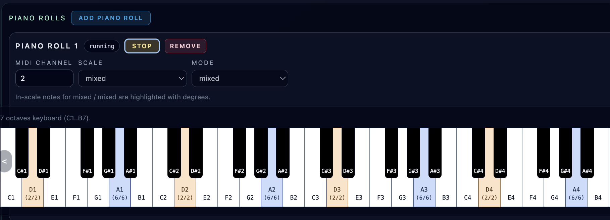

# Piano Rolls

**Navigation:** [Up](performance.md) | [Prev](controller_sequencers.md) | [Next](midi_controllers.md)

Piano Rolls provide manual performance input with scale-aware keyboard highlighting.

## Purpose

Piano Rolls are for live/manual playing on an on-screen keyboard while the instrument engine is running.

They coexist with sequencer tracks and controller sequencers, which means you can jam manually on top of sequenced playback.

## Add / Remove / Enable

Each piano roll supports:

- `Add Piano Roll`
- `Remove`
- `Start` / `Stop` (enable/disable that piano roll)

A piano roll only sends notes when:

- instruments are running
- that piano roll is enabled

## Piano Roll Controls

Each piano roll has:

- `MIDI Channel` (`1..16`)
- `Scale`
- `Mode`

## Scale/Mode Following Behavior During Live Playback

When the instrument engine is running and a piano roll is enabled, the piano roll can follow the currently running sequencer tracks for harmonic guidance.

### Shared Scale/Mode Case

If running sequencer tracks agree on the same scale+mode:

- the piano roll shows that shared scale/mode
- keys are highlighted according to that theory

### Mixed Scale/Mode Case

If running sequencer tracks disagree:

- piano roll controls show `mixed`
- highlighting is computed from the intersection of the active theories
- only notes common to the active scales/modes are highlighted

This is especially helpful when multiple tracks create potentially conflicting harmonic contexts.

## Keyboard Range and Layout

The piano keyboard spans:

- `C1 .. B7` (84 notes)

UI behavior:

- Full-width horizontal keyboard section
- Scroll arrows appear when the keyboard overflows the viewport
- Smooth horizontal scrolling controls

## Key Highlighting and Degree Labels

Highlighted keys show:

- in-scale status
- scale degree labels (`1..7`)
- rainbow degree coloring for quick visual recognition

In mixed-theory situations, a key can show combined degree labels (for example `2/5`) when it belongs to multiple active track theories.

## Playing Notes (Pointer Interaction)

- Press/hold on a key sends `note_on`
- Release sends `note_off`
- Works for both white and black keys

The UI tracks held notes and clears them if the piano roll becomes inactive or the session stops.

## Practical Use Cases

- Live melody or bass improvisation on top of sequencer patterns
- Testing an instrument patch in musical context without external MIDI hardware
- Performing harmonically guided lines while sequencer tracks define the key center

## Screenshots

  

<em>Piano roll with scale-aware key highlighting and mixed-theory display behavior.</em>

**Navigation:** [Up](performance.md) | [Prev](controller_sequencers.md) | [Next](midi_controllers.md)
