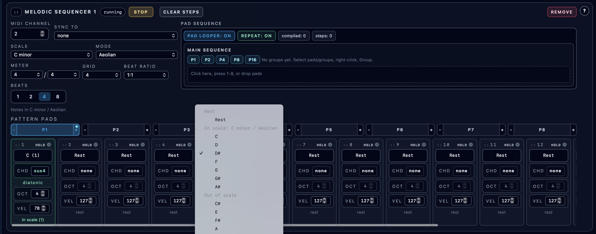

# Sequencer Tracks and Step Editing

**Navigation:** [Up](performance.md) | [Prev](instrument_rack_and_engine_transport.md) | [Next](drummer_sequencers.md)

Sequencer tracks are step-based pattern sequencers used for melodic/rhythmic note playback.

This page covers the **melodic sequencer track** editor. Drum-machine style programming is documented in [Drummer Sequencers](drummer_sequencers.md).

## Global Sequencer Clock

The sequencer section contains a global clock with:

- Running/stopped state badge
- `BPM` field (range `30..300`)

The backend runs the step timing (native runtime clock), which reduces browser timing jitter during playback.

## Adding / Removing Tracks

- `Add Sequencer` creates a new sequencer track
- `Drummer` creates a drummer sequencer card (documented separately in [Drummer Sequencers](drummer_sequencers.md))
- Each track has its own `Remove` button

## Per-Track Controls

Each track card provides:

- track state badge (running/stopped or queued start/stop state)
- `Start` / `Stop` (track enable state)
- `Remove`
- `Clear Steps`
- `MIDI Channel` (`1..16`)
- `Scale` (root + scale type)
- `Mode` (Ionian, Dorian, Phrygian, Lydian, Mixolydian, Aeolian, Locrian)
- `Steps` (`16` or `32`)

### Queued Start/Stop State Labels

When changes are queued to take effect at the next cycle boundary, the track state label can show queued states such as:

- starting at step 1
- stopping at step 1

## Scale, Scale Type, and Mode

Orchestron separates:

- Scale root (for example `C`, `Db`, `F#`)
- Scale type (`major`, `neutral`, `minor`)
- Mode (7 diatonic modes)

This supports guided note entry and better readability in the track step editor and piano roll highlighting.

## Step Editor (Per-Step Note Programming)

Each step cell supports:

- Rest or note selection
- Hold toggle (`HOLD`)
- Octave field (separate from pitch class)
- In-scale/out-of-scale status display
- Playhead highlighting during playback

### Step Note Entry Workflow

Each step has a pitch-class dropdown grouped into:

- `Rest`
- In-scale notes (for the current track scale/mode)
- Out-of-scale notes

The octave is edited separately via the `OCT` field.

This split note/octave design makes pattern entry faster than selecting full MIDI note numbers.

### Theory Aids In Steps

- In-scale notes are highlighted
- In-scale notes show degree labels (`1..7`)
- Out-of-scale notes remain selectable (for chromatic writing)
- Enharmonic note labels are available where relevant (for example sharps/flats)

### Hold Toggle

Each step includes a `HOLD` toggle.

Use `HOLD` to sustain behavior across steps according to the sequencer runtime logic and the note/gate pattern.

### Step Cell Visual States

Step cells visually indicate:

- Active playhead step (when track + transport are running)
- In-scale programmed note
- Out-of-scale programmed note
- Rest / hold combinations

## Clear Steps

`Clear Steps` resets the current track step contents (for the active pad pattern context) so you can quickly reprogram a track.

## Related Features

- Pattern pads (P1..P8), queued pad switching, pad copying, transposition, and pad-loop sequence controls are documented in [Pattern Pads, Queued Switching, and Pad Looper](pattern_pads_and_pad_looper.md).

## Screenshots

  

<em>Sequencer track detail showing step editing, note selection, octave, and hold controls.</em>

**Navigation:** [Up](performance.md) | [Prev](instrument_rack_and_engine_transport.md) | [Next](drummer_sequencers.md)
