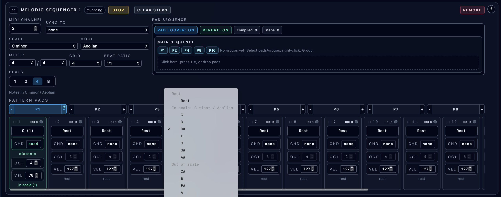

# Melodic Sequencers and Step Editing

**Navigation:** [Up](performance.md) | [Prev](audio_mixer_and_routing.md) | [Next](drummer_sequencers.md)

Melodic sequencers are step-based pattern sequencers used for note playback.

This page covers the **melodic sequencer** editor. Drum-machine style programming is documented in [Drummer Sequencers](drummer_sequencers.md).

Use the pen beside the device name to rename it. See [Device Names](performance.md#device-names) for editing controls, validation, and import/export behavior.

See [Sequencer timing](sequencer_timing.md) for triplets, beat grouping, editing behavior and legacy compatibility (EN/DE/FR/ES).

## Collapse the Panel

Melodic, drummer, and controller groups collapse independently. The shared tempo remains above the groups. Each group has its own Add button, which expands it. Panels start expanded and remember your choice across view switches until browser reload. Collapsing does not stop playback or discard edits.

## Global Sequencer Clock

The sequencer section contains a global clock with:

- Running/stopped state badge
- `BPM` field (range `30..300`)

The backend runs the step timing (native runtime clock), which reduces browser timing jitter during playback.

## Adding / Removing Melodic Sequencers

- `Add Melodic Sequencer` creates a new melodic sequencer card
- `Add Drummer Sequencer` creates a drummer sequencer card (documented separately in [Drummer Sequencers](drummer_sequencers.md))
- A performance can contain up to 16 melodic sequencers
- Each melodic sequencer has its own `Remove` button

## Per-Sequencer Controls

Each melodic sequencer card provides:

- sequencer state badge (running/stopped or queued start/stop state)
- `Start` / `Stop` (sequencer enable state; can be used manually while the multitrack arranger is stopped)
- `Remove`
- `Clear Steps`
- `MIDI Channel` (`1..16`)
- `Scale` (root + scale type)
- `Mode` (Ionian, Dorian, Phrygian, Lydian, Mixolydian, Aeolian, Locrian)
- `Meter` (`2..7` over `4` or `8`)
- `Subdivision` (1, 2, 3, 4, 6 or 8 steps per local meter beat)
- `Advanced timing → Playback speed` (`1:1`, `2:1`, `3:2`, `4:3`, `3:4`, `5:4`, `4:5`, `7:4`)
- `Pattern length` (every integer from 1–16 local beats; whole bars show both units)

The step editor width is derived from the sequencer's own timing and length:

- steps per beat = the sequencer's selected `Subdivision`
- pad steps = `beats * steps per beat`
- default timing (`4/4`, grid `4`) gives `16` steps for a `4`-beat pad
- odd meters can still use matching one-bar pad lengths such as `3` beats in `3/4` or `5` beats in `5/4`

`Advanced timing → Playback speed` changes how quickly the sequencer advances relative to the shared transport beat without changing its stored pad length, meter, or grid:

- `1:1` keeps normal speed
- ratios above `1:1` make the melodic sequencer run faster
- ratios below `1:1` make the melodic sequencer run slower

This is separate from `Meter` and `Subdivision`, so you can combine polymeter and true polyrhythm on the same performance page.

### Queued Start/Stop State Labels

When changes are queued to take effect at the next cycle boundary, the sequencer state label can show queued states such as:

- starting at step 1
- stopping at step 1

## Scale, Scale Type, and Mode

Orchestron separates:

- Scale root (for example `C`, `Db`, `F#`)
- Scale type (`major`, `neutral`, `minor`)
- Mode (7 diatonic modes)

This supports guided note entry and better readability in the sequencer step editor and piano roll highlighting.

## Pattern Workspace

The **Playback source** toggle selects **Arrangement** or **Manual pads**. New sequencers use Manual pads; placing their first item on an arranger lane selects Arrangement automatically. Later source choices are saved with the performance. The arranger’s **Loop song** toggle controls repeating or stopping at the song end.

The upper-right [pattern workspace](pattern_pads_and_pad_looper.md) assembles pads and reusable phrases with drag-and-drop. Cmd/Ctrl-click selects items to group; right-click splits groups. Apply commits shared phrase edits explicitly. Play loops the whole workspace; hold a speaker for 250 ms to preview an individual pad or phrase until release. Only pads with a note above zero velocity are green; rests, holds without notes and zero-velocity patterns stay dark. Selection outlines remain separate. With Manual pads running, click another pattern pad to queue it for the end of the current pattern: its outline is orange while queued and blue-green once playing. While stopped or using Arrangement, clicks only select the editing pad.

## Step Editor (Per-Step Note Programming)

Each step cell supports:

- Rest or note selection
- Chord selection, including the standard `5` power chord (root + perfect fifth)
- Hold toggle (`HOLD`)
- Octave field (separate from pitch class)
- In-scale/out-of-scale status display
- Playhead highlighting during playback

### Step Note Entry Workflow

Each step has a pitch-class dropdown grouped into:

- `Rest`
- In-scale notes (for the current sequencer scale/mode)
- Out-of-scale notes

The octave is edited separately via the `OCT` field.

This split note/octave design makes pattern entry faster than selecting full MIDI note numbers.

### Theory Aids In Steps

- In-scale notes are highlighted
- In-scale notes show degree labels (`1..7`)
- Out-of-scale notes remain selectable (for chromatic writing)
- Enharmonic note labels are available where relevant (for example sharps/flats)
- Chord choices are grouped as none, diatonic, or chromatic for the selected step root and mode. A `5` power chord is diatonic only when both the root and perfect fifth are in the current mode.

### Hold Toggle

Each step includes a `HOLD` toggle.

Use `HOLD` to sustain behavior across steps according to the sequencer runtime logic and the note/gate pattern.

### Step Cell Visual States

Step cells visually indicate:

- Active playhead step (when the melodic sequencer + transport are running)
- In-scale programmed note
- Out-of-scale programmed note
- Rest / hold combinations

## Early and Late Notes

Timing moves an individual attack by **−50% to +50% of one local step**, in 1% increments. Zero means **On grid**. The millisecond readout follows the current tempo, grid and beat ratio: at 120 BPM with 4/4, Subdivision 4 and speed 1×, −20% is 25 ms early. Timing belongs to each pad and does not change its length, meter or playback speed.

Moving a note also moves its release, preserving its length and any HOLD extension. A following attack can shorten the preceding note to avoid overlap. Chords move together. If neighboring attacks land at exactly the same instant, the later logical step wins.

An early first step plays before the boundary when the same pad repeats. On a fresh start or a different-pad launch it plays at the boundary instead. Queued stops, pauses and finite arrangement ends suppress repeat anticipation. A command received after an anticipated attack has already sounded cannot undo that attack.

Copying steps or pads preserves timing. Clear Steps resets it. Inactive drum cells retain their timing for reactivation. Old performances load on grid; Save/Load, browser restoration, native bundles and both CSD export modes preserve offsets. Timing edits during playback use the normal coalesced live-edit workflow.

Use the **Timing** slider or signed percentage field in each step to adjust its position. The reset arrow restores zero. The slider supports arrow keys; the note/chord copy handle also copies timing.

The performance CLI can discover tracks with `edit sequencers list` and inspect or change offsets with `edit step-timing list|set|reset`. Pads use 1–8; steps are zero-based. YAML/JSON scores also support per-note timing. See the [skill timing reference](../../integrations/skills/orchestron-performance-creator/references/step_timing.md) for the full workflow and examples.

## Clear Steps

`Clear Steps` resets the current melodic sequencer step contents (for the active pad pattern context) so you can quickly reprogram it.

## Related Features

- Pattern pads (#1..#8), queued pad switching, pad copying, transposition, and phrase library and arranger controls are documented in [Pattern Pads and Reusable Phrases](pattern_pads_and_pad_looper.md).

## Screenshots

  

<em>Melodic sequencer detail showing step editing, note selection, octave, and hold controls.</em>

**Navigation:** [Up](performance.md) | [Prev](audio_mixer_and_routing.md) | [Next](drummer_sequencers.md)
