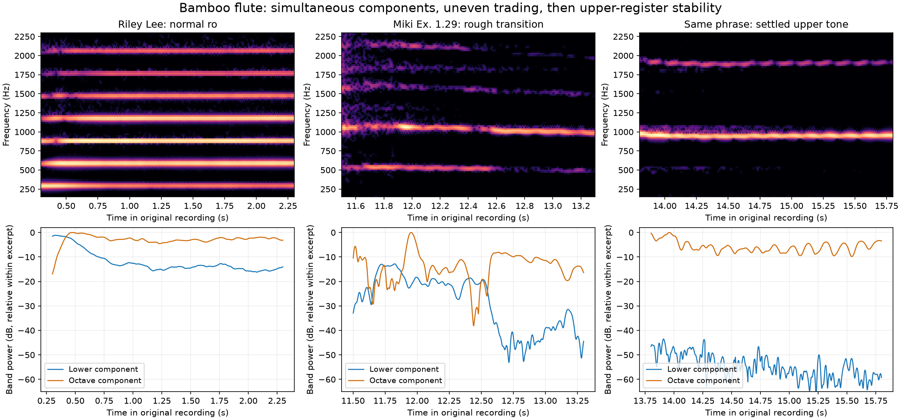
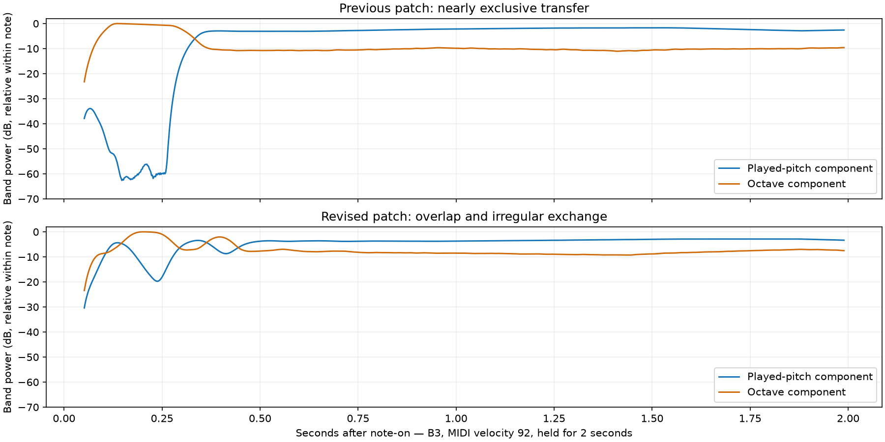

# Bamboo-flute reference comparison — 26 September 2026

The previous patch made one smooth, nearly exclusive transfer between two
harmonic families. The recordings support a broader range: overlapping and
unevenly fluctuating components during rough transitions, and stable upper
notes after the transition. These observations informed the new patch.

## Recordings and useful passages

| Recording | Passage | What the spectral analysis shows |
| --- | --- | --- |
| [Riley Lee, UNSW: ro](https://www.phys.unsw.edu.au/music/flute/shakuhachi/RLsoundclips.html) ([WAV](https://www.phys.unsw.edu.au/music/flute/shakuhachi/sounds/Ro.wav)) | 0.3–2.3 s | Normal low note, approximately 295 Hz; the second harmonic is about 11 dB stronger at the median. A strong octave component alone does not establish an upper register. |
| [Miki / Pro Musica Nipponia: shakuhachi examples](https://urresearch.rochester.edu/institutionalPublicationPublicView.action?institutionalItemId=29587), Ex. 1.27 | Scale demonstrations after the introductory material | Basic ranges on different flute lengths; useful normal-tone context. |
| Same collection, **Ex. 1.28** | Approximately 5.8–16.5 s | Explicitly labelled **extended kan range** by the publisher: a reference for upper-register playing. This is not a matched low/high note pair. |
| Same collection, **Ex. 1.29** | **11.5–13.3 s**, then **13.8–15.8 s**; another transition around 19.7–22 s | Rough onset with lower and octave bands coexisting and trading intensity, followed by a sustained upper tone with the lower band roughly 49 dB weaker at the median. |

The publisher calls Ex. 1.29 a demonstration of special techniques. Its metadata
does not identify every subpassage or supply breath-pressure measurements. The
register transition above is an interpretation of the spectrum, not an assertion
that an isolated pressure increase caused it. The collection credits Minoru Miki
and Pro Musica Nipponia; the recordings remain copyrighted and are not included
in this repository or instrument.

In the 11.5–13.3 s passage, the octave/lower band-power ratio ranges from about
−6 to +35 dB between its 10th and 90th percentiles. After removing slow envelope
trends, their correlation is approximately −0.54: some intensity changes oppose
one another. Prominent upper-envelope modulation falls around 4–5 Hz in that
window and 6–7 Hz in the later window. Those are observations of these passages,
not universal flute oscillation rates. Harmonic bands, noise, player gestures,
room acoustics and independent vibration modes cannot be fully separated from
these recordings alone.

[Castellengo and Fabre's acoustic study](https://www-fourier.ujf-grenoble.fr/~faure/enseignement/musique/documents/chapter_3_production_of_musical_sounds/1993_castellengo_flute.pdf)
reports uneven exchanges between shakuhachi harmonics during head movement
(pp. 231–232), and distinguishes them from tongue/throat or fingering ornaments.
Its separate discussion of transverse-flute multiphonics describes interacting
modes and rattling. That supports a possible mechanism, but does not demonstrate
that every shakuhachi overblow involves two independently competing modes.

## Consequences for Lake Bamboo Flute

- Keep air-first onset and a velocity-dependent pressure peak/settling envelope.
- Broaden the register boundary and keep the lower family present during transfer.
- Apply unequal resonance memory and irregular intensity exchange, strongest near
  the boundary and during the onset; let strong sustained notes stabilize.
- Treat velocity as an expressive proxy. A real player also adjusts jet direction,
  lip geometry and fingering.

The revised patch is an explicitly designed modal-envelope approximation. It
uses coupled amplitude modulation, not a solved fluid/jet feedback model. Its
small residual lower component during stable overblowing is a musical choice
in response to the requested sound, not a universal property of real flutes.

## Reproduction and limits

`compare_recordings.py /tmp/bamboo-flute-comparison` uses the skill's audio Python.
It expects `unsw_ro.wav` and `miki_techniques.mp3`; download the latter using the
publisher's Ex. 1.29 link. Source downloads stay outside the repository.
The analysis downmixes and resamples copies to 22,050 Hz, uses a 1,024-sample Hann
window (46 ms) and 44-sample hop (2 ms), follows the octave ridge, and integrates
±45 Hz bands. Each plot has one shared level reference per excerpt, so it compares
component balance, not calibrated loudness between recordings. Original audio
is untouched. The 2 ms hop does not give 2 ms event resolution.

[Comparison measurements](comparison_measurements.json) record exact windows and
settings. [Additional reference windows](reference_measurements.json) were measured
with the same FFT/band settings, with detrending performed before trimming the
padded analysis window. Spectrograms and envelopes were visually inspected.
**No listening check was performed.**
